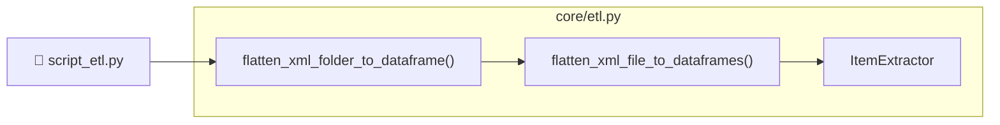

# Exploring Boardgames Part One: Data Download and ETL
TODO: link to part 2
## Introduction

During an elevator ride years ago, an elderly neighbour remarked on the fresh stack of Dominion[^1] boxes I was carrying. I casually replied something about it being "the golden age of board games", which is certainly something I personally felt during the 2010s, when it seemed that I was constantly discovering the existence of new board games with interesting mechanics that were much more complex than the games I played when I was a child. However, this little snippet of conversation occasionally resurfaces from the back of my mind over the years, for the simple reason that I, a scientist, did not like saying things without evidence.

And while I do consider myself enthusiastic about board games, I was never enthusiastic enough to, say, make an account on [boardgamegeek.com](https://boardgamegeek.com/) and participate in that gaming community online.


To acquire this evidence, 

Some API things already exist. Since, primarily doing this for my own learning, I decided to write my own anyways for my own benefit, for bulk download, and since I only need part of the API.

## Data Download
### The BoardGameGeek XML API
All board games on BoardGameGeek (BGG) have a id assigned to them. For example, [Settlers of Catan](https://boardgamegeek.com/boardgame/13/catan) is located at `https://boardgamegeek.com/boardgame/13/catan`, with an id of `13`. From manual probing of the URLs, it appears the current maximum id for boardgames specifically is somewhere around `362383`.

Board game data can be downloaded for the [BoardGameGeek API](https://boardgamegeek.com/wiki/page/BGG_XML_API2) by URI of the form:

```HTTP
https://boardgamegeek.com/xmlapi2/thing?type=boardgame,&stats=1&id=1,4
``` 
where:
- `type=<boardgame|boardgameexpansion|etc.>` is a filter for that `type` and can be a comma-delimited list to get multiple types, or omitted to get everything
- `stats=1` gets ratings and other statistics
- `id=1,4,...` is a comma-delimited list of the boardgame ids.

&nbsp;

The API is also capable of returning information about users, guilds, and much more.

&nbsp;

### Downloader Design
After 

Project folder structure[^2]

```
📦boardgames
 ┣ 📂core
 ┃ ┗ 📄bgg.py
 ┗ 📄script_retrieve_all_boardgames.py

 ```
Most of the 


By default, ids are sampled randomly. This is incase something happened that prevented me from getting everything, I would still get a random sample across ids.

The server will throttle when requests are too often. Too large will be blocked out right, but there's also a size that isn't blocked but often causes errors.

I ran this on an AWS server, batch size, cooldown, yadayada. This is probably very conservative, and took ~30 hours. 

Resumability is implemented via a JSON file. This JSON file keeps track of . By default it's unoptimally formatted, which actually makes it unnecessarily large, (TODO confirm size and compacting size), but this could compacted by exporting JSON as optimal.

Logging is both to stdout and a logging file.


 This is probably overly conservative. But this may I could spend less than 20% of time actively maintaining a connection.

`Retriever` is initialized with a save path.
Other description, used script as guide.

- Resumability
- Server behaviour
- Functions

- Testing

Test coverage isn't very high.
Run testing with `pytest` something, verbose something. Temporary files. Monkeypatched. 

```
 📦boardgames
  ┣ 📂core
  ┃ ┗ 📄bgg.py
* ┃ 📂data
* ┃ ┗ 📂xml
* ┃   ┣ 0.xml
* ┃   ┗ ...
  ┗ 📄script_retrieve_all_boardgames.py

 ```

## ETL
This section deals with the conversion of XML data returned from the BGG API into an appropriate format for storage an analysis.

### Structure of Input XML Data
Below is an example of a retrieved XML file, formatted for readability (with ellipses indicating abbreviated chunks). The root is an `<items>` tag containing many `<item>` tags. Each `<item>` has a number of subtags for attributes of the boardgame such as `<name>`, `<yearpublished>`, `<playtime>`, etc. As well, several `<poll>` tags contain data about polls users can vote on, and `<link>` tags contain information to types of data contained in other tables, such as types of boardgame mechanics the game uses, or the publisher of the game. A <statistics> tag contains information about BGG user ratings and how many users own the game, have it on their wishlist, etc.

```xml
<?xml version="1.0" encoding="utf-8"?>
<items termsofuse="https://boardgamegeek.com/xmlapi/termsofuse">
    <item type="boardgame" id="101769">
        <thumbnail>https://cf.geekdo-images.com/....png</thumbnail>
        <image>https://cf.geekdo-images.com/....png</image>
        <name type="primary" sortindex="1" value="Keine Mark zuviel" />
        <description>
            Merchandising game&amp;#10;&amp;#10;Players have to roll dice, 
            move meeples over the board and reach target spots in order to 
            get Bargain cards.&amp;#10;&amp;#10;
        </description>
        <yearpublished value="1991" />
        <minplayers value="2" />
        <maxplayers value="6" />
        <poll name="suggested_numplayers"
              title="User Suggested Number of Players"
              totalvotes="0">
            <results numplayers="1">
                <result value="Best" numvotes="0" />
                <result value="Recommended" numvotes="0" />
                <result value="Not Recommended" numvotes="0" />
            </results>
            <results numplayers="2">
                ...
            </results>
            ...
        </poll>
        <playingtime value="30" />
        <minplaytime value="30" />
        <maxplaytime value="30" />
        <minage value="7" />
        <poll name="suggested_playerage"
              title="User Suggested Player Age"
              totalvotes="0">
            <results>
                <result value="2" numvotes="0" />
                ...
                <result value="18" numvotes="0" />
                <result value="21 and up" numvotes="0" />
            </results>
        </poll>
        <poll name="language_dependence"
              title="Language Dependence"
              totalvotes="0">
            <results>
                <result level="1"
                        value="No necessary in-game text"
                        numvotes="0" />
                <result level="5"
                        value="Unplayable in another language"
                        numvotes="0" />
            </results>
        </poll>
        <link type="boardgamecategory" id="1017" value="Dice" />
        ...
        <link type="boardgamepublisher"
              id="4065"
              value="Neckermann Versand AG" />
        <statistics page="1">
            <ratings>
                <usersrated value="0" />
                <average value="0" />
                <bayesaverage value="0" />
                <ranks>
                    <rank type="subtype"
                          id="1" name="boardgame"
                          friendlyname="Board Game Rank"
                          value="Not Ranked"
                          bayesaverage="Not Ranked" />
                </ranks>
                <stddev value="0" />
                <median value="0" />
                <owned value="1" />
                <trading value="0" />
                <wanting value="0" />
                <wishing value="0" />
                <numcomments value="0" />
                <numweights value="0" />
                <averageweight value="0" />
            </ratings>
        </statistics>
    </item>
    ...
</items>
```

Given this structure, I decided to separate the data into three segments containing a game's main attributes and statistics, its links, and polling data.

### Data Extractor Design
Classes and functions for extracting the data from the xml and transforming it into a storage format are located in `core/etl.py`.


```
 📦boardgames
  ┣ 📂core
  ┃ ┣ 📄bgg.py
* ┃ ┗ 📄etl.py
  ┃ 📂data
* ┣ 📄script_etl.py
  ┗ 📄script_retrieve_all_boardgames.py

 ```





`Script` to run.


Read in a file, then get the root xml thing. You should be able 

#### An unexpected encoding bug

Unexpected bug is double escaping. XML `&amp;3483 -> ` but one of things already handles. However, encoding is still weird on my end, HASHI de CUBES example, but no on their end description.

#### Extractor

extractor has a bunch of custom things for each field. I basically wrote a separate func.

Three separate type of data comes out.

#### Flow of data back out into a huge pandas object

Then return a dict or w/e.
Then a bunch of those can concatenated into a list of dataframes.

Dataframes are further concatenated.

#### Output Data Storage
CSV, compressed csv, parquet

#### Running the script


For file storage, I found uncompressed csv would have been >300MB. Compressed csvs or parquet files were around ~70MB, but loaded faster in a jupyter notebook in downstream analysis (~3-8 secs vs ~15-20 secs). Thus, I saved the data as parquet files, with the drawback that parquet files aren't human readable.

## Summary and Discussion

Turn into a package, how would I do that.
Probably something like: I don't know.

Further testing?


## Notes
[^1]: [Dominion](https://boardgamegeek.com/boardgame/36218/dominion) is a card-based board game. A copious number of [expansions](https://www.riograndegames.com/games/dominion/) are available, each of which add new cards to the game. This results in players having to carry multiple boxes around to their friends' house, unless they pursue [alternate](https://imgur.com/a/oH2yj) [solutions](https://www.google.com/search?q=dominion+storage+box), or perhaps [play online](https://dominion.games/).
[^2] See this [StackOverflow post](https://stackoverflow.com/questions/19699059/representing-directory-file-structure-in-markdown-syntax) for this format of folder tree.