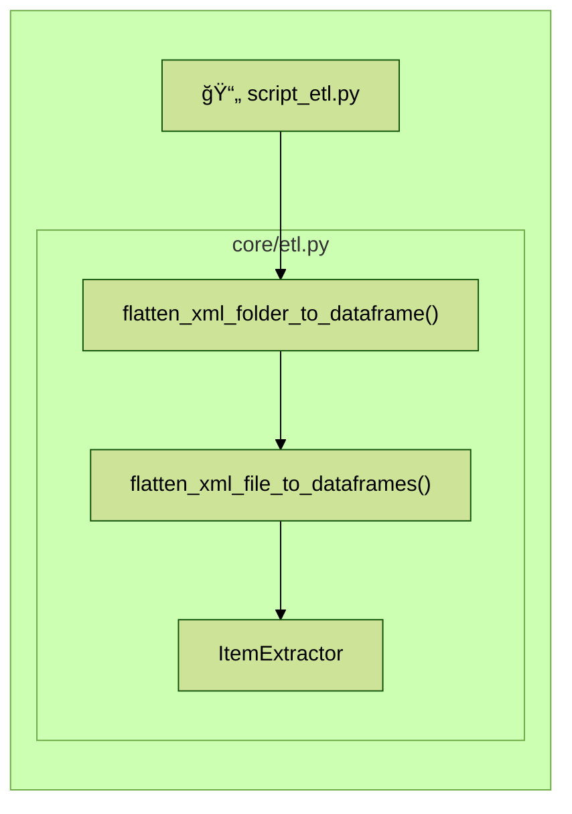

# Exploring Boardgames Part One: Data Download and ETL
TODO: link to part 2



## Introduction

During an elevator ride years ago, an elderly neighbour remarked on the fresh stack of Dominion[^1] boxes I was carrying. I casually replied something about it being "the golden age of board games", which is certainly something I personally felt during the 2010s, when it seemed that I was constantly discovering the existence of new board games with interesting mechanics that were much more complex than the games I played when I was a child. However, this little snippet of conversation occasionally resurfaces from the back of my mind over the years, for the simple reason that I, a scientist, did not like saying things without evidence.

And while I do consider myself enthusiastic about board games, I was never enthusiastic enough to, say, make an account on [boardgamegeek.com](https://boardgamegeek.com/) and participate in that gaming community online.


To acquire this evidence, 

Some API things already exist. Since, primarily doing this for my own learning, I decided to write my own anyways for my own benefit, for bulk download, and since I only need part of the API.

Some APIs written. Some partial data sets. Link and Link. So I wanted to download the whole thing. And analyze the data.


## Data Download
### The BoardGameGeek XML API
All board games on BoardGameGeek (BGG) have a id assigned to them. For example, [Settlers of Catan](https://boardgamegeek.com/boardgame/13/catan) is located at `https://boardgamegeek.com/boardgame/13/catan`, with an id of `13`. From manual probing of the URLs, it appears the current maximum id for boardgames specifically is somewhere around `362383`.

Board game data can be downloaded for the [BoardGameGeek API](https://boardgamegeek.com/wiki/page/BGG_XML_API2) by URI of the form:

```HTTP
https://boardgamegeek.com/xmlapi2/thing?type=boardgame,&stats=1&id=1,4
``` 
where:
- `type=<boardgame|boardgameexpansion|etc.>` is a filter for that `type` and can be a comma-delimited list to get multiple types, or omitted to get everything
- `stats=1` gets ratings and other statistics
- `id=1,4,...` is a comma-delimited list of the boardgame ids.

&nbsp;

The API is also capable of returning information about users, guilds, and much more.

&nbsp;

### Downloader Design
After 

Project folder structure[^2]

```
📦boardgames
 ┣ 📂core
 ┃ ┗ 📄bgg.py
 ┗ 📄script_retrieve_all_boardgames.py

 ```
Most of the 


By default, ids are sampled randomly. This is incase something happened that prevented me from getting everything, I would still get a random sample across ids.

The server will throttle when requests are too often. Too large will be blocked out right, but there's also a size that isn't blocked but often causes errors.

I ran this on an AWS server, batch size, cooldown, yadayada. This is probably very conservative, and took ~30 hours. 

Resumability is implemented via a JSON file. This JSON file keeps track of . By default it's unoptimally formatted, which actually makes it unnecessarily large, (TODO confirm size and compacting size), but this could compacted by exporting JSON as optimal.

Logging is both to stdout and a logging file.


 This is probably overly conservative. But this may I could spend less than 20% of time actively maintaining a connection.

`Retriever` is initialized with a save path.
Other description, used script as guide.

- Resumability
- Server behaviour
- Functions

- Testing

Test coverage isn't very high.
Run testing with `pytest` something, verbose something. Temporary files. Monkeypatched. 

```
 📦boardgames
  ┣ 📂core
  ┃ ┗ 📄bgg.py
* ┃ 📂data
* ┃ ┗ 📂xml
* ┃   ┣ 0.xml
* ┃   ┗ ...
  ┗ 📄script_retrieve_all_boardgames.py

 ```

## ETL
This section deals with the conversion of XML data returned from the BGG API into an appropriate format for storage and analysis.

### Structure of Input XML Data
Below is an example of a retrieved XML file, formatted for readability (with ellipses indicating abbreviated chunks). The root is an `<items>` tag containing many `<item>` tags. Each `<item>` has a number of subtags for attributes of the boardgame such as `<name>`, `<yearpublished>`, `<playtime>`, etc. As well, several `<poll>` tags contain data about polls users can vote on, and `<link>` tags contain information to types of data contained in other tables, such as types of boardgame mechanics the game uses, or the publisher of the game. Subtags of the `<statistics>` tag contain information about BGG user ratings and how many users own the game, have it on their wishlist, etc.

```xml
<?xml version="1.0" encoding="utf-8"?>
<items termsofuse="https://boardgamegeek.com/xmlapi/termsofuse">
    <item type="boardgame" id="101769">
        <thumbnail>https://cf.geekdo-images.com/....png</thumbnail>
        <image>https://cf.geekdo-images.com/....png</image>
        <name type="primary" sortindex="1" value="Keine Mark zuviel" />
        <description>
            Merchandising game&amp;#10;&amp;#10;Players have to roll dice, 
            move meeples over the board and reach target spots in order to 
            get Bargain cards.&amp;#10;&amp;#10;
        </description>
        <yearpublished value="1991" />
        <minplayers value="2" />
        <maxplayers value="6" />
        <poll name="suggested_numplayers"
              title="User Suggested Number of Players"
              totalvotes="0">
            <results numplayers="1">
                <result value="Best" numvotes="0" />
                <result value="Recommended" numvotes="0" />
                <result value="Not Recommended" numvotes="0" />
            </results>
            <results numplayers="2">
                ...
            </results>
            ...
        </poll>
        <playingtime value="30" />
        <minplaytime value="30" />
        <maxplaytime value="30" />
        <minage value="7" />
        <poll name="suggested_playerage"
              title="User Suggested Player Age"
              totalvotes="0">
            <results>
                <result value="2" numvotes="0" />
                ...
                <result value="18" numvotes="0" />
                <result value="21 and up" numvotes="0" />
            </results>
        </poll>
        <poll name="language_dependence"
              title="Language Dependence"
              totalvotes="0">
            <results>
                <result level="1"
                        value="No necessary in-game text"
                        numvotes="0" />
                <result level="5"
                        value="Unplayable in another language"
                        numvotes="0" />
            </results>
        </poll>
        <link type="boardgamecategory" id="1017" value="Dice" />
        ...
        <link type="boardgamepublisher"
              id="4065"
              value="Neckermann Versand AG" />
        <statistics page="1">
            <ratings>
                <usersrated value="0" />
                <average value="0" />
                <bayesaverage value="0" />
                <ranks>
                    <rank type="subtype"
                          id="1" name="boardgame"
                          friendlyname="Board Game Rank"
                          value="Not Ranked"
                          bayesaverage="Not Ranked" />
                </ranks>
                <stddev value="0" />
                <median value="0" />
                <owned value="1" />
                <trading value="0" />
                <wanting value="0" />
                <wishing value="0" />
                <numcomments value="0" />
                <numweights value="0" />
                <averageweight value="0" />
            </ratings>
        </statistics>
    </item>
    ...
</items>
```

Given this structure, I decided to separate the data into three segments containing a game's main attributes and statistics, its links, and polling data.

### Data Extractor - File Structure
```
 📦boardgames
  ┣ 📂core
  ┃ ┣ 📄bgg.py
* ┃ ┗ 📄etl.py
  ┃ 📂data
* ┣ 📄script_etl.py
  ┗ 📄script_retrieve_all_boardgames.py

 ```


Classes and functions for extracting the data from the xml and transforming it into a storage format are located in `core/etl.py`.

`script.etl.py` calls functions in `etl.py`, and runs with command line args.
```text
$ python script_etl.py -h

usage: script_etl.py [-h] [--omit-general-data] [--omit-link-data]
                     [--omit-poll-data] [--output-csv]
                     [--omit-csv-compression]
                     read_xml_dir output_dir output_prefix

Extract a folder of xml files containing boardgame data and save them as
parquet (default) or csv files. Saved files will have format:
<output_dir>/<output_prefix>_<data_type>.<parquet|csv|csv.gz> where
<data_type> indicates whetherthe file contains general data, link data, or
poll data.

positional arguments:
  read_xml_dir          Directory of xml files downloaded from BGG.
  output_dir            Directory to save output parquet (default) or csv
                        files.
  output_prefix         Prefix for naming output files.

options:
  -h, --help            show this help message and exit
  --omit-general-data   Flag to omit general data extraction.
  --omit-link-data      Flag to omit link data extraction.
  --omit-poll-data      Flag to omit poll data extraction.
  --output-csv          Output files as csv instead of parquet.
  --omit-csv-compression
                        Omit gunzip compression of csv files.
```

### Data Extractor - Function Flow

`script_etl.py` primarily calls `etl.flatten_xml_folder_to_dataframe()`, which takes a folder of `xml` files and calls `etl.flatten_xml_file_to_dataframe()` on each file in a loop. 




`flatten_xml_file_to_dataframe()` gets the root element of each file (which is the `<items>` tag) and loads each `<item>` subtag (representing an individual board game) in an `ItemExtractor` instance for data extraction.

```python
def flatten_xml_file_to_dataframes(
        file_path: str,
        get_general_data: bool = True,
        get_link_data: bool = True,
        get_poll_data: bool = True
        ) -> dict[pd.DataFrame]:
    """Given a single xml file, return its data in pandas DataFrames.

    Args:
        file_path (str): Location of the input xml file.
        get_general_data (bool, optional): Return general data.
            Defaults to True.
        get_link_data (bool, optional): Return data relating boardgames to
            other types of items.
            Defaults to True.
        get_poll_data (bool, optional): Return poll data for each boardgame.
            Defaults to True.

    Returns:
        dict[pd.DataFrame]: Contains the requested dataframes.
    """
    # Initialize
    out = {}
    if get_general_data:
        out[KEY_GENERAL_DATA] = []
    if get_link_data:
        out[KEY_LINK_DATA] = []
    if get_poll_data:
        out[KEY_POLL_DATA] = []

    # Extract data.
    # Link and poll data are lists of dicts themselves,
    # hence extend not append.
    root = _read_xml_file(file_path)
    for item in root:
        extractor = ItemExtractor(item)
        if get_general_data:
            out[KEY_GENERAL_DATA].append(extractor.extract_general_data())
        if get_link_data:
            out[KEY_LINK_DATA].extend(extractor.extract_link_data())
        if get_poll_data:
            out[KEY_POLL_DATA].extend(extractor.extract_poll_data())

    # Convert to pandas DataFrames
    out[KEY_GENERAL_DATA] = pd.DataFrame(out[KEY_GENERAL_DATA])
    out[KEY_LINK_DATA] = pd.DataFrame(out[KEY_LINK_DATA])
    out[KEY_POLL_DATA] = pd.DataFrame(out[KEY_POLL_DATA])

    return out
```


`ItemExtractor` has three public extraction methods: `.extract_general_data()`, `.extract_link_data()`, `.extract_poll_data()`. These three methods return the following data structures:

```python
# A dict containing keys that will be pandas col headings
extractor.extract_general_data() --> 
    {'id': 348, 'name': 'Name of Game', ...}

# list of dicts, as there are multiple links per each boardgame
extractor.extract_link_data() --> 
    [
        {'boardgame_id': 4, 'link_id': 394, 'type':'boardgamepublisher',... },
        {...},
        ...
    ]

# list of dicts, as there are multiple polls per each boardgame
extractor.extract_poll_data() -->
    [
        {'boardgame_id': 101769
         'poll_name': 'suggested_numplayers'
         'poll_title': 'User Suggested Number of Players'
         'poll_totalvotes': 0
         'results_numplayers': 1
         'result_value': 'Best'
         'result_numvotes': '0'},
         {...},
         ...
    ]
```


These extraction methods use a number of private methods to extract each data field from the various subtags of each `<item>`. Potentially, some of these could have been extracted using a generic method, but I wrote individual methods just to keep things decoupled, and as the the number of fields wasn't prohibitively large, and this allowed me to tweak individual extractor method behaviour without hard commitments.

For example, below is a series of methods that gets integer-like fields:

```python
    def _extract_year_published(self) -> int | None:
        """Return boardgame year published."""
        tag = self.item.find("yearpublished")
        return None if tag is None else int(tag.attrib['value'])

    def _extract_min_players(self) -> int | None:
        """Return minimum number of players."""
        tag = self.item.find("minplayers")
        return None if tag is None else int(tag.attrib['value'])

    def _extract_max_players(self) -> int | None:
        """Return maximum number of players"""
        tag = self.item.find("maxplayers")
        return None if tag is None else int(tag.attrib['value'])

    def _extract_playing_time(self) -> int | None:
        """Return playing time."""
        tag = self.item.find("playingtime")
        return None if tag is None else int(tag.attrib['value'])

    def _extract_min_playtime(self) -> int | None:
        """Return minimum playing time."""
        tag = self.item.find("minplaytime")
        return None if tag is None else int(tag.attrib['value'])

    def _extract_max_playtime(self) -> int | None:
        """Return maximum playing time."""
        tag = self.item.find("maxplaytime")
        return None if tag is None else int(tag.attrib['value'])

    def _extract_min_age(self) -> int | None:
        """Return minimum recommended age."""
        tag = self.item.find("minage")
        return None if tag is None else int(tag.attrib['value'])
```

Could be written as:
```python
    def extract_int_like(self, tag_name:str) -> int | None:
        tag = self.item.find(tagname)
        return None if tag is None else int(tag.attrib['value'])

```


But these are semantically different types of data, so it would be easier to change if they didn't rely on the same method in the future.

As a side note, by converting data to `int` for example instead of leaving it as string, we get the benefit that if there was some abnormality like on eof the numbers if a float, teh script will thorw an error, for better or for rowr.se. Did I do error ignoring? Alert the errors

Similarly, we can do a bit of data cleaning by doing something like, where we round floats to 3 decimals.
```python
    def _extract_ratings_average(self) -> float | None:
        """Return mean average rating to 3 decimals."""
        out = self._extract_ratings_subtag_helper("average")
        return None if out is None else round(float(out), 3)
```

For each `<item>` tag, an `ItemExtractor` instance's 
Item extract returns dict of pd.DataFrames, up the chain back out. `pdconcat` each time.


This dict of dataframes is then further concatenated by each file by `flatten_xml_folder_to_dataframe()` resulting in a final dict of dataframes.

```mermaid
%%{init: {'theme':'forest'}}%%
graph TD
    classDef emptypadding fill:None, stroke:None;
    classDef backgroundbox stroke:None;

 subgraph background [ ]
    folder_func["flatten_xml_folder_to_dataframe()"] -->|"dict[pd.DataFrame]"|script["📄 script_etl.py"];
 subgraph core/etl.py
 subgraph padding1 [ ]
    ItemExtractor["ItemExtractor<br>.extract_general_data() <br> .extract_link_data() <br> .extract_poll_data()"];
    ItemExtractor --> |"dict[pd.DataFrame]"|file_func;
    file_func["flatten_xml_file_to_dataframes()"] --> |"dict[pd.DataFrame]"|folder_func;
 end
 end
 end
class padding1 emptypadding
class background backgroundbox

```





### Output Data Storage
By default, `script_etl.py` calls `etl.write_dataframes_to_parquet()` to write the final dict of dataframes to disk for storage. 

I found uncompressed csv files would have been >300MB. Compressed csvs or parquet files were around ~70MB, but parquet files loaded faster in a jupyter notebook during downstream analysis (~3-8 secs vs ~15-20 secs). Thus, I saved the data as parquet files, with the drawback that parquet files aren't human readable.

Output directory is a script parameter, but I outputted the data into a subfolder in `data/`:

```
 📦boardgames
  ┣ 📂core
  ┃ ┣ 📄bgg.py
  ┃ ┗ 📄etl.py
  ┃ 📂data
  ┃ ┣ 📂xml
* ┃ ┗ 📂parquet
* ┃   ┣ 2022-09-19_general_data.parquet
* ┃   ┣ 2022-09-19_link_data.parquet
* ┃   ┗ 2022-09-19_poll_data.parquet
  ┣ 📄script_etl.py
  ┗ 📄script_retrieve_all_boardgames.py
```

### Note: An Encoding Bug

Consider the board game with id `292791` and the name `箸でCUBEs (Hashi de CUBEs)`.


While the first sentence of the description on the [BGG website](https://boardgamegeek.com/boardgame/292791/cubes-hashi-de-cubes) begins with: 

```html
箸でCUBEs (Hashi de CUBEs), roughly translated as "Cubes with chopsticks"
``` 

the description field in the raw xml is a doubly escaped string:

```html
&amp;#231;&amp;#174;&amp;#184;&amp;#227;&amp;#129;&amp;#167;CUBEs (Hashi de CUBEs), roughly translated as &amp;quot;Cubes with chopsticks&amp;quot;
```

that when unescaped twice becomes:
```html
箸でCUBEs (Hashi de CUBEs), roughly translated as "Cubes with chopsticks"
```


It's likely that these Japanese characters are encoded differently than `utf-8` somehow, but I decided not to pursue this further because I don't think it would affect my downstream analysis much for now. 

Note: double unescaping is actually handled in two instances, as it is unescaped once by the `lxml` xml parser, and once by `ItemExtractor._extract_description()` when extracting the description field.

## Summary and Discussion

Turn into a package, how would I do that.
Probably something like: I don't know.

Further testing?

TODO link to next blog post

Improvements: 
Converting all print statements to logger methods.

Structural pattern matching improvement in batch download. Available in python 3.10?? used it in writing funcs, but not batch download.


[^1]: [Dominion](https://boardgamegeek.com/boardgame/36218/dominion) is a card-based board game. A copious number of [expansions](https://www.riograndegames.com/games/dominion/) are available, each of which add new cards to the game. This results in players having to carry multiple boxes around to their friends' house, unless they pursue [alternate](https://imgur.com/a/oH2yj) [solutions](https://www.google.com/search?q=dominion+storage+box), or perhaps [play online](https://dominion.games/).
[^2]: See this [StackOverflow post](https://stackoverflow.com/questions/19699059/representing-directory-file-structure-in-markdown-syntax) for this format of folder tree.