## Introduction
- *[Github repo for this project](https://github.com/andrewKOwong/boardgames)*
- *[Link to part 2: Data Analysis]()*

Years ago, a neighbour in the elevator remarked on the fresh stack of Dominion[^1] boxes I was carrying. I casually said something about "the golden age of board games", and the reply was a confused "oh...." as we parted ways. And I too was confused afterwards, for even though I had heard the words "golden age of board games" thrown around, I hadn't really thought about it, except to note that board games were getting more interesting, complex, and fun for me over the years.

People that do really care about board games congregate at [boardgamegeek.com](https://boardgamegeek.com/) (abbreviated as BGG), where the world's collection of board games are described, discussed, and rated, thus collectively contributing to a large dataset that can be accessed via the [BGG API](https://boardgamegeek.com/wiki/page/BGG_XML_API2). Therefore, this data is potentially useful for trying to figure out what the golden age of board games really means, and other related questions.

However, the API does not support bulk download of the entire collection of board games in one go. Some BGG datasets have been made available by others online. For example, [this](https://www.kaggle.com/datasets/andrewmvd/board-games) is a smaller dataset of 20K games that have received at least 30 ratings by users, while [this](https://www.kaggle.com/datasets/seanthemalloy/board-game-geek-database) is a larger dataset of >100K games. Note that these datasets represent a snapshot in time, as data changes as users add ratings. As well, there is at least [one python API wrapper available](https://github.com/lcosmin/boardgamegeek) (although it is no longer maintained), and a number of other analyses about board games have been written previously, e.g. [here](https://jvanelteren.github.io/blog/2022/01/19/boardgames.html) and [here](https://dvatvani.github.io/BGG-Analysis-Part-1.html).

I wanted to get more experience writing code that interacts with HTTP servers,  so I decided to write my own code to handle downloading the data and to analyze it myself. As a side benefit, I wanted to try out the `pytest` library for testing.

The content of the current post deals with code I wrote to download the data and prepare the data; the analysis is [described in a second blog post](https://mixedconclusions.com/blog/boardgames_part_two/).


## Data Download
### The BoardGameGeek XML API
All board games on BGG have a id assigned to them. For example, [Settlers of Catan](https://boardgamegeek.com/boardgame/13/catan) is located at `https://boardgamegeek.com/boardgame/13/`, with an id of `13`. From manual probing of the URLs, it appears the current maximum id for boardgames is somewhere around `362383`.

Board game data can be downloaded from the [BGG API](https://boardgamegeek.com/wiki/page/BGG_XML_API2) by URI of the form:

```text
https://boardgamegeek.com/xmlapi2/thing?type=boardgame,&stats=1&id=1,4
``` 
where:
- `type=boardgame,boardgameexpansion,boardgameaccessory,videogame,rpgitem,rpgissue` is a filter for that `type` and can be a comma-delimited list to get multiple selected types, or omitted to get everything. The non-boardgame types exist because boardgamegeek.com shares an id system with videogamegeek.com and rpggeek.com.
- `stats=1` including this gets ratings and other statistics
- `id=1,4,...` is a comma-delimited list of the boardgame ids.


The API is also capable of returning information about users, guilds, and much more.


### Server Behaviour

During initial testing, I found requesting too large of a batch of games at once (e.g. 50K games in a single request) will be blocked by the API server. Request batch sizes on the scale of around 1K games are accepted by the server, but often also cause backend errors that do not appear to be throttling response, as the request can be immediately made again (sometimes successfully). Batch sizes of 250-500 seem to work well, and take about 10-30 seconds to complete. Too frequent requests are throttled.


### File Structure
To organize my code, I put functions and classes for downloading from the API under `core/bgg.py`, and wrote `script_retrieve_all_boardgames.py` as client code to retrieve all board game data from the API server.

```text
📦boardgames
 ┣ 📂core
 ┃ ┗ 📄bgg.py
 ┗ 📄script_retrieve_all_boardgames.py

 ```


### Downloader - Basic Design

`bgg.py` contains a `Retriever` class, which is initialized with a directory string for where the downloaded data will be stored. For example:

```python
from core.bgg import Retriever
retriever = Retriever('./data')
```

The `Retriever` method `retriever.retrieve_all()` will start a download of all board games (but not expansions) on BGG. The full code of `retrieve_all()` is reproduced below and is discussed in the following subsections.

```python
def retrieve_all(
            self,
            batch_cooldown: int = 5*60,
            server_cooldown: int = 3*60*60,
            batch_size: int = 500,
            shuffle: bool = True,
            random_seed: int = None,
            max_id: int = None) -> None:
        """Retrieve all board games from Board Game Geek.

        By default, gets board games in randomized batches.
        As the BGG ids (from 1 to ~362383) are not evenly distributed
        in terms of actual board games vs board game accessories,
        randomization allows the user to have a representative sample
        of board game ids should they choose to terminate the operation early.

        Cooldown periods between batches help prevent server overloading.
        As well a longer cooldown period can be applied should the user
        encounter a server error. These errors could be a result of getting
        blocked by the server for too many requests, or the server being down
        due to maintenance. This generic strategy is used as the server error
        codes/reasons do not appear to be publicly documented.

        A batch request might get a 200 response, 202 response, or other
        responses. 200 response is a successful batch request. 202 indicates
        that the server has queued the request for later processing. Of the
        other responses, there is at least a 502 response that includes a
        message saying that there is a server error and that you can try again
        in 30 seconds. In this 502 case, the longer cooldown period is skipped,
        and the next batch is requested.

        200, 202, and other responses are marked in a 'progress.json' file as
        'complete', 'queued', and 'incomplete', respectively. The number of
        batches of each status (as well as retrieval run events) is logged to
        'retriever.log'. If the number of 'queued' and 'incomplete' statuses is
        not zero, running retrieve_all with a Retriever object instantiated
        with the same save_dir will load that 'progress.json' file and request
        only the unfinished batches.

        References:
        1) https://boardgamegeek.com/wiki/page/BGG_XML_API2

        Args:
            batch_cooldown (int, optional): Seconds to cooldown between
                batches. Defaults to 10*60, i.e. 10 min.
            server_cooldown (int, optional): Seconds to cooldown on
                encountering a server response error code. Defaults to
                12*60*60, i.e. 12 hours.
            batch_size (int, optional): Number of 'thing' ids to request in one
                batch. Defaults to 5000. Note: 500 seems to be a good size to
                avoid server errors and server blocking, when requesting board
                games only (i.e. not expansions and accessories). Board games
                comprise only about a third of all ids.
            shuffle (bool, optional): Whether ids should be requested in a
                randomized order. Defaults to True.
            random_seed (int, optional): Seed for randomizing order, supplied
                to random.seed(). Defaults to None.
            max_id (int, optional): Provide a max_id to download up to,
                otherwise uses preset self.MAX_ID.
        """
        # Set max_id if not provided
        if max_id is None:
            max_id = self.MAX_ID

        # RetrieverLogger is a helper class that tracks
        # relevant retrieval statistics while logging.
        log = RetrieverLogger(self.log_file_path)
        log.log_run_start()
        # Resume from an existing progress file
        # or create new progress object and batches.
        if self._check_progress_file_exists():
            log.log_resuming_from_file()
            progress = self._load_progress_file()
        else:
            log.log_new_progress_file()
            ids = [i for i in range(1, max_id + 1)]
            if shuffle:
                random.seed(random_seed)
                random.shuffle(ids)
            progress = self._create_progress_object(ids, batch_size=batch_size)
            self._save_progress_file(progress)  # Initial save

        # Loop progress object, ignoring already complete batches.
        # Defensively deepcopy since we're mutating during iteration.
        log.log_total_batches(progress)
        for idx, batch in enumerate(deepcopy(progress)):
            if batch[self.PROGRESS_KEY_STATUS] == \
                    self.PROGRESS_STATUS_COMPLETE:
                log.log_batch_already_complete(idx)
                continue
            else:
                # Try the request, but pause if no internet
                while True:
                    try:
                        log.log_batch_start(idx)
                        uri = self.generate_game_uri(
                            batch[self.PROGRESS_KEY_IDS]
                            )
                        r = self.api_request(uri)
                        break
                    except requests.ConnectionError:
                        print(f"Unable to connect to internet, "
                              f"pausing {self.PAUSE_TIME_NO_CONNECTION}"
                              f" seconds.")
                        self._countdown(self.PAUSE_TIME_NO_CONNECTION)
                        continue
                # First, no matter the result, save the access time
                batch[self.PROGRESS_KEY_LAST_ACCESSED] = \
                    datetime.now().strftime('%Y-%b-%d %H:%M:%S.%f')
                # If its 200, save the file, change status to complete
                # If it's 202, mark it as queued.
                # Anything else, could mean server blocking or down,
                # so wait a while, then try again.
                if r.status_code == 200:
                    batch[self.PROGRESS_KEY_STATUS] = \
                        self.PROGRESS_STATUS_COMPLETE
                    progress[idx] = batch
                    self._write_response(r, self.xml_dir + f'/{idx}.xml')
                    self._save_progress_file(progress)
                    log.log_batch_downloaded(idx, r, batch_cooldown)
                elif r.status_code == 202:
                    batch[self.PROGRESS_KEY_STATUS] = \
                        self.PROGRESS_STATUS_QUEUED
                    progress[idx] = batch
                    self._save_progress_file(progress)
                    log.log_batch_queued(idx)
                else:
                    will_cooldown = True
                    # There is a 502 condition where the server error
                    # recommends trying again in 30 seconds.
                    # In that case, skip long server cooldown,
                    # but move onto the next batch.
                    if (r.status_code == 502) and \
                       (r.text.find("try again in 30 seconds") != 1):
                        will_cooldown = False
                    log.log_batch_error(idx, r)

                    batch[self.PROGRESS_KEY_STATUS] = \
                        self.PROGRESS_STATUS_INCOMPLETE
                    progress[idx] = batch
                    self._save_progress_file(progress)

                    # For all other error codes,
                    # cooldown a longer time in case it means
                    # the server is doing some sort of blocking
                    # without explicitly notifying us.
                    if will_cooldown:
                        log.log_cooldown_start(server_cooldown, 'server')
                        self._countdown(server_cooldown)
            # Cooldown between batches to not overload
            # or get blocked by server.
            log.log_cooldown_start(batch_cooldown, 'batch')
            self._countdown(batch_cooldown)

        # End of run logging
        log.log_run_complete_summary(
            progress,
            self.PROGRESS_KEY_STATUS,
            [self.PROGRESS_STATUS_COMPLETE,
             self.PROGRESS_STATUS_QUEUED,
             self.PROGRESS_STATUS_INCOMPLETE]
            )

```

#### Arguments for `.retrieve_all()`

`.retrieve_all()` has several optional kwargs.

- `batch_cooldown` specifies to change how long to wait between batches
- `server_cooldown` specifies how long to wait if you encounter a server problem. This is a defensive tactic, as I could not find documentation defining exactly what error codes and messages would get returned in what instance, so I thought it might be better to just wait a while.
- `batch_size` controls how many board games to request at once.
- `shuffle` specifies that games should be be retrieved in random order. This is default behaviour, so that if the user chooses to terminate early they'll still have a random sample of boardgames.
- `random_seed` for reproducible shuffling. 
- `max_id` if you want to set a different maximum id other than `362383`, which is coded as a class constant.

#### Batching, Resumability, and Response Handling
At the start of a run, `.retrieve_all()` looks to see if the if the save directory loaded into its `Retriever` object already contains a file called `progress.json`. If it doesn't, a list of randomized board game ids is created and split into batches, and a `progress` object and a new `progress.json` is created.

This `progress` object is a `list[dict]` with each `dict` containing an `ids` key containing a list of board game ids in that batch, a `status` key for whether a batch is `incomplete`, `complete`, or `queued`, and a `last_accessed` key that contains a timestamp of when the batch was last attempted for a download.

`.retrieve_all()` then loops through the `progress` object, taking each batch and calling `self.generate_uri()` and `self.api_request()` to attempt to download the batch of board games. If there is a connection error (e.g. from no internet connection), a sixty second pause is started, before reattempting the batch download.

Each response from each request comes with an HTTP response code. `200` indicates a successful request and includes board game data, whereas `202` indicates that the server has queued that request for processing, and it can be retrieved at a later time by using the same request URI. Of the other responses, there is at least a `502` response that includes a message saying that there is a server error and that you can try again in 30 seconds. There are also other `502`, `503`, and possibly `429` responses, but I didn't fully probe the server to see what I would get.

`200`, `202`, and other responses are marked in the `progress.json` file as
`complete`, `queued`, and `incomplete`, respectively. The number of
batches of each status (as well as retrieval run events) is logged to
`retriever.log` at the end of each run. If any batches were `queued` or `incomplete`, running `.retrieve_all()` with a Retriever object instantiated
with the same `save_dir` will load the same `progress.json` file in that save directory and request only the unfinished batches.


### Logging
Logging is handled by a helper class `bgg.RetrieverLogger`, an instance of which is initialized with a file path string for the log file. `retriever.retrieve_all()` creates of instance of `RetrieverLogger` when it is called, and calls `RetrieverLogger` methods for logging different events in the download cycle. 

For example, `retriever` calls `log.log_run_start()` at the start of the run, `log.log_new_progress_file()` when a new progress file is created, `log.batch_start()` when a new batch is started.

Because of this design, `RetrieverLogger` is tightly coupled to `Retriever`, which could impair reusability and refactoring.

This is an example of the logging output, which is both logged to file and to `stdout`:
```text
2022-09-07 00:53:32,975 | INFO: ***STARTING RETRIEVER RUN***
2022-09-07 00:53:32,976 | INFO: Creating new progress file.
2022-09-07 00:53:33,497 | INFO: Starting run of 725 batches.
2022-09-07 00:53:33,703 | INFO: - Attempting batch 1 of 725...
2022-09-07 00:53:43,409 | INFO: --- Batch 1 of 725 downloaded 921.603 KB in 9.7 seconds.
2022-09-07 00:53:43,409 | INFO: --- Elapsed: 00h 00m 10s | Remaining: 38h 09m 02s
2022-09-07 00:53:43,409 | INFO: --- Cumulative data size: 0.9 MB.
2022-09-07 00:53:43,410 | INFO: Starting batch cooldown of 180 seconds.
2022-09-07 00:56:43,625 | INFO: - Attempting batch 2 of 725...
2022-09-07 00:56:59,409 | INFO: --- Batch 2 of 725 downloaded 924.451 KB in 15.8 seconds.
2022-09-07 00:56:59,410 | INFO: --- Elapsed: 00h 03m 26s | Remaining: 38h 42m 38s
2022-09-07 00:56:59,410 | INFO: --- Cumulative data size: 1.8 MB.
2022-09-07 00:56:59,410 | INFO: Starting batch cooldown of 180 seconds.outputoutput, copypaste log file?
```

Here's an example where a server error is encounter:
```text
2022-09-07 14:51:18,969 | INFO: - Attempting batch 260 of 725...
2022-09-07 14:52:19,060 | WARNING: Response with error code 502.
2022-09-07 14:52:19,060 | WARNING: Response text follows:
2022-09-07 14:52:19,060 | WARNING: 
<html><head>
<meta http-equiv="content-type" content="text/html;charset=utf-8">
<title>502 Server Error</title>
</head>
<body text=#000000 bgcolor=#ffffff>
<h1>Error: Server Error</h1>
<h2>The server encountered a temporary error and could not complete your request.<p>Please try again in 30 seconds.</h2>
<h2></h2>
</body></html>

2022-09-07 14:52:19,360 | INFO: Starting batch cooldown of 180 seconds.
2022-09-07 14:55:19,575 | INFO: - Attempting batch 261 of 725...
```


### Calling the Script

 `script_retrieve_all_boardgames.py` runs with the following command line args:
 ```text
 $  python script_retrieve_all_boardgames.py -h

usage: script_retrieve_all_boardgames.py [-h] [--save-dir] [--batch-size] [--batch-cooldown] [--server-cooldown]
                                         [--max-id] [--no-shuffle] [--random-seed] [--clear-progress]

Retrieves all boardgames from Board Game Geek via API.

options:
  -h, --help          show this help message and exit
  --save-dir          Directory to save downloaded data, logs, and other files. (default: ./data)
  --batch-size        Number of ids to sent per API request. (default: 500)
  --batch-cooldown    Number of seconds to cooldown wait between batches. (default: 300)
  --server-cooldown   Number of seconds to cooldown wait when encountering a server error. (default: 10800)
  --max-id            Max 'thing' id to download up to. (default: None)
  --no-shuffle        Flag to disable shuffling of 'thing' ids while downloading. (default: False)
  --random-seed       Random seed for id shuffling. (default: None)
  --clear-progress    Flag to clear progress file if already present in save directory. (default: False)

 ```

Because my internet connection was unstable when I was writing this code, I ran this on an AWS EC2 `t2.micro` instance. I used the default batch size of 500 ids per batch, but decreased the batch cooldown from the default of 300 seconds to 180 seconds. This is probably overly very conservative in terms of how much cool down time to use and the download took in total ~30 hours. Each batch takes 10-15 seconds to transfer. 

```text
 📦boardgames
  ┣ 📂core
  ┃ ┗ 📄bgg.py
* ┃ 📂data
* ┃ ┗ 📂xml
* ┃   ┣ 0.xml
* ┃   ┗ ...
  ┗ 📄script_retrieve_all_boardgames.py

 ```


### Testing

I used [pytest](https://docs.pytest.org/en/7.1.x) as a testing framework, although I only tested a small portion of my code.

I found it helpful to write tests for `Retriever.generate_game_uri()` before I wrote the method itself, as it was easier to start knowing the string I had in mind, and then writing the string arithemetic logic in the method.

I also wrote tests to see how `Retriever.retrieve_all()` handled different response codes. I did this by [monkeypatching](https://docs.pytest.org/en/7.1.x/how-to/monkeypatch.html?highlight=monkeypatch) out the `get` method of the `requests` library to instead call the `.get_response()` method of a `MockServer` class that returns `MockResponse` objects mimicking `requests.Response` objects with `.status_code` and `.text`, and `.content` attributes:

```python
class MockResponse:
    """Mock of requests.Response"""
    def __init__(self, status_code: int, text: str):
        """Init MockResponse with desired values.

        Args:
            status_code (int): mocking requests.Response.status_code.
            text (str): mocking requests.Response.text. Will also be
                converted to a bytes object mocking requests.Response.content.
        """
        self.status_code = status_code
        self.text = text
        self.content = bytes(text, encoding='utf-8')


class MockServer:
    """Use MockServer.get_response as monkeypatch for requests.get"""
    def __init__(self) -> None:
        # This is a cyclic iterator that will
        # yield items in a loop when calling next() on it
        self.response_cycle = cycle([
            (200, 'DOWNLOADED'),
            (202, 'QUEUED'),
            (429, 'RATE_LIMITED'),
            (502, 'try again in 30 seconds'),
            (502, 'OTHER ERROR'),
            (503, 'SERVICE UNAVAILABLE')
            ])

    def get_response(self, uri) -> MockResponse:
        """Get the next MockReponse in the cycle.

        Returns:
            MockResponse: mocking request.Response, with .status_code,
                .text, and .content.
        """
        code, text = next(self.response_cycle)
        return MockResponse(code, text)

```
The test then runs `retriever.retrieve_all()`, writing a `progress.json` to a temporary folder that pytest generates (which on linux is located at `/tmp/pytest-of-<user>/pytest-current`). The test then loads a `progress` object from `progress.json`, and checks that the statuses and contents are as expected.

Tests can be run in the shell while in the root folder with `pytest`, or `pytest -sv` if you want to see the logger output in `stdout` as it's happening, or `pytest -rA` for better formatting after it happens. 

Test files are located in `boardgames/test`.
 

## ETL
This section deals with the conversion of XML data returned from the BGG API into an appropriate format for storage and analysis.

### Structure of Input XML Data
Below is an example of a retrieved XML file, formatted for readability (with ellipses `...` indicating abbreviated chunks). The root is an `<items>` tag containing hundreds of individual `<item>` tags. Each `<item>` tag has a number of subtags for board game attributes such as `<name>`, `<yearpublished>`, `<playtime>`, etc. As well, several `<poll>` tags contain data about polls that users vote on, whereas multiple `<link>` tags link to additional data about e.g. the types of boardgame mechanics the game uses or the publisher of the game. Subtags of the `<statistics>` tag contain information about BGG user ratings and how many users own the game, have it on their wishlist, etc.

```xml
<?xml version="1.0" encoding="utf-8"?>
<items termsofuse="https://boardgamegeek.com/xmlapi/termsofuse">
    <item type="boardgame" id="101769">
        <thumbnail>https://cf.geekdo-images.com/....png</thumbnail>
        <image>https://cf.geekdo-images.com/....png</image>
        <name type="primary" sortindex="1" value="Keine Mark zuviel" />
        <description>
            Merchandising game&amp;#10;&amp;#10;Players have to roll dice, 
            move meeples over the board and reach target spots in order to 
            get Bargain cards.&amp;#10;&amp;#10;
        </description>
        <yearpublished value="1991" />
        <minplayers value="2" />
        <maxplayers value="6" />
        <poll name="suggested_numplayers"
              title="User Suggested Number of Players"
              totalvotes="0">
            <results numplayers="1">
                <result value="Best" numvotes="0" />
                <result value="Recommended" numvotes="0" />
                <result value="Not Recommended" numvotes="0" />
            </results>
            <results numplayers="2">
                ...
            </results>
            ...
        </poll>
        <playingtime value="30" />
        <minplaytime value="30" />
        <maxplaytime value="30" />
        <minage value="7" />
        <poll name="suggested_playerage"
              title="User Suggested Player Age"
              totalvotes="0">
            <results>
                <result value="2" numvotes="0" />
                ...
                <result value="18" numvotes="0" />
                <result value="21 and up" numvotes="0" />
            </results>
        </poll>
        <poll name="language_dependence"
              title="Language Dependence"
              totalvotes="0">
            <results>
                <result level="1"
                        value="No necessary in-game text"
                        numvotes="0" />
                <result level="5"
                        value="Unplayable in another language"
                        numvotes="0" />
            </results>
        </poll>
        <link type="boardgamecategory" id="1017" value="Dice" />
        ...
        <link type="boardgamepublisher"
              id="4065"
              value="Neckermann Versand AG" />
        <statistics page="1">
            <ratings>
                <usersrated value="0" />
                <average value="0" />
                <bayesaverage value="0" />
                <ranks>
                    <rank type="subtype"
                          id="1" name="boardgame"
                          friendlyname="Board Game Rank"
                          value="Not Ranked"
                          bayesaverage="Not Ranked" />
                </ranks>
                <stddev value="0" />
                <median value="0" />
                <owned value="1" />
                <trading value="0" />
                <wanting value="0" />
                <wishing value="0" />
                <numcomments value="0" />
                <numweights value="0" />
                <averageweight value="0" />
            </ratings>
        </statistics>
    </item>
    ...
</items>
```

Given this structure, I decided to separate the data into three segments containing a game's main attributes and statistics, its links, and polling data.

### File Structure
```text
 📦boardgames
  ┣ 📂core
  ┃ ┣ 📄bgg.py
* ┃ ┗ 📄etl.py
  ┃ 📂data
* ┣ 📄script_etl.py
  ┗ 📄script_retrieve_all_boardgames.py

 ```


Classes and functions for extracting the data from the xml and transforming it into a storage format are located in `core/etl.py`. `script_etl.py` is client code that calls functions in `etl.py`.

### Function Flow

`script_etl.py` primarily calls `etl.flatten_xml_folder_to_dataframe()`, which takes a folder of `xml` files and calls `etl.flatten_xml_file_to_dataframe()` on each file in a loop. 




`flatten_xml_file_to_dataframe()` gets the root element of each file (which is the `<items>` tag) and loads each `<item>` subtag (representing an individual board game) in an `ItemExtractor` instance for data extraction.

```python
def flatten_xml_file_to_dataframes(
        file_path: str,
        get_general_data: bool = True,
        get_link_data: bool = True,
        get_poll_data: bool = True
        ) -> dict[pd.DataFrame]:
    """Given a single xml file, return its data in pandas DataFrames.

    Args:
        file_path (str): Location of the input xml file.
        get_general_data (bool, optional): Return general data.
            Defaults to True.
        get_link_data (bool, optional): Return data relating boardgames to
            other types of items.
            Defaults to True.
        get_poll_data (bool, optional): Return poll data for each boardgame.
            Defaults to True.

    Returns:
        dict[pd.DataFrame]: Contains the requested dataframes.
    """
    # Initialize
    out = {}
    if get_general_data:
        out[KEY_GENERAL_DATA] = []
    if get_link_data:
        out[KEY_LINK_DATA] = []
    if get_poll_data:
        out[KEY_POLL_DATA] = []

    # Extract data.
    # Link and poll data are lists of dicts themselves,
    # hence extend not append.
    root = _read_xml_file(file_path)
    for item in root:
        extractor = ItemExtractor(item)
        if get_general_data:
            out[KEY_GENERAL_DATA].append(extractor.extract_general_data())
        if get_link_data:
            out[KEY_LINK_DATA].extend(extractor.extract_link_data())
        if get_poll_data:
            out[KEY_POLL_DATA].extend(extractor.extract_poll_data())

    # Convert to pandas DataFrames
    out[KEY_GENERAL_DATA] = pd.DataFrame(out[KEY_GENERAL_DATA])
    out[KEY_LINK_DATA] = pd.DataFrame(out[KEY_LINK_DATA])
    out[KEY_POLL_DATA] = pd.DataFrame(out[KEY_POLL_DATA])

    return out
```
### Item Extractor

`ItemExtractor` has three extraction methods: `.extract_general_data()`, `.extract_link_data()`, and `.extract_poll_data()`. These three methods return the following data structures:

```python
# A dict containing keys that will become pandas col headings
extractor.extract_general_data() --> 
    {'id': 348, 'name': 'Name of Game', ...}

# list of dicts, as there are multiple links per boardgame
extractor.extract_link_data() --> 
    [
        {'boardgame_id': 4, 'link_id': 394, 'type':'boardgamepublisher',... },
        {...},
        ...
    ]

# list of dicts, as there are multiple polls per boardgame
extractor.extract_poll_data() -->
    [
        {'boardgame_id': 101769
         'poll_name': 'suggested_numplayers'
         'poll_title': 'User Suggested Number of Players'
         'poll_totalvotes': 0
         'results_numplayers': 1
         'result_value': 'Best'
         'result_numvotes': '0'},
         {...},
         ...
    ]
```


These extraction methods use a number of internal methods to extract each data field from the various subtags of each `<item>`. Potentially, some of these fields could have been extracted using a generic method, but since the number of fields wasn't prohibitively large, I wrote individual methods to keep things decoupled.

For example, below is a series of methods that gets integer-like fields:

```python
    def _extract_year_published(self) -> int | None:
        """Return boardgame year published."""
        tag = self.item.find("yearpublished")
        return None if tag is None else int(tag.attrib['value'])

    def _extract_min_players(self) -> int | None:
        """Return minimum number of players."""
        tag = self.item.find("minplayers")
        return None if tag is None else int(tag.attrib['value'])

    def _extract_max_players(self) -> int | None:
        """Return maximum number of players"""
        tag = self.item.find("maxplayers")
        return None if tag is None else int(tag.attrib['value'])

    def _extract_playing_time(self) -> int | None:
        """Return playing time."""
        tag = self.item.find("playingtime")
        return None if tag is None else int(tag.attrib['value'])

    def _extract_min_playtime(self) -> int | None:
        """Return minimum playing time."""
        tag = self.item.find("minplaytime")
        return None if tag is None else int(tag.attrib['value'])

    def _extract_max_playtime(self) -> int | None:
        """Return maximum playing time."""
        tag = self.item.find("maxplaytime")
        return None if tag is None else int(tag.attrib['value'])

    def _extract_min_age(self) -> int | None:
        """Return minimum recommended age."""
        tag = self.item.find("minage")
        return None if tag is None else int(tag.attrib['value'])
```

Could be written as:
```python
    def extract_int_like(self, tag_name:str) -> int | None:
        tag = self.item.find(tagname)
        return None if tag is None else int(tag.attrib['value'])

```


But since these are semantically different types of data, it could be easier to change individual methods in the future by not using a generic method. Nonetheless, this is probably a good target for refactoring.

As a side note, converting numerical data to `int` (for example) acts as a sort of soft check to ensure int-like data doesn't contain any decimals, as `int()` will throw an error if it encounters a decimal-containing `str`. This is probably ok if we expect this to be a very rare case (or perhaps indicating a silent change in the BGG API), at which point we can catch the errors in the script and decide what to do.


We can also do some data cleaning in these extraction methods, where for example, we round ratings averages to three decimals:
```python
    def _extract_ratings_average(self) -> float | None:
        """Return mean average rating to 3 decimals."""
        out = self._extract_ratings_subtag_helper("average")
        return None if out is None else round(float(out), 3)
```

While I had it in mind that this might make it easier to look at data in downstream analysis, it could be argued that it's better to leave data unadulterated at this stage and let changes like this happen downstream.

### Data Flow

Data extracted from multiple board games by multiple `ItemExtractor` instances are converted into `pandas` dataframes by `flatten_xml_file_to_dataframe()` and packaged into a dictionary of three dataframes, one for general data, link data, and poll data. 

`flatten_xml_folder_to_dataframe()` takes these `dict[pd.DataFrame]` from each `flatten_xml_file_to_dataframe()` call and concatenates them into larger dataframes, returning a final dict of three dataframes.

```mermaid
graph TD
    classDef empty fill:None, stroke:None;
    classDef etl_box stroke:#00478F, stroke-width:3px, fill:#70B8FF, color:black;
    classDef bg_box stroke:None, fill:#C2E1FF;
    classDef nodes stroke:#00478F, stroke-width:2px, fill:#FFE45C, color:black;
    classDef data_nodes stroke:#00478F, stroke-width:2px, fill:#97E576;
    classDef emptypadding fill:None, stroke:None;
    classDef backgroundbox stroke:None;

    script("📄 script_etl.py")
    folder("flatten_xml_folder_to_dataframe()")
    file("flatten_xml_file_to_dataframes()")
    item("ItemExtractor<br>.extract_general_data() <br> .extract_link_data() <br> .extract_poll_data()")
    dld{{"dict/list[dict]"}}
    dpd1{{"dict[pd.DataFrame]"}}
    dpd2{{"dict[pd.DataFrame]"}}

    subgraph bg [ ]
        folder --> dpd2 --> script;
        subgraph core/etl.py
            subgraph padding [ ]
                item --> dld --> file
                file --> dpd1 --> folder
            end
        end
    end

class script,folder,file,item nodes
class dld,dpd1,dpd2 data_nodes
class core/etl.py etl_box
class padding empty
class bg bg_box

```





### Output Data Storage
The final `dict[pd.DataFrame]` is written to disk by `script.etl.py`.


By default, `script_etl.py` does this by calling `etl.write_dataframes_to_parquet()`. I found uncompressed csv files would have been >300MB, whereas compressed csvs or parquet files were around ~70MB. However, parquet files loaded faster in a jupyter notebook during downstream analysis (~3-8 secs vs ~15-20 secs). Thus, I saved the data as parquet files, with the drawback that parquet files aren't human readable.

Output directory is a script parameter, but I outputted the data into a subfolder in `data/`:

```text
 📦boardgames
  ┣ 📂core
  ┃ ┣ 📄bgg.py
  ┃ ┗ 📄etl.py
  ┃ 📂data
  ┃ ┣ 📂xml
* ┃ ┗ 📂parquet
* ┃   ┣ 2022-09-19_general_data.parquet
* ┃   ┣ 2022-09-19_link_data.parquet
* ┃   ┗ 2022-09-19_poll_data.parquet
  ┣ 📄script_etl.py
  ┗ 📄script_retrieve_all_boardgames.py
```


### Note: An Encoding Bug

Consider the board game with id `292791` and the name `箸でCUBEs (Hashi de CUBEs)`.


While the first sentence of the description on the [BGG website](https://boardgamegeek.com/boardgame/292791/cubes-hashi-de-cubes) begins with: 

```html
箸でCUBEs (Hashi de CUBEs), roughly translated as "Cubes with chopsticks"
``` 

the description field in the raw xml is a doubly escaped string:

```html
&amp;#231;&amp;#174;&amp;#184;&amp;#227;&amp;#129;&amp;#167;CUBEs (Hashi de CUBEs), roughly translated as &amp;quot;Cubes with chopsticks&amp;quot;
```

that when unescaped twice becomes:
```html
箸でCUBEs (Hashi de CUBEs), roughly translated as "Cubes with chopsticks"
```

    
It's likely that these Japanese characters are encoded differently than `utf-8` somehow, but I decided not to pursue this further because I don't think it would affect my downstream analysis much for now. 

Note: double unescaping is actually handled in two instances, as it is unescaped once by the `lxml` xml parser, and once by `ItemExtractor._extract_description()` when extracting the description field.

### Running the Script

`script_etl.py` runs with the following command line args:
```text
$ python script_etl.py -h

usage: script_etl.py [-h] [--omit-general-data] [--omit-link-data]
                     [--omit-poll-data] [--output-csv]
                     [--omit-csv-compression]
                     read_xml_dir output_dir output_prefix

Extract a folder of xml files containing boardgame data and save them as
parquet (default) or csv files. Saved files will have format:
<output_dir>/<output_prefix>_<data_type>.<parquet|csv|csv.gz> where
<data_type> indicates whetherthe file contains general data, link data, or
poll data.

positional arguments:
  read_xml_dir          Directory of xml files downloaded from BGG.
  output_dir            Directory to save output parquet (default) or csv
                        files.
  output_prefix         Prefix for naming output files.

options:
  -h, --help            show this help message and exit
  --omit-general-data   Flag to omit general data extraction.
  --omit-link-data      Flag to omit link data extraction.
  --omit-poll-data      Flag to omit poll data extraction.
  --output-csv          Output files as csv instead of parquet.
  --omit-csv-compression
                        Omit gunzip compression of csv files.
```

## Summary and Discussion

In summary, this part covers code to download all boardgames from BGG, as well as code to extract the downloaded data from `xml` format to `parquet` files suitable for downstream analysis.

I felt when I started this project I went off on too many early tangents, and it would have been better to aim for a working prototype sooner. For example, I initially tried to implement a bunch of ways to control how random sampling works, but then I realized it wasn't necessary if I could just get the whole data set.

Some possible improvements:
- I used a bunch of `print()` calls for debugging while writing the code. In the future, I'd rather try using [logging at the `DEBUG` level](https://docs.python.org/3/library/logging.html#logging.debug) that I can turn on and off as needed.
- [As mentioned above]() `RetrieverLogger` is tightly coupled with `Retreiver`. Writing it this way helped me conceptually separate the logic of retrieval vs the logging itself. But this feels easy to break if one had to rewrite `Retriever.retrieve_all()` or wanted to reuse `RetrieverLogger` for a new `Retreiver` method.
- Looking back, I could probably refactor [extraction methods]() for individual XML data fields around "groups" of data. For example, a single method could handle a bunch of tags with different names but all containing integer values inside a `value` attribute. Similarly, a single method could handle float values, with a parameter to control rounding if necessary.
- `Retreiver` objects are instantiated with a directory path for saving retrieved data, before the `.retrieve_all()` method is called. The reason for this is that I had made an assumption that I might need to call a bunch of different methods on the same directory, but this didn't turn out to be the case, and it probably would have been simpler to have `.retreive_all()` be a top-level function that has a directory path as a parameter. I think if I scoped out more clearly what functionality I needed I might have gone with that design instead.

An additional thing I learned about during this project is [structural pattern matching](https://peps.python.org/pep-0635/) that was implemented in python 3.10. I ended up using it in `etl._write_dataframes()`, but it could have replaced the `if...elif...else` statements in response code matching for `Retriever.retrieve_all()`. 


*[Click here for my post on exploratory analysis of this dataset.]()*


[^1]: [Dominion](https://boardgamegeek.com/boardgame/36218/dominion) is a card-based board game. A copious number of [expansions](https://www.riograndegames.com/games/dominion/) are available, each of which add new cards to the game. This results in players having to carry multiple boxes around to their friends' house, unless they pursue [alternate](https://imgur.com/a/oH2yj) [solutions](https://www.google.com/search?q=dominion+storage+box), or perhaps [play online](https://dominion.games/).