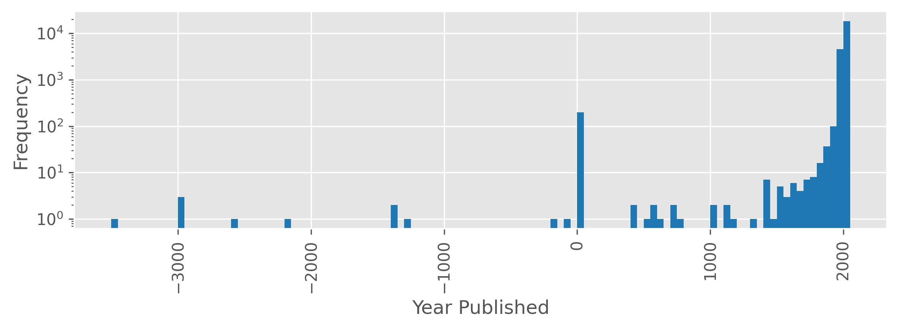
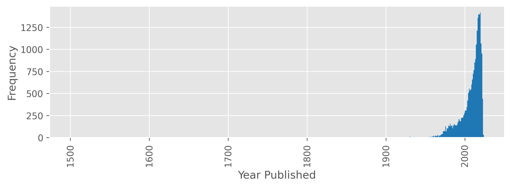
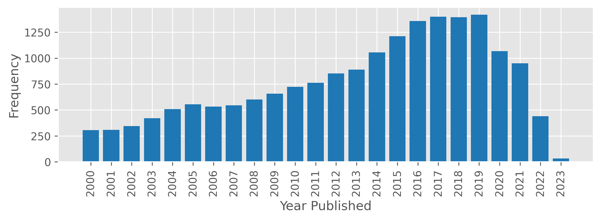
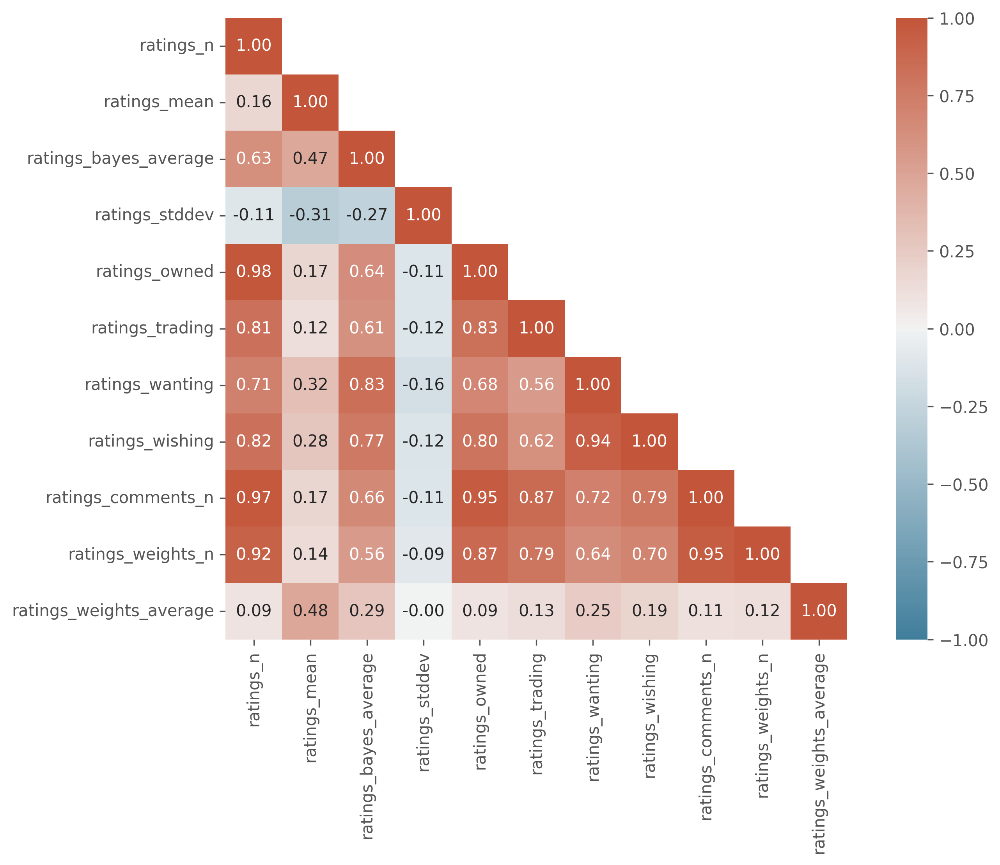
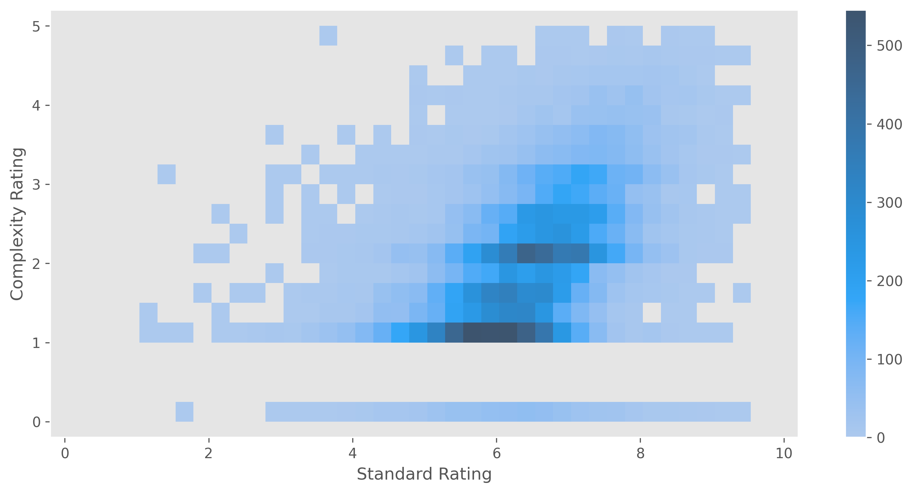

- *[Github repo for this project](https://github.com/andrewKOwong/boardgames)*
- *[Link to part one]()*

## Introduction
In a [previous post]()
I described a data download from [boardgamegeek.com](https://boardgamegeek.com/) (BGG)
on Sep 19, 2022.
In this post, I'll describe an exploratory data analysis on this data set by:
1) Describing an investigation into the "geek rating" of a boardgame,
and using this geek rating to narrow the scope of boardgames I look at.
2) Give an overview of general characteristics of this boardgame dataset.
3) Answer the question "Are we in a golden age of boardgames?"
by looking at how boardgame ratings have changed over time.

## Overview of Data
During the data download, I split boardgame data into three parts:
- The first part contains general information about the boardgame.
This consists of 108,015 game entries with 23 data fields.
- The second part contains data about other meta information for that boardgame,
which in the original XML data was contained in `<link>` tags for each game.
    This consists of ten types of metadata:
    - Artists that have worked on the game.
    - Designers that have worked on the game.
    - Publishers that have published the game.
    - Mechanics that the game uses (e.g. dice rolling, hand management)
    - Expansions of the game.
    - Compilations that the boardgame belongs to.
    - Games that reimplement the mechanics of the boardgame.
    - Games that can be integrated (i.e. combined with) the game. 
    - Categories of games that a game belongs to 
    (e.g. card game, war game, fantasy, party game)
    - Board game families that the game belongs to.
    This seems to be a more abstract type of categorization
    (e.g. "Players: Two Player Only Games", "Crowdfunding: Kickstarter", "Components: Miniatures")

    There are 1,053,398 link entries.
    Some of these links are "inbound" links,
    which happens when e.g. a boardgame is technically an expansion of another game,
    but is also a stand alone boardgame itself.

- The third part contains user polling data about aspects of the boardgame,
such as the optimal playtime that users think the boardgame will take to play.

For this analysis, I will only discuss the general data,
and ignore the link and polling data for now.

## The Bayesian Average Rating: Rated vs Unrated Games
### The Geek Rating: Rated vs Unrated Games

Games on BGG may be rated by users out of 10. Games that receive 30+ user ratings are assigned a ["geek rating"](https://boardgamegeek.com/wiki/page/BoardGameGeek_FAQ#toc13). This geek rating is used to rank board games against each other, and is necessary to prevent games with a few high rankings from appearing higher than games with a large number of rankings. For example, one may not want a game with five ratings of 10 to be considered a "better" board game than a game with a ratings mean of 4.8 but with 100K ratings. Games that don't meet the 30+ user rating threshold receive a geek rating of 0, and I'll refer to these games as "unrated" games.

The exact calculation method for the geek rating is not published by BGG,
but is apparently mostly a [Bayesian average](https://en.wikipedia.org/wiki/Bayesian_average).
Its construction probably involves taking the user ratings 
and adding in [100](https://boardgamegeek.com/wiki/page/BoardGameGeek_FAQ) 
to [1500-1600](https://boardgamegeek.com/blogpost/109537/reverse-engineering-boardgamegeek-ranking) 
dummy ratings with a value of 5.5.

Of the entire dataset, about 85K games are unrated 
versus 23K games with geek ratings.

### Visualizing the Effect of Dummy Ratings

The following scatterplot visualizes the impact of the dummy ratings.
Bayes ratings are plotted along the x axis and the actual ratings along the y.
The number of ratings a game possesses is mapped to the color of the points.

When the number of ratings is low,
the Bayes rating is composed mostly of dummy ratings
and ends up at around 5.5.
As the number of ratings increase,
actual ratings swamp out the dummy ratings
resulting in the points drifting toward to the `y=x` diagonal.


### Computing the Parameters of the Bayesian Average
If we assume the Bayesian average uses the model:

$$
r = 
    \frac
        { R m  + \sum_i^n x^i}
        {m + n}
$$

where Bayes average rating \\(r\\) is constructed from the sum of all user ratings
\\(x_i\\) and \\(m\\) dummy ratings of value \\(R\\), divided by the total of user ratings + dummy ratings,
then we can try to discover what values of \\(R\\) and \\(m\\) fits our data.

A caveat here is that this doesn't take into account other parameters
that BGG might be using, such as weighting ratings based on information about certain users.

I first translated the equation into a function that computes a Bayesian average with an arbitrary number of dummy ratings and average dummy rating value:
```python
def compute_bayesian_average(
    game_df: pd.DataFrame,
    dummy_rating: float,
    num_dummies: int,
    ratings_mean_key: str='ratings_mean',
    ratings_n_key: str='ratings_n'
    ) -> pd.Series:
    """Compute a Bayesian average using vectorized ops.
    
    Args:
        game_df: game dataframe with ratings info.
        dummy_rating: the mean rating for dummy values.
        num_dummies: number of dummy ratings to use.
        ratings_mean_key: col key for ratings mean.
        ratings_n_key: col key for number of ratings.
    
    Returns:
        pd.Series with computed Bayesian averages.
    """
    return (
        ((game_df[ratings_mean_key] * game_df[ratings_n_key]) 
            + (dummy_rating * num_dummies))
        /(game_df[ratings_n_key] + num_dummies))
```
We can then evaluate how far the generated Bayesian ratings are from the actual Bayesian ratings from BGG by calculating the [root-mean-square deviation (RMSD)](https://en.wikipedia.org/wiki/Root-mean-square_deviation):

```python
def compute_rmsd(
        y_trues: pd.Series|np.ndarray,
        y_preds: pd.Series|np.ndarray) -> float:
    """Compute the root mean squared deviation.
    
    Args:
        y_trues: 1D vector of .
        y_preds (np.ndarray or pd.Series): A 1D vector.
    Returns:
        RMSD as a scalar float.
    """
    # Check both are 1D vectors of same length.
    assert len(y_trues.shape) == 1
    assert y_trues.shape == y_preds.shape
    return np.sqrt(((y_trues - y_preds)**2).mean())
```

Next, we'll use the [`minimize` function](https://docs.scipy.org/doc/scipy/reference/generated/scipy.optimize.minimize.html) from `scipy.optimize` to find
the values of \\(R\\) and \\(m\\) that minimizes the RMSD of the
computed Bayesian averages.

We'll need to write a wrapper function that takes in \\(R\\) and \\(m\\) as an argument,
while outputting the RMSD.
This function will used as one of the parameters
for `minimize`.

```python
def error_wrapper(
    dummy_args: tuple[float, int],
    game_df: pd.DataFrame,
    bayes_average_key: str='ratings_bayes_average'
    ) -> float:
    """Objective function to minimize Bayes dummy parameters.

    This function is meant to be used in by `scipy.optimize.minimize` as
    the objective function to be minimized. The `game_df` param will be
    supplied in the `args` parameter for `minimize`.
    
    Args:
        dummy_args: a tuple of (dummy_rating, num_dummies)
            i.e. args for compute_bayesian_average().
        game_df: game dataframe from which y_true bayes average ratings
            are taken.
        bayes_average_key: col key for bayes average ratings. 
    
    Returns:
        Float for RMSD.
    """
    (dummy_rating, num_dummies) = dummy_args

    y_true = game_df[bayes_average_key] 
    y_pred = compute_bayesian_average(game_df, dummy_rating, num_dummies) 
    error = compute_rmsd(y_true, y_pred)
    return error 
```
Now we can run the optimization like so:

```python
# i.e. scipy.optimize.minimize
op_res = minimize(error_wrapper, (0, 0), args=(rated))
```
Here are the results:
```
Optimization terminated successfully.
        Current function value: 0.019480
        Iterations: 29
        Function evaluations: 120
        Gradient evaluations: 40
=============================================
Optimization Result
-------------------
Mean Dummy Rating: 5.495617489008271
Number of Dummy Ratings: 1972.456740224388
Final RMSD: 0.019480321333741443
```

The closest we can get to reproducing the real Bayes rating values
seems to be when the number of dummy ratings is around 1972
with a rating value of 5.5.

For comparison, here are the RMSDs for 0 dummies (i.e. the real user ratings), 100, 1500, and 1972 dummies at a rating value of 5.5:

|                   | RMSD |
|-------------------|------|
| Real User Ratings             | 1.1244 
| Computed Bayesian (100 x 5.5) | 0.6033 
| Computed Bayesian (1500 x 5.5)| 0.0520 
| Computed Bayesian (1972 x 5.5)| 0.0194

We can visualize this trend. In the following plot, the x axis plots the real Bayes rating values,
whereas the y axis plots the mean real user rating (panel A),
Bayes rating values when using 100 dummy values (B),
1500 dummy values (C),
and the number of dummy we got from our optimization i.e. ~1972 (D).
As we increase the number of dummy values, the generated Bayes rating
approached the real Bayes rating from BGG. The step from 1500 to 1972 ratings lowers the RMSD by a relatively small amount, suggesting that the 1500 estimate was fairly accurate.


[](images/optimizing_bayes_model.png)

We can look at the remaining difference between real Bayes ratings
and the computed Bayes ratings. 
In the plot below, 
the x axis plots the number of ratings on a log scale,
while the y axis plots the differences.

The residual differences are less than 0.1 for almost all games,
although there are a small number of strong outliers.

[](images/bayes_residuals.png)

## Data Overview
### Shape, Missing Values, and Duplicate Values
If we remove all the unrated games, we are left with 23318 game entries.
These contain 23 data columns,
of which the first 11 deal with properties of the game itself,
while the last 12 deal with user ratings of the game.

There are no duplicate game entries in this data set.

There is one instance of an empty data field present in the `description` column.
However, missing values are encoded as `0` in numerical columns.
There are no empty string values in text columns.

Let's take a brief look at each of these data columns.

### Name and Description
As a quick qualitative look at word frequencies in these text fields,
let's construct some [word clouds](https://amueller.github.io/word_cloud/generated/wordcloud.WordCloud.html)
that approximately display frequency of common words by size of the word,
while omitting [stop words](https://en.wikipedia.org/wiki/Stop_word) like "and", "the", etc.:

This is a word cloud from board game names:
[](images/name_wordcloud.png)

Similarly, this is a word cloud of the board game descriptions:
[](images/description_wordcloud.png)

### Year Published
The following plot shows a histogram of games by publication year.
The publication year for games ranges from -3500 to 2023 
(although one should probably consider anything before the modern era to be an approximate annotations).
The spike in games at year 0 is from 0 being used to encode missing values.
Note the log scale in the frequency axis.

[](images/year_histo_all.png)


Zooming into a more recent time scale,
we see that the vast majority of games are published in the last 70 years.

[](images/year_histo_1500.png)

If we look at games published 2000,
we see that the number of games published per year continues
to increase until 2020, with a strong dropoff after.

[](images/year_histo_modern.png)

This dropoff does not appear to be explained
by the time it takes for a game to reach thirty ratings,
as this dropoff appears for unrated games as well.
While the COVID-19 pandemic may be a factor,
the dropoff also seems too strong to be fully attributable to it.
Thus, I would guess that this reflects the time it takes
for games to be added to BGG,
but I would find this cause surprising as well,
as I would assume board game creators would add their games to BGG
as part of their marketing efforts.


### Players
Board games have a value for minimum and maximum number of players. 
For about 19% of games these values are the same.

The largest minimum number of players is 10,
while the largest maximum number of players goes up to 999.

If we ignore the games with a player max larger than 24,
we can construct a heatmap between minimum and maximum player numbers.
Most games are 2 players or 2-4 players.
Note that in cases where both the minimum and maximum are 0,
or where the maximum is 0 but the minimum is not,
most likely indicate the use of 0's as a missing value placeholder.

[](images/players_heatmap.png)

### Playtime
Board games have value for minimum playtime, playtime, and maximum playtime,
but the maximum playtime column is actually redundant with the playtime column.

Below is a heatmap showing the number of games in various
minimum and maximum playtime bins.
Games with 0 for both minimum and maximum playtimes are using
0 as as a missing value placeholder.
The biggest bin is for games with a 30 minute value for both
maximum and minimum playtime.

[](images/playtime_heatmap.png)

### Age

Boardgames have an associated mininum recommended age. Most of the minimum ages are 8, 10, 12 years.
Minimum ages of 0 are probably of mix of real values and missing value placeholders.

[](images/age_histogram.png)

### Ratings {#ratings}
There are a number of data columns related to user ratings of the boardgames,
which I've prefixed with `rating_`. Here's a description each column:

 - `ratings_n`: the number of ratings users have given
 - `ratings_mean`: the average of user ratings
 - `ratings_bayes_average`: the Bayesian average 'geek rating' as discussed above
 - `ratings_stddev`: standard deviation of user ratings
 - `ratings_median`: an unused data column
 - `ratings_owned`: how many users that have marked the game as being owned
 - `ratings_trading`: how many users are looking to trade away the game
 - `ratings_wanting`: users marked the game as wanted
 - `ratings_wishing`: users placed onto their wishlist
 - `ratings_comments_n`: how many times users have commented on the game
 - `ratings_weights_n`: times users have given a weight rating. This is supposed to how complex a user thinks a game is, from 1 (light complexity) to 5 (heavily complex).
 - `ratings_weights_average`: the mean of the weight rating. 

For a simplified look at these ratings columns, 
below is 1) a heatmap of the correlation coefficients between the columns and 2) the heatmap after clustering.

Heatmap:
[](images/ratings_heatmap.png)

Clustermap:
[](images/ratings_clustermap.png)

Some observations:
- the number of regular ratings, weight ratings, comments, and wishing/wanting/trading/owned statuses are highly to fairly correlated with each other.
- number of regular or weight ratings isn't correlated with the average score of the ratings.
- average rating has a mild correlation with the weight average rating, which could suggest more complex games are rated higher.


## What is the Golden Age of Board Games?
### Game Rating Over Time 

Let's take a look at the median rating of games by year.

Below, we can plot the median rating of games by year (the blue line, with the shaded area indicating Q1 and Q3) as well as the number of games published each year (the blue bars). 
I've arbitrarily limited the data to 1960 onwards, 
as this captures the vast majority of games, 
with the number of games published continuing to diminish before 1960.
For the latter half of the twentieth century, 
the median rating hovers around 6, 
but takes a turn upward starting around 2010 and reaching above 7 in 2020. 
For comparison I've also plotted the top 5% of games by number of ratings in orange in a similar fashion; the ratings for these games are generally higher, but we see the same trend as before.

Note that the number of games increases as we approach the present.


This data suggests that the quality of games has increased in this past decade, perhaps as game design improves over time and so forth.
However, there could be some form of [recency bias](https://en.wikipedia.org/wiki/Recency_bias).
For example, since there are more games published recently, 
one could imagine a boardgame enthusiast might be more interested in purchasing, playing, and/or rating a game published in the last ten years, compared to a "classic" boardgame from a decade or two ago that they haven't played in a while.
As well, very new games might have a higher proportion of [early adopter](https://en.wikipedia.org/wiki/Early_adopter)-style users that are more willingly enthusiastic than an average user.
This could be a contributor to the sharper uptick post-2020.

If we had to further investigate the reasons behind this uptick, we could gather data on individual reviews per game. For example, if we wanted to see if early adopters of a game tend to rate a game higher, we could see how the ratings for a game changes over time.


### Are Higher Ratings a Result of Increased Complexity?
As we saw [above](#ratings), standard ratings (`ratings_mean`) is moderately correlated with the complexity ratings (`ratings_weights_average`) with a Pearson's correlation coefficient of 0.48.

Let's take a look at what this looks like
by plotting a 2D histogram of 
standard ratings vs complexity ratings.



There appears to indeed be a slight positive association between the two sets of ratings.


This trend also holds when only considering the top 5% of games by number of standard ratings.


Given that standard ratings have increased in the 2010s,
we can also see if complexity ratings have increased concurrently.


It appears that an increasing in the 2010s is not obvious in either the top 5% or in all games. The spike in 2022/2023 is again probably some sort of bias from the smaller number of very recent games.

However, note that the median rating is actually generated from a small number of individual ratings (often <10):


### Ratings Versus Other Board Game Properties
Let's take a look to see if standard ratings are correlated with any other board game properties.


Given the low Pearson coefficients, there does not seem to be any obvious correlation.

## Discussion

Given that the number of boardgames published and the overall rating of boardgames has kept increasing in the last decade,
one could interpret this
to mean we have increasingly more and better choices of games to play (assuming one has similar taste to the aggregate tastes of BGG users).
Thus, it does seem reasonable to declare that we are in a golden age of boardgames.

While I found that higher complexity was moderately associated 
with increasing ratings of games,
for further work we could dig deeper into what types of mechanics, themes, or other attributes
are associated with ratings increases.
If we then integrated these as features in the main data set,
we start thinking about building models
to figure out which features contribute most to higher ratings.

On a minor technical note, my analysis would probably have been easier
if I had downloaded all boardgame ids instead of only boardgames alone
(e.g. without expansions etc.),
as this would have saved me some confusion and wrangling of missing
board game ids. 

As of this writing, [recommend.games](https://recommend.games/),
a website for recommending board games to play, is [on hiatus](https://blog.recommend.games/posts/announcement-hiatus/),
although a similar website [trythesegames.com](https://trythesegames.com/) is available. Looking at the [BGG XML API](https://boardgamegeek.com/wiki/page/BGG_XML_API2),
it appears one can download more detailed information about user ratings and collections.
It would be interesting to get this data and try to build a recommendation engine using it.

