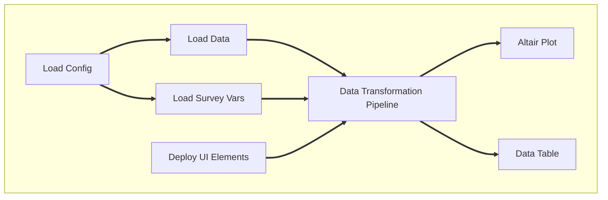

- The [repo for this project](https://github.com/andrewKOwong/clps)
is on Github.
- The [dashboard is deployed](https://clps-data.streamlit.app/) on Streamlit
Community Cloud.
- A sub-project extracting the CLPS codebook is
[here](https://mixedconclusions.com/blog/clps_survey_vars/)

## Introduction
In a previous blogpost, I extracted the survey variables from the CLPS codebook

[Some friends of mine](https://parallaxinformation.com/) have been using.

- Again, describe data, but not verbatim from other project.


In this project.

## Project Organization
The code for this project is organized as follows:
```
clps/
├── .streamlit/
│   └── config.toml
├── clps/
│   ├── survey_vars/
│   │   ├── __init__.py
│   │   ├── json_keys.py
│   │   └── utils.py
│   ├── __init__.py
│   ├── constants.py
│   └── transform.py
├── clps_docs
├── data/
│   ├── bootstraps.csv
│   ├── clps.csv
│   ├── clps.zip
│   └── survey_vars.json
├── test/
│   ├── __init__.py
│   ├── test_survey_var_utils.py
│   └── test_transform.py
├── text/
│   └── intro.md
├── .gitattributes
├── .gitignore
├── README.md
├── app.py
├── config.yaml
├── requirements.txt
└── validate_data.py
```

The main dashboard code is found in `app.py`,
containing the main logic flow and UI elements for the Streamlit app.

The `clps` folder contains module code that is called by `app.py`.
This includes the submodule `transform.py`
(handling pandas data transformation),
the `survey_vars` submodule (handling survey variable extraction
related constants),
and `constants.py` (which handles other project constants).

The `data` folder contains data from the CLPS PUMF
(`clps.csv` and `bootstraps.csv`)
as well as a compressed version of the CLPS data (`clps.zip`)
and the extracted survey variables (`survey_vars.json`)
from the codebook.

The `test` folder contains `pytest` tests.

The `text` folder holds long text/markdown files,
which right now consists of the introduction text for the dashboard.

`.streamlit` contains configuration info for Streamlit Community Cloud.
Additionally, `requirements.txt` contains the Python dependencies for
installation on Streamlit Community Cloud, but does not contain the full
list of dependencies for local developmenet (as some dependencies are already
loaded by SCC).

`config.yaml` contains project configuration info,
which is mostly file paths of the data.

`validate_data.py` is a script that does minor validation of the
CLPS data using [Pandera](https://pandera.readthedocs.io/en/stable/index.html)


## CLPS Methodology Overview
The methodology for the CLPS survey is described in detail in the
"Guide" section of the CLPS documentation, but a brief overview is given here.

To construct this dataset, StatsCan sampled 42,400 people drawn mostly from
the 2016 Canadian Census. This sample contains 29,972 people from the general
population, and 12,428 oversampled from the Indigenous population.
This sample was stratified by province,
and the Indigenous population further sub-stratified by Indigenous identity.
The response rate was 50.7%, and combined with other exclusions,
resulted in a final sample of 21,170 respondents.

To account for the stratified design,
StatsCan provides a set of survey weights.
These weights (ranging from 20 - 8140) represent the number of people
in the Canadian population that each respondent represents.
For example, a respondent with a weight of 570.9 (the median weight)
should have their response treated as if it represents 570.9 people.
Note that the sum of the weights is less than the total population of Canada,
has it takes into account the exclusions from the sample
(e.g. people less than 18 years of age).

For estimating sample variance, StatsCan also provides 1000 bootstrap
sample sets.
However, I did not use these for this project (see discussion).

## CLPS Data Overview
The primary dataset is a CSV file consisting of 21,170 rows and 277 columns.
Each row corresponds to a survey respondent,
whereas each column corresponds to a survey variable.

Of the 277 survey variables,
274 are represent a response to a survey question
(including demographic variables).
The remaining 3 columns are an ID column (`PUMFID`),
a column of survey weights (`WTPP`),
and a column representing the date the data was created
(`VERDATE`, which only consists of one value, `28/02/2022`).

Survey answers are represented as integers.
For example, survey variable `PRIP10A` represents a question with the text:
> Were the following disputes or problems serious and not easy to fix? -
> A large purchase or service where you did not get what you paid for
> and the seller did not fix the problem

which could be answered with the following values:
```python
{
    "Yes": 1,
    "No": 2,
    "Valid skip": 6,
    "Not stated": 9
}
```
Thus, the `PRIP10A` column will have the values 1, 2, 6, or 9.

`"Valid skip"` refers to a question that is not applicable to the respondent,
given their response to a previous question.
For `PRIP10A`, the question is only asked
if the respondent had answered "Yes" to the question for `PRIP05A`
with the text:
> Have you had any of the following types of disputes or problems in Canada
> since (month) 2018? - A large purchase or service where you did not get what
> you paid for and the seller did not fix the problem

<br>

The full list of survey variables and their answer encodings
can be in found in the CLPS codebook.
This is available as a PDF,
but I have also extracted the data as a JSON file
that can be
browsed [as a dashboard](https://clps-survey-variables.streamlit.app/)
in a [related project detailed in another blogpost](https://mixedconclusions.com/blog/clps_survey_vars/).


Since this data is mostly ints, it's highly compressable, with the zipped data
taking 576KB of space (from 12MB uncompressed).

## Data Validation
Before working with the data, I wanted to check my assumptions and compare the
data to the values extracted from the CLPS codebook
(see [previous blogpost](https://mixedconclusions.com/blog/clps_survey_vars/)).

Rather than simply coding the checks, I decided to use a data validation tool.
I had recently come across a
[YouTube video](https://www.youtube.com/watch?v=-tU7fuUiq7w)
discussing [Pandera](https://pandera.readthedocs.io/en/stable/index.html),
a data validation toolkit for `pandas` dataframes.
While it took me a bit of extra time to learn, I felt that a framework would
help organize the structure of the code and make it easier to scale for more
validation checks in the future.

Aside from simple checks like type checking, I wanted to check the following:
1) For the column `PUMFID`, that every row is unique.
2) The unique values in every column match the answer codes from each
survey variable extracted from the codebook. This excludes `PUMFID` and `WTPP`,
which do not contain answer codes.
3) Compiled answer frequencies and weighted frequencies match the codebook.
4) There are no null values.

Panderas primarily uses `DataFrameSchema` objects to
[validate
dataframes](https://pandera.readthedocs.io/en/stable/dataframe_schemas.html).
These schema objects are defined with various different checks,
 such as with column-based validation
(allowing one to check e.g.
the data types, null values, and more complex checks),
as well as
[wide checks](https://pandera.readthedocs.io/en/stable/checks.html?highlight=wide#wide-checks),
where checks operate on more than column of a dataframe simultaneously.
For checking matching answer codes and frequencies, I used column-based checks,
whereas for the weighted frequencies, I used wide checks as I had to compute
the sum of the weighted frequencies for each answer code using the `WTPP`
weight column. For checking the lack of null values, Pandera checks
disallow null values by default unless specified.

The validation script can be run with (in the top level directory):
```bash
python validate_data.py 2> validate_test_err.txt
```
Piping the `stderr` is optional, but convenient for inspection as Pandera
outputs its collected errors to the `stderr` stream. See `--help` for
input/output filepath options.

Side note: While writing this section, I came across [Great
Expectations](https://github.com/great-expectations/great_expectations),
another data validation tool that I'm curious to explore in the future.

## Dashboard Overview
The dashboard is built with [Streamlit](https://streamlit.io/).
I chose Streamlit as it promised an easy-to-use interface for building
dashboards from relatively simple Python scripts.

The dashboard can be accessed online at
[https://clps-data.streamlit.app/](https://clps-data.streamlit.app/).
Additionally, it can also be run locally by cloning the
[repository](https://github.com/andrewKOwong/clps)
and running `streamlit run app.py` in the top-level directory.

The dashboard is a single page, and looks like this:


On the left, a toggleable sidebar provides introductory information
as well as instructions on operating the dashboard.
On the right is the main part of the dashboard,
which is split into three sections.

The top section contains widgets for selecting the survey variable to display,
filtering by region, and grouping by demographic information.
Demographic variables are also survey variables
(e.g. "Age Group" refers to the data column "AGEGRP").
Note that a user cannot select a demographic variable and
groupby the same demographic variable.

There is also a checkbox to control whether weighted frequencies
are displayed
(i.e. checked will use survey weights to compute the weighted frequencies,
whereas unchecked will use raw counts of the survey respondents),
and a checkbox to control whether the plot below is
capable if mouse-based interactive panning and zooming.
Disabling pan/zoom can be useful for users who want to scroll up and down
over the dashboard without accidentally panning or zooming the plot.

The middle section contains a plot of the selected data,
(using Altair as the plotting library).
This is a bar plot that can be stacked by grouping variables.
Additionally, Streamlit handles interactive Altair plots,
allowing pan/zoom, hover tooltips, and the ability to save
the plot as a SVG/PNG file (via the three-dot menu in the top-right corner).

The bottom section contains a data table displaying the plotted data,
for convenient readability and inspection.

While I did not really consider responsive design when building the dashboard,
the default Streamlit behaviour seems to function well enough on mobile,
as most of the UI is down a central column.
However, some of the survey variables with many options
(i.e. with many categories on the x-axis)
 end up being extremely-cramped or unreadable on mobile

## Dashboard Implementation
### App Flow


1. Load the `config.yaml` configuation file.
This contains the filepaths to various input files,
as well as a flag for whether to load the compressed data.
It is loaded as a dictionary.
2. Load the CLPS data (`clps.zip`)
and the survey variable metadata (`survey_vars.json`).
The main CLPS data loader is cached to avoid reloading the data upon
app state changes.
Survey variable metadata is loaded into a custom `SurveyVars` class
(located in `clps.survey_vars.utils`) for convenient access.
3. Deploy the UI elements, which includes the sidebar and
various widgets for selecting/filtering/grouping.
4. Feed the widgets' return values and the CLPS data/metadata
into the data transformation pipeline
(this is a call to `clps.transform.transform()`).
5. The transformed data is plotted with Altair.
6. The transformed data is also then styled and displayed as a data table.

The details of each of these steps are discussed below.


### Representing the Survey Variables: `SurveyVars` Class
The `SurveyVars` class is a custom class defined in
`clps.survey_vars.utils`.
The constructor for the `SurveyVars` class takes in a file path
to the location of the survey variable metadata JSON file.
It calles a helper function `load_keyed_survey_vars()`
to load the JSON file
(which is formatted equivalently to a Python list of dicts).
This list of dicts is then converted into a dictionary
where the keys are the survey variable names,
and the values are `_SurveyVar` objects that
represent a single survey variable.

`SurveyVars` has several access mechanisms.
`.get_var(key: str)` returns a `_SurveyVar` object,
and an implemented `__getitem__` method allows for
`[ ]` bracket indexing.
Additionally, `get_all_var_names()` returns a list of all
the survey variable names. `get_region()` is a special
convenience method that returns the `_SurveyVar` object
for the "REGION" survey variable.

Individual `_SurveyVar` objects are created from their raw
JSON dictionary-like representations.
During instantiation,
private attributes for each piece of metadata are created
(e.g. `self._name`, `self._concept`, etc.).
These can then be accessed by public `@property` attributes
that are read-only.
As well, lookup dictionaries are generated for
allowing access to answer categories, frequencies, etc.,
by their answer codes.
These are accessed by `lookup_*()` methods
(e.g. `lookup_answer(code: int | str)`).
A `has_valid_skips()` method is provided to check whether
the survey variable has the "Valid skip" answer category.

Special handling is required for survey variable "PROBCNTP",
as the metadata has an aggregated answer category
"01-16" that sums up all the individual answer categories 1 to 16.
These numbers represents how many "serious problems"
a survey respondent reported having,
and are not aggregated in the main CLPS data.
The answer section for "PROBCNTP" is moved into
private attributes of the form `self._aggregate_*`,
and a new set of answer categories and codes is generated
that disaggregates the "01-16" category into individual
answer categories.
However, no attempt is made to disaggregate the frequencies,
weighted frequencies, or percentages,
as this would require access (and coupling) to the raw CLPS data,
which does not appear to be necessary at this time.

For any survey variable that has a missing metadata attribute
(e.g. "PUMFID" has no answer section at all),
calling the attribute returns `None`.
For `lookup_*()`` methods, this is also the default behaviour,
but a `suppress_missing=False` flag can be passed
to raise an `AttributeError` instead.

### UI Elements
UI elements are deployed in the main `app.py` file
by various `deploy_*()` functions.

`deploy_sidebar()` takes a file path to a text file
containing text for the sidebar text,
as read from `config.yaml`.

The data selection/filtering/grouping widgets are `st.selectbox()`
objects.
These objects take a list of options,
as well as a `format_func` that converts options to
appropriate strings for display.
The return values of these widgets are the selected options.
For example, `deploy_survey_var_selectbox()` returns
the selected survey variable name (e.g. `"AGEGRP"`),
which itself is returned from the `st.selectbox()`
used in the function.
The checkboxes operate similarly.

When the user changes an option,
Streamlit [reruns the entire app script
](docs.streamlit.io/library/get-started/main-concepts#app-model)
with the new option value set.
Hence, it is important for relatively expensive operations
like data-loading to be cached with `@st.cache_data`.


### Data Transformation Pipeline
The collected UI widget values,
along with the CLPS data and survey variable metadata,
are passed to `clps.transform.transform()`.

This function calls internal helper functions in
`clps.transform` to do the following:
- Filter the CLPS data for the region of interest (row filtering).
- Filter by the selected and groupby variables (column filtering).
- Replace integer answer codes with string answer categories,
stored as a ordered categorical data type.
- Filter out "Valid skip" answer categories, if applicable.
- Groupby and aggregate. This is done by summing up the survey
weights for weighted frequencies, or counting the rows for raw
frequencies.

The transformed data is returned as a `DataFrame`.


### Plotting with Altair
Originally, I wanted to plot the data with `matplotlib`,
as I was already familiar with it.
However, it seemed to me that for interactive plots,
I would have to [use third-party libraries
](https://blog.streamlit.io/make-your-st-pyplot-interactive/)
 like `mpld3`,
or use an interactive backend.
It wasn't immediately obvious to me how much work this would be.
I then noticed that the default Streamlit plotting functions used
Altair as their plotting library.
These plots look quite good and had interactivity without much configuration,
so I thought I might as well learn Altair and have some fun wit it.

Note: when I was first developing the app,
Streamlit only supported Altair version 4,
but now supports Altair version 5 as of the
[June 1, 2023 Streamlit version 1.23.0 release
](docs.streamlit.io/library/changelog#version-1230).

The main plotting function in `app.py` is `create_chart()`.
The body of this function deals largely with a number of chart arguments
before passing them into the `alt.Chart` object in a series of chained
methods:

```python
return (alt.Chart(df)
        .mark_bar()
        .encode(**chart_args)
        .configure_axis(labelFontSize=14,
                        titleFontSize=16,
                        ))
```
The four steps in the chain correspond to steps
1. Loading the data into a `Chart` object.
2. Specifying that the chart should be a bar chart.
3. Specifying how the data should be converted into the bars.
This includes what variable the bars should be,
how and what order the bars should be stacked,
what the axis labels should be, etc.
4. Configuring global parameters for the chart.

This design I find to be quite elegant.
However, I did encounter some issues.

### Issues and Considerations with Altair plotting.
#### Altair Aggregations
Altair offers the ability to aggregate the data within
the `Chart` object itself.
This was my initial design, as it seemed extremely convenient.
However, as I wanted to test the data transformations for correctness,
I needed a way to look at the data post-aggregation.
I was unable to find a way to do this.
I tried to pull out the Vega/Vega-Lite specification,
which appeared to only contain unaggregated data.
Subsequently, I put all data transformation logic into
`pandas` operations as described above,
which allowed me to test the transformed data.

#### Stacked Bar Chart Sort Order

- weird altair stuff
    - sort order
    - docs colour sorting actually from altair 5, which streamlit doesn't
    currently support
- why not use altair aggregations
    - testing
    - also makes it easier to do all transformations at once,
    took a while to move from prototype to this,
    extracting all the UI logic, clean decoupled.
- line label breaking.

### Data Table Display
- Updates to streamlit

## Testing
- data transformations
- surveyvars
- some eyeball testing.
    - not super easy to get, potentially use selenium in the future

## Discussion and Future Improvements
- selenium in the future instead of eye ball testing.
- refactor survey var loading in order to cache, try the JSON,
the load into survey var constructor.

- other rigorous testing?