- The [repo for this project](https://github.com/andrewKOwong/clps_data)
is on Github.
- The [dashboard is deployed](https://clps-data.streamlit.app/) on Streamlit
Community Cloud.
- A sub-project extracting the CLPS codebook is
[here](https://mixedconclusions.com/blog/clps_survey_vars/)
- Note: this post was last updated on 2023-06-19,
and may not reflect app updates since then.
- To learn more about how this dataset can help your organization,
please contact [Parallax Information Consulting](https://parallaxinformation.com/).

## Introduction
Some friends of mine at
[Parallax Information Consulting](https://parallaxinformation.com/)
have been working with a dataset from Statistics Canada (StatsCan)
derived from the [Canadian Legal Problems Survey](
https://www.justice.gc.ca/eng/rp-pr/jr/survey-enquete.html
) (CLPS). This survey is a national survey of Canadians' experiences
with the justice system, and is conducted periodically,
with the most recent survey conducted in 2021.

The main dataset is provided by StatsCan as a [Public Use Microdata File](
https://www150.statcan.gc.ca/n1/pub/35-25-0002/352500022022001-eng.htm),
containing both data and documentation describing the data and survey
methodology.

In a [previous blogpost](
https://mixedconclusions.com/blog/clps_survey_vars/
), I describe the extraction
I performed of survey metadata from a PDF "codebook" provided by StatsCan.
In this blogpost, I describe the construction of a dashboard from the
main CLPS dataset itself.
First, I'll give an overview of the organization of the project
and go through the structure of the data.
Then I'll describe some simple data validation procedures I performed using
a data validation toolkit called
[Pandera](https://pandera.readthedocs.io/en/stable/index.html).
Finally, I'll spend the bulk of this post describing the dashboard and its implementation,
including various issues I encountered.

## Project Organization
The code for this project is organized as follows:
```txt
clps/
├── .streamlit/
│   └── config.toml
├── clps/
│   ├── survey_vars/
│   │   ├── __init__.py
│   │   ├── json_keys.py
│   │   └── utils.py
│   ├── __init__.py
│   ├── constants.py
│   └── transform.py
├── clps_docs
├── data/
│   ├── clps.zip
│   └── survey_vars.json
├── test/
│   ├── __init__.py
│   ├── test_survey_var_utils.py
│   └── test_transform.py
├── text/
│   └── intro.md
├── .gitattributes
├── .gitignore
├── README.md
├── app.py
├── config.yaml
├── requirements.txt
└── validate_data.py
```

The main dashboard code is found in `app.py`,
containing the main logic flow and UI elements for the Streamlit app.

The `clps` folder contains module code that is called by `app.py`.
This includes the submodule `transform.py`
(handling `pandas` data transformations),
the `survey_vars` submodule (handling survey variable extraction),
and `constants.py` (which handles project-level constants).

The `data` folder
contains a compressed version of the CLPS data (`clps.zip`)
and the extracted survey variables (`survey_vars.json`)
from the codebook.
Note: `clps.zip` corresponds to `clps2021ecpj_p.csv` in the CLPS PUMF.

The `test` folder contains `pytest` tests.

The `text` folder holds long text/markdown files,
which right now consists of the introduction text for the dashboard.

`.streamlit` contains configuration info for Streamlit Community Cloud (SCC).
Additionally, `requirements.txt` contains the Python dependencies for
installation on Streamlit Community Cloud, but does not contain the full
list of dependencies for local development (as some dependencies are already
loaded by SCC).

`config.yaml` contains project configuration info,
which is mostly file paths for the data.

`validate_data.py` is a script that does minor validation of the
CLPS dataset using [Pandera](https://pandera.readthedocs.io/en/stable/index.html).


## CLPS Methodology Overview
The methodology for the CLPS survey is described in detail in the
"Guide" section of the CLPS documentation, but a brief overview is given here.

To construct this dataset, StatsCan sampled 42,400 people drawn mostly from
the 2016 Canadian Census. This sample contains 29,972 people from the general
population, and 12,428 people oversampled from the Indigenous population.
This sampling was stratified by province,
and the Indigenous population further sub-stratified by Indigenous identity.
The response rate was 50.7%, and combined with other exclusions,
resulted in a final sample of 21,170 respondents.

To account for the stratified design,
StatsCan provides a set of survey weights.
These weights (ranging from 20 - 8140) represent the number of people
in the Canadian population that each respondent represents.
For example, a respondent with a weight of 570.9 (the median weight)
should have their response treated as if it represents 570.9 people.
Note that the sum of the weights is less than the total population of Canada,
as it takes into account the exclusions from the sample
(e.g. people less than 18 years of age).

For estimating sample variance, StatsCan also provides 1000 bootstrap
sample sets.
However, I did not use these for this project (see discussion).

## CLPS Data Overview

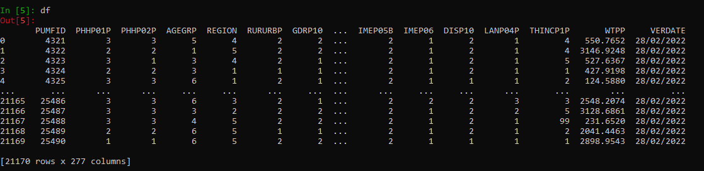


The primary dataset is a CSV file consisting of 21,170 rows and 277 columns.
Each row corresponds to a survey respondent,
whereas each column corresponds to a survey variable.

Of the 277 survey variables,
274 are represent a response to a survey question
(including demographic variables).
The remaining 3 columns are an ID column (`PUMFID`),
a column of survey weights (`WTPP`),
and a column representing the date the data was created
(`VERDATE`, which only consists of one value, `28/02/2022`).

Survey answers are represented as integers.
For example, survey variable `PRIP10A` represents a question with the text:
> Were the following disputes or problems serious and not easy to fix? -
> A large purchase or service where you did not get what you paid for
> and the seller did not fix the problem

which could be answered with the following values:
```python
{
    "Yes": 1,
    "No": 2,
    "Valid skip": 6,
    "Not stated": 9
}
```
Thus, the `PRIP10A` column will have the values 1, 2, 6, or 9.

`"Valid skip"` refers to a question that is not applicable to the respondent,
given their response to a previous question.
For `PRIP10A`, the question is only asked
if the respondent had answered "Yes" to the question for `PRIP05A`
with the text:
> Have you had any of the following types of disputes or problems in Canada
> since (month) 2018? - A large purchase or service where you did not get what
> you paid for and the seller did not fix the problem

<br>

The full list of survey variables and their answer encodings
can be in found in the CLPS codebook.
This is available as a PDF,
but I have also extracted the data as a JSON file
that can be
browsed [as a dashboard](https://clps-survey-variables.streamlit.app/)
in a [related project detailed in another blogpost](https://mixedconclusions.com/blog/clps_survey_vars/).


Since this data is mostly ints, it's highly compressable, with the zipped data
taking 576KB of space (from 12MB uncompressed).

## Data Validation
Before working with the data, I wanted to check my assumptions and compare the
data to the values extracted from the CLPS codebook
(see [previous blogpost](https://mixedconclusions.com/blog/clps_survey_vars/)).

Rather than simply coding the checks, I decided to use a data validation tool.
I had recently come across a
[YouTube video](https://www.youtube.com/watch?v=-tU7fuUiq7w)
discussing [Pandera](https://pandera.readthedocs.io/en/stable/index.html),
a data validation toolkit for `pandas` dataframes.
While it took me a bit of extra time to learn, I felt that a framework would
help organize the structure of the code and make it easier to scale for more
validation checks in the future.

Aside from simple checks like type checking, I wanted to check the following:
1) For the column `PUMFID`, that every row is unique.
2) The unique values in every column match the answer codes from each
survey variable extracted from the codebook. This excludes `PUMFID` and `WTPP`,
which do not contain answer codes.
3) Compiled answer frequencies and weighted frequencies match the codebook.
4) There are no null values.

Panderas primarily uses `DataFrameSchema` objects to
[validate
dataframes](https://pandera.readthedocs.io/en/stable/dataframe_schemas.html).
These schema objects are defined with various different checks,
 such as with column-based validation
(allowing one to check e.g.
the data types, null values, and more complex checks),
as well as
[wide checks](https://pandera.readthedocs.io/en/stable/checks.html?highlight=wide#wide-checks),
where checks operate on more than column of a dataframe simultaneously.
For checking matching answer codes and frequencies, I used column-based checks,
whereas for the weighted frequencies, I used wide checks as I had to compute
the sum of the weighted frequencies for each answer code using the `WTPP`
weight column. For checking the lack of null values, Pandera checks
disallow null values by default unless specified.

The validation script can be run with (in the top level directory):
```bash
python validate_data.py 2> validate_test_err.txt
```
Piping the `stderr` is optional, but convenient for inspection as Pandera
outputs its collected errors to the `stderr` stream. See `--help` for
input/output filepath options.

Side note: while writing this section, I came across [Great
Expectations](https://github.com/great-expectations/great_expectations),
another data validation tool that I'm curious to explore in the future.

## Dashboard Overview
The dashboard is built with [Streamlit](https://streamlit.io/).
I chose Streamlit as it promised an easy-to-use interface for building
dashboards from relatively simple Python scripts.

The dashboard can be accessed online at
[https://clps-data.streamlit.app/](https://clps-data.streamlit.app/).
Additionally, it can also be run locally by cloning the
[repository](https://github.com/andrewKOwong/clps_data)
and running `streamlit run app.py` in the top-level directory.

The dashboard is a single page, and looks like this:


On the left, a toggleable sidebar provides introductory information
as well as instructions on operating the dashboard.
On the right is the main part of the dashboard,
which is split into three sections.

The top section contains widgets for selecting the survey variable to display,
filtering by region, and grouping by demographic information.
Demographic variables are also survey variables
(e.g. "Age Group" refers to the data column "AGEGRP").
Note that a user cannot select a demographic variable and
groupby the same demographic variable.

There is also a checkbox to control whether weighted frequencies
are displayed
(i.e. checked will use survey weights to compute the weighted frequencies,
whereas unchecked will use raw counts of the survey respondents),
and a checkbox to control whether the plot below is
capable of mouse-based interactive panning and zooming.
Disabling pan/zoom can be useful for users who want to scroll up and down
over the dashboard without accidentally panning or zooming the plot.

The middle section contains a plot of the selected data,
(using Altair as the plotting library).
This is a bar plot that can be stacked by grouping variables.
Additionally, Streamlit handles interactive Altair plots,
allowing pan/zoom, hover tooltips, and the ability to save
the plot as a SVG/PNG file (via the three-dot menu in the top-right corner).

The bottom section contains a data table displaying the plotted data,
for convenient readability and inspection.

While I did not really consider responsive design when building the dashboard,
the default Streamlit behaviour seems to function well enough on mobile,
as most of the UI is inside a central column.
However, some of the survey variables with many options
(i.e. with many categories on the x-axis)
 end up being extremely-cramped or unreadable on mobile

## Dashboard Implementation
### App Flow

Here is an overview of the data flow in the dashboard app:
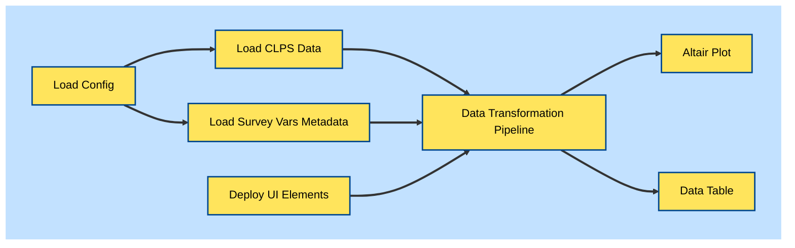

The steps are:
1. Load the `config.yaml` configuation file.
This contains the filepaths to various input files,
as well as a flag for whether to load the compressed data.
It is loaded as a dictionary.
2. Load the CLPS data (`clps.zip`)
and the survey variable metadata (`survey_vars.json`).
The main CLPS data loader is cached to avoid reloading the data upon
app state changes.
Survey variable metadata is loaded into a custom `SurveyVars` class
(located in `clps.survey_vars.utils`) for convenient access.
3. Deploy the UI elements, which includes the sidebar and
various widgets for selecting/filtering/grouping.
4. Feed the widgets' return values and the CLPS data/metadata
into the data transformation pipeline
(this is a call to `clps.transform.transform()`).
5. Plot the transformed data with Altair.
6. Style and display the transformed data as a table.

The details of selected steps are discussed below.


### Representing the Survey Variables: `SurveyVars` Class
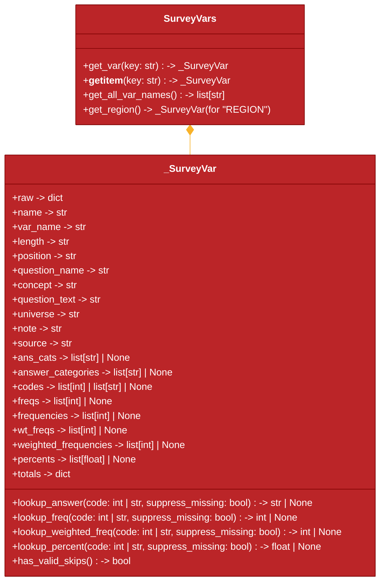


The `SurveyVars` class is a custom class defined in
`clps.survey_vars.utils`.
The constructor for the `SurveyVars` class takes in a file path
to the location of the survey variable metadata JSON file.
It calls a helper function `load_keyed_survey_vars()`
to load the JSON file
(which is formatted equivalently to a Python list of dicts).
This list of dicts is then converted into a dictionary
where the keys are the survey variable names,
and the values are `_SurveyVar` objects that
represent a single survey variable.

`SurveyVars` has several access mechanisms.
`get_var(key: str)` returns a `_SurveyVar` object,
and implementing the `__getitem__` dunder method allows for
`[ ]` bracket indexing.
Additionally, `get_all_var_names()` returns a list of all
the survey variable names. `get_region()` is a special
convenience method that returns the `_SurveyVar` object
for the "REGION" survey variable.

Individual `_SurveyVar` objects are created from their raw
JSON dictionary-like representations.
During instantiation,
private attributes for each piece of metadata are created
(e.g. `self._name`, `self._concept`, etc.).
These can then be accessed by public `@property` attributes
that are read-only.
As well, lookup dictionaries are generated for
allowing access to answer categories, frequencies, etc.,
by their answer codes.
These are accessed by `lookup_*()` methods
(e.g. `lookup_answer(code: int | str)`).
A `has_valid_skips()` method is provided to check whether
the survey variable has the "Valid skip" answer category.

Special handling is required for survey variable "PROBCNTP",
as the metadata has an aggregated answer category
"01-16" that sums up all the individual answer categories 1 to 16.
These numbers represents how many "serious problems"
a survey respondent reported having,
and are not aggregated in the main CLPS data.
The answer section for "PROBCNTP" is moved into
private attributes of the form `self._aggregate_*`,
and a new set of answer categories and codes is generated
that disaggregates the "01-16" category into individual
answer categories.
However, no attempt is made to disaggregate the frequencies,
weighted frequencies, or percentages,
as this would require access (and coupling) to the raw CLPS data,
and does not appear to be necessary at this time.

For any survey variable that has a missing metadata attribute
(e.g. "PUMFID" has no answer section at all),
calling the attribute returns `None`.
For `lookup_*()` methods, this is also the default behaviour,
but a `suppress_missing=False` flag can be passed
to raise an `AttributeError` instead.

### UI Elements
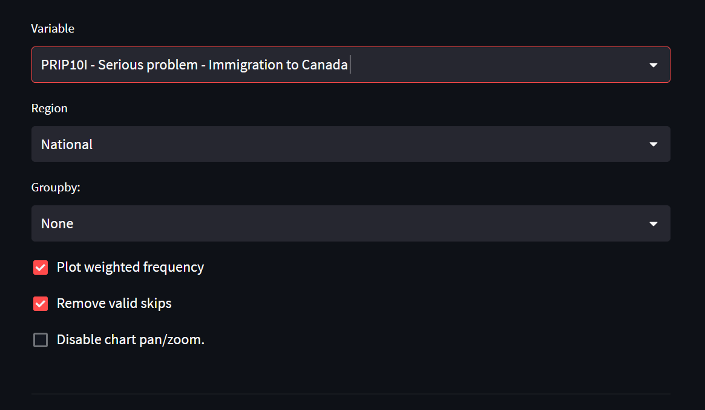

UI elements are deployed in the main `app.py` file
by various `deploy_*()` functions.

`deploy_sidebar()` takes a file path to a text file
containing text for the sidebar text,
as read from `config.yaml`.

The data selection/filtering/grouping widgets are `st.selectbox()`
objects.
These objects take a list of options,
as well as a `format_func` that converts options to
appropriate strings for display.
The return values of these widgets are the selected options.
For example, `deploy_survey_var_selectbox()` returns
the selected survey variable name (e.g. `"AGEGRP"`),
which itself is returned from the `st.selectbox()`
used in the function.
The checkboxes operate similarly.

When the user changes an option,
Streamlit [reruns the entire app script
](https://docs.streamlit.io/library/get-started/main-concepts#app-model)
with the new option value set.
Hence, it is important for relatively expensive operations
like data-loading to be cached with `@st.cache_data`.


### Data Transformation Pipeline
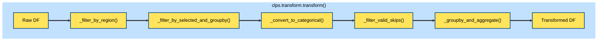


The collected UI widget values,
along with the CLPS data and survey variable metadata,
are passed to `clps.transform.transform()`.

This function calls internal helper functions in
`clps.transform` to do the following:
- Filter the CLPS data for the region of interest (row filtering).
- Filter by the selected and groupby variables (column filtering).
- Replace integer answer codes with string answer categories,
stored as a ordered categorical data type.
- Filter out "Valid skip" answer categories, if applicable.
- Groupby and aggregate. This is done by summing up the survey
weights for weighted frequencies, or counting the rows for raw
frequencies.

The transformed data is returned as a `DataFrame`.


### Plotting with Altair

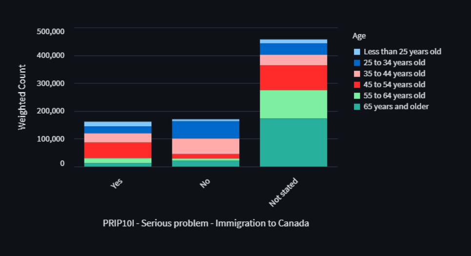


Originally, I wanted to plot the data with `matplotlib`,
as I was already familiar with it.
However, it seemed to me that for interactive plots,
I would have to [use third-party libraries
](https://blog.streamlit.io/make-your-st-pyplot-interactive/)
 like `mpld3`,
or use an interactive backend.
It wasn't immediately obvious to me how much work this would be.
I then noticed that the default Streamlit plotting functions used
Altair as their plotting library.
These plots look quite good and had interactivity without much configuration,
so I thought I might as well learn Altair and have some fun with it.

Note: when I was first developing the app,
Streamlit only supported Altair version 4,
but now supports Altair version 5 as of the
[June 1, 2023 Streamlit version 1.23.0 release](
    https://docs.streamlit.io/library/changelog#version-1230).

The main plotting function in `app.py` is `create_chart()`.
The body of this function deals largely with a number of chart arguments
before passing them into the `alt.Chart` object in a series of chained
methods:

```python
return (alt.Chart(df)
        .mark_bar()
        .encode(**chart_args)
        .configure_axis(labelFontSize=14,
                        titleFontSize=16,
                        ))
```
The four steps in the chain correspond to steps
1. Loading the data into a `Chart` object.
2. Specifying that the chart should be a bar chart.
3. Specifying how the data should be converted into the bars.
This includes what variable the bars should be,
how and what order the bars should be stacked,
what the axis labels should be, etc.
4. Configuring global parameters for the chart.

This design I find to be quite elegant.
However, I did encounter some issues.

### Issues and Considerations with Altair Plotting
#### Altair Aggregations vs Pandas Aggregations
Altair offers the ability to aggregate the data within
the `Chart` object itself.
This was my initial design, as it seemed extremely convenient.
However, as I wanted to test the data transformations for correctness,
I needed a way to look at the data post-aggregation.
I was unable to find an easy way to do this.
I tried to pull out the Vega/Vega-Lite specification,
but they appeared to only contain unaggregated data.
Subsequently, I put all data transformation logic into
`pandas` operations as described above,
which allowed me to test the transformed data.
Essentially, this also allows decoupling of transformation vs plotting.

#### Stacked Bar Chart Sort Order
For stacked bar charts,
the default behaviour of Altair is to sort the colour bars
by the names of the grouping variable's subgroups.

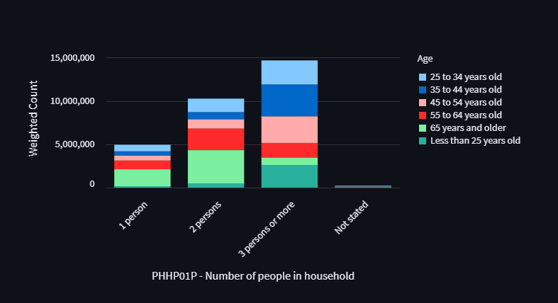

However, this is not desireable, as the CLPS
survey variables have their own implicit order,
as specified in the codebook.
Setting an `:O` flag for ordinal data
to pull
the internal order from a Pandas ordered `Categorical` dtype column
is not a currently supported solution in Altair.


A custom sort order can be specified in the `color` encoding channel:
```python
groupby_order = list(df[groupby_var].cat.categories)
color = alt.Color(
            f"{groupby_var}:N",
            sort=alt.Sort(groupby_order)
            )
```
While this sorts the legend,
it does not actually sort the order of the stacked bars themselves:


Surprisingly, there is no native way to provide a custom ordering
to the stacked bar order.
Instead, the official documentation points to the solution
found in [this Github comment](
    https://github.com/altair-viz/altair/issues/245#issuecomment-748443434
),
wherein the `order` encoding is used
to access an underlying variable in the Vega specification
(of the form `f"color_{groupby_var}_sort_index"`).
Thus, in the case where grouping is performed
for the age group variable (``"AGEGRP"``):

```python
groupby_order = list(df[groupby_var].cat.categories)
color = alt.Color(
    f"{groupby_var}:N",
    title=GROUPBY_VARS[groupby_var],
    sort=alt.Sort(groupby_order)
    )
order = alt.Order(
    f'color_{groupby_var}_sort_index:Q', sort='descending')
```
the resulting variable would be `"color_AGEGRP_sort_index"`.

You can actually see this variable name if you use the default tooltip:


#### Breaking Long Bar Chart Labels
For some survey variables, the name of some categories
can be very long, and would look better with line wrapping:

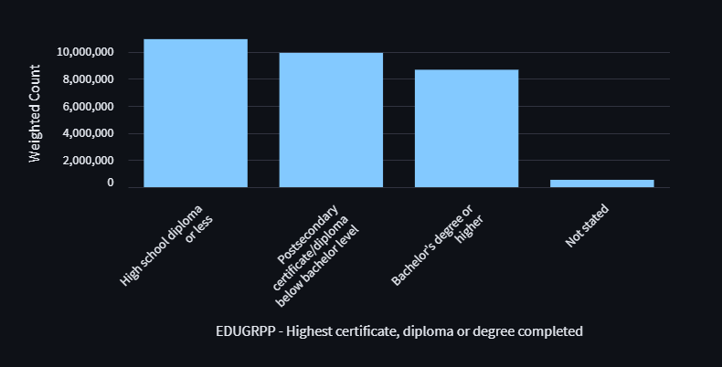

One way to wrap labels is to
[split the label into separate list items](
https://stackoverflow.com/questions/71215156/how-to-wrap-axis-label-in-altair
).
For reasons I did not end up diagnosing,
this did not work for me.

I ended up using a workaround
where I split the labels using `textwrap.wrap()`,
joined the list with the delimiter `----`,
then used the `labelExpr` argument in `alt.Axis`
to provide a [Vega expression](
    https://vega.github.io/vega/docs/expressions/
) that splits the labels on the delimiter:
```python
x = alt.X(f"{selected_var}",
              type='ordinal',
              title=f"{selected_var} - {survey_vars[selected_var].concept}",
              sort=list(df[selected_var].cat.categories),
              axis=alt.Axis(labelLimit=1000,
                            labelAngle=-45,
                            labelOverlap=False,
                            # Vega expression to split the labels
                            labelExpr=f"split(datum.label, '{LABEL_SPLIT}')"))
```

Newlines apparently do not work as a delimiter,
although I did not investigate this further to confirm.


### Data Table Display

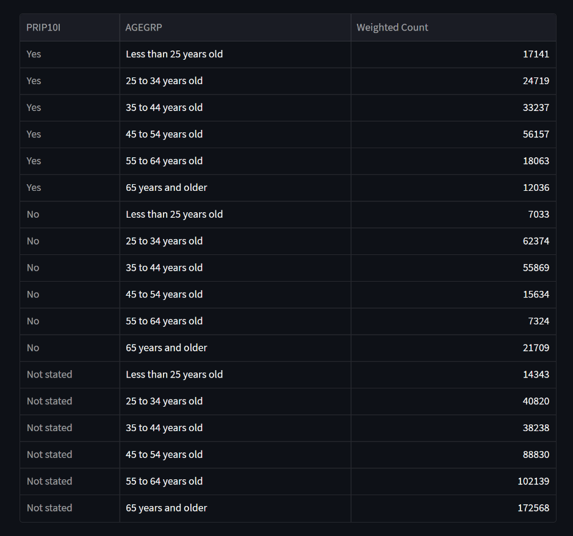


The output from `transform()` is also displayed as a data table,
and is processed by `style_datatable()` to return a Pandas `Styler` object.
Although there is no styling applied currently,
this `Styler` object allows further styling of the table,
either by altering `style_datatable()` itself,
or via further chained method calls on the `Styler` object
in the main `app.py` body.
This styled dataframe is then passed into `st.dataframe()`,
with a [magic formula](
https://discuss.streamlit.io/t/st-dataframe-controlling-the-height-threshold-for-scolling/31769
) passed to the height argument to prevent scrolling on the data table.

While I was originally working on this app,
Streamlit did not support hiding of the index column
via a
[call](https://pandas.pydata.org/docs/reference/api/pandas.io.formats.style.Styler.hide.html)
to `Styler.hide()`.
As well, there was a bug in the display of categorical index columns.
Both these issues appear to have been fixed in the
[June 1, 2023 release of Streamlit 1.23.0](
    https://docs.streamlit.io/library/changelog#version-1230
)
(search for "hide_index" and
"display issue with index columns using category dtype").

## Testing

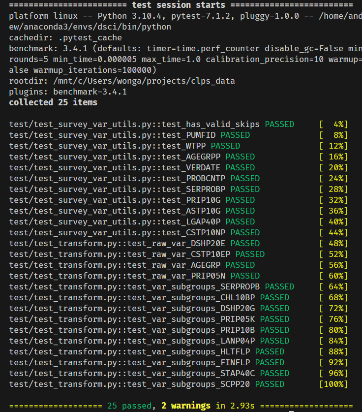

Testing is primarily handled using [Pytest](https://docs.pytest.org/en/7.3.x/).
The test suite is located in the `tests/` directory,
and covers the `clps.transform` and `clps.survey_vars.utils`
submodules.
The test suite can be run with using
`pytest` in the shell at the project root directory.
Use `-vv` optionally for verbose output.

For `clps.transform`, I tested the final output of the `transform()` function.
The first set of tests covers the cases where there is no groupby variable.
For several selected survey variables, the output of `transform()` was
compared with reference values (frequencies etc.)
that were manually obtained from the codebook.
The second set of tests covers the cases where there is a groupby variable.
Here, I picked several survey variables and then picked a
different subcategory and subgroup for each survey variable.
The output of `transform()` was then compared against a freshly written
set of `pandas` methods that would perform the same operations to
extract that particularly subcategory and subgroup.


For `clps.survey_vars.utils`,
I instantiated a `SurveyVars` object
and pulled out several individual `_SurveyVar` objects
representing individual survey variables.
For these, I tested various methods/attributes of the `_SurveyVar` objects
(e.g. `has_valid_skips`, `lookup_answer`, `universe`, `note`, etc.)
and compared them against reference values from the codebook.

For testing the coherence between the data table
and the plots, I relied on manual visual testing.
Essentially, I picked a few variables at random and check if the
size of the stacked bars and their tooltips match the data table.
This is not ideal, and potentially could be automated with a library
like [Selenium](https://www.selenium.dev/) in the future.
Given the data flow (data transformation -> chart / table)
and minimal manipulation during chart creation,
I thought it was not too likely that the data would be mutated accidentally,
and decided to leave automated testing for the future.

## Miscellaneous Issues: Using Git Large File Storage

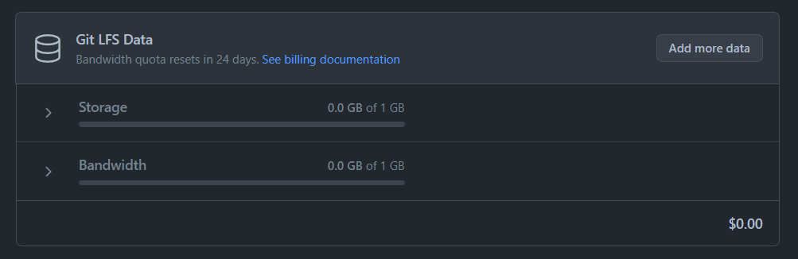

Originally, I was going to package the original uncompressed CLPS data and bootstraps
along with the repo using [Git Large File Storage (LFS)
](https://docs.github.com/en/repositories/working-with-files/managing-large-files/configuring-git-large-file-storage).
Github offers 1GB of storage and 1GB of bandwidth per month for free,
which I assumed would be plenty,
as these two files together are around 200MB,
and I wasn't expecting that many people would try to clone the repo.
It turns out, I alone overshot this bandwidth limit in less than 10 minutes
while I was doing some troubleshooting
and ended up cloning the repo a few times.

Since the original data is distributed by StatsCan regardless,
I decided to remove this data from the repo and from registration with Git LFS.
Personally, I found this surprisingly confusing.

The [instructions
](https://docs.github.com/en/repositories/working-with-files/managing-large-files/removing-files-from-git-large-file-storage)
on Github recommend [first using a tool
 ](https://docs.github.com/en/authentication/keeping-your-account-and-data-secure/removing-sensitive-data-from-a-repository)
 such as `git-filter-repo` to purge your git history of these large files.
It then recommends either removing the files from `.gitattributes`
or running `git lfs uninstall`.
However `git lfs uninstall` appears to just uninstall `git-lfs` from my system.
What I found was left was a `.git/lfs` directory that still contained
local copies of the large files.

I ended up just deleting the `.git/lfs` directory,
although I'm not sure if I was supposed to use [`git-lfs-prune`
](https://www.mankier.com/1/git-lfs-prune#:~:text=In%20general%20terms%2C%20prune%20will,orphaned%20commits%20are%20always%20deleted.)
instead.
I also ended up running `git-filter-repo` on the `.gitattributes` file itself,
since I had nothing in there information in there except for the large file storage
information.

The Github docs then say that the [only way to remove
](https://docs.github.com/en/repositories/working-with-files/managing-large-files/removing-files-from-git-large-file-storage#git-lfs-objects-in-your-repository)
the large files from the Github LFS storage quota itself
is to delete the Github repo and recreate it.
This is a bit of a hassle, as I had to make backups,
create a new repo, move things over, etc.

In the future, I think I would consider more carefully
whether there are alternatives before using Git LFS.


## Discussion and Future Improvements
There are several areas of discussion and potential improvements.


### Data Caching

Currently, the main CLPS data is cached using the `@st.cache_data` decorator.
However, the loading of `survey_variables.json` is not cached.
This is because the `@st.cache_data` decorator only works
if the function output is pickleable.

A potential option would to cache the loading of the `survey_variables.json`
file itself,
and the construct the `SurveyVars` instance from JSON data.
However, I'm not sure if there would be much of a performance gain,
as `survey_variables.json` is only around 250KB.


### Design of the `SurveyVars` Class
I had a piecemeal approach to designing the `SurveyVars` class,
whereby I implemented and changed the class as needed while working
on the data transformations pipeline.
In retrospect, I think it would have been beneficial
to spend a bit more upfront time
thinking about and writing down the potential API of the class
before I started coding it.
This would have also allowed me to pursue a test-driven development approach,
which may have helped me code more clearly and with more speed,
instead of writing tests after the fact as I did here.

### Removing Valid Skips
"Valid skip" values are removed in the transformation pipeline
by checking for values against a project-wide `VALID_SKIP` constant.
To me, this feels somewhat like a design inconsistency.
An alternative could be that `_SurveyVar` objects
could return an integer value for valid skips for that
particular survey variable,
so that data can be filtered before conversion of the CLPS
integer data to string data.
However, in the CLPS dataset, all valid skips are the same
string, so it is not really worth the effort to do this,
unless there is a potential for new data where
valid skips take on different string values.

### Additional Features
Some additional features that could be added include:
- **A plot to display the distribution of responses for follow-up questions.**
Some questions/survey variables are only presented to respondents if they
answered a previous question with a particular response.
For example, the question for `"PRIP10A"` is only presented
if the respondent answered "Yes" to the question for `"PRIP05A"`.
In turn, survey variables `"CON_10A"` to `"CON_10H"`
are only presented if the respondent answered "Yes" to `"PRIP10A"`.
This flow of respondents could be displayed as a [Sankey diagram](
    https://plotly.com/python/sankey-diagram/
).
- **Implementation of StatsCan release guidelines.**
In the guide document for CLPS, StatsCan recommends that estimates be
released with confidence intervals (calculated from bootstrap weights).
As well, StatsCan has a series of guidelines for when survey category
and group size estimates should be released with warnings or suppressed
if the sample size is too small.
I have omitted this feature for now,
but this is worth implementing if this dashboard is to be used
as more than a simple exploration tool for the CLPS dataset.

## Further Information
If you'd like to know more about this dataset,
please reach out to [Parallax Information Consulting](
    https://parallaxinformation.com/)!

Thanks for reading!