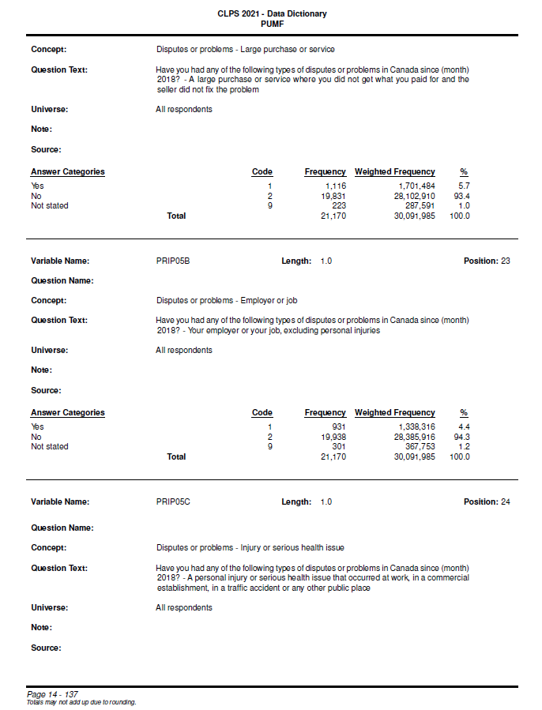
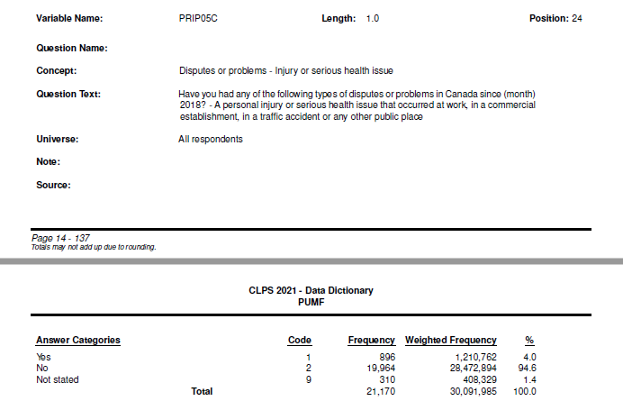
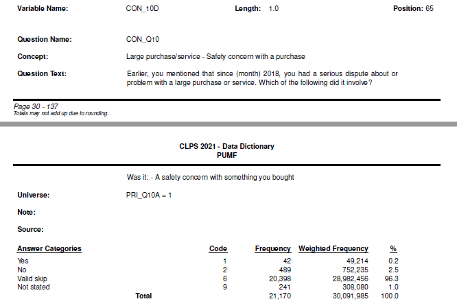
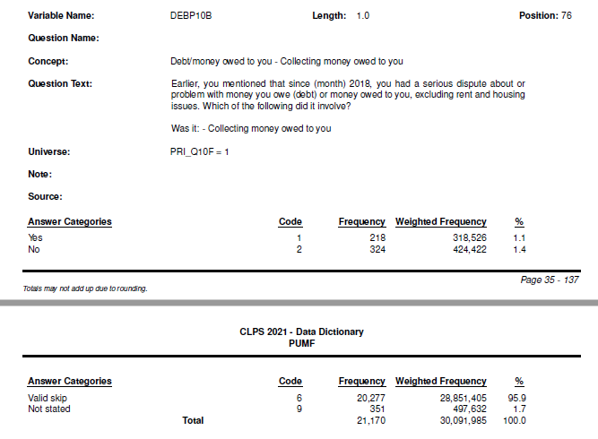
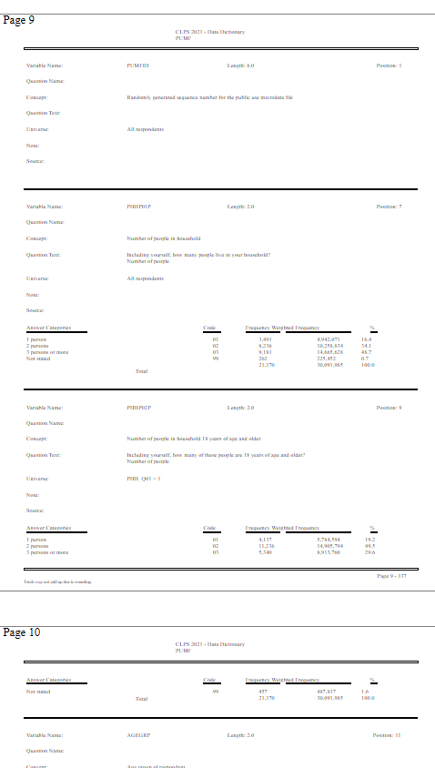
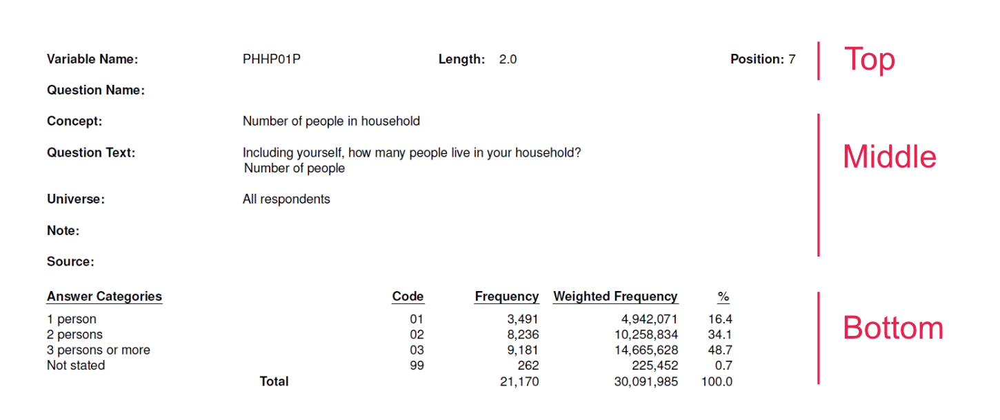
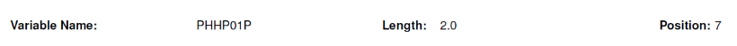
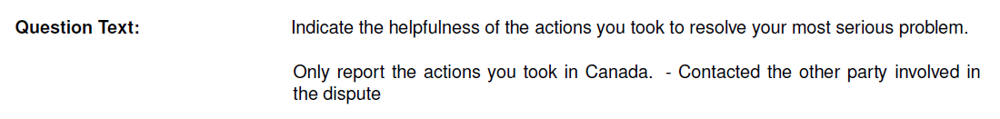
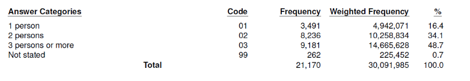

## Introduction
Some friends were working on a project that required the use of data from the
[Canadian Legal Problems
Survey](https://www.justice.gc.ca/eng/rp-pr/jr/survey-enquete.html) (CLPS).
CLPS is a national survey of Canadians' experiences with the justice system,
conducted periodically by Statistics Canada,
 with the most recent survey conducted in 2021.
Data from the survey is freely available in the form of a [Public Use
Microdata
File](https://www150.statcan.gc.ca/n1/pub/35-25-0002/352500022022001-eng.htm)
provided by StatsCan.


The main data set is a CSV file containing individual survey responses as rows,
and each column corresponding to a survey variable
(i.e. a response to an individual question or a demographic variable).
Column headings represent a variable name.
For example, the column `PRIP05A` corresponds to a question about whether the
respondent had a dispute related to a large purchase,
and values in the `PRIP05A` column represent answers to that question.These
answers are coded as integers,
with "Yes" mapped to `1`, "No" mapped to `2`,
and "Not stated" mapped to `9`.

A full list of these headings and response mappings are provided in a codebook
PDF file, but in a format that is not readily machine-readable,
requiring manual transcribing to access.

Thus, in this project, I extracted the data from the codebook PDF
in order to use it in combination with the main data set for processing and
display. The result is a JSON with the extracted codebook data, as well as a
simple web app for browsing the codebook and verifying correct extraction.
I plan to use this JSON in a future project to create a web app for exploring the main CLPS data set.


## Describing the Codebook
A typical page of the codebook PDF looks like this:


The codebook is divided into sections, each of which corresponds to a survey
variable.
These sections don't correspond to a single page, but may bridge across two
pages.

For example, the survey variable `PRIP05C` has its answer categories on a
separate page:



Sometimes, page breaks can occur in the middle of a field. For example,
`CON_10D` has its question text broken over two pages:


As well, when a page break occurs in the middle of the answer categories
fields, it creates more than set of answer category headings:


While it is possible to manually copy-paste the data out into a spreadsheet, I
felt this would be somewhat error-prone and tedious as there 277 survey
variables.
This is especially the case as I wanted to extract all the data from each
section, as I thought the frequency counts etc.
might be useful for checking the main data set later.

## Extracting to HTML
I first sought out a library to extract data from PDFs.
There's a number of options, such as [pypdf](https://github.com/py-pdf/pypdf),
[PyMuPDF](https://github.com/pymupdf/PyMuPDF),
[pdfminer.six](https://github.com/pdfminer/pdfminer.six),
and [PDFquery](https://github.com/jcushman/pdfquery).

After extracting the bare text with them,
I found that the bare text was not sufficient, as
it loses the semantic structure of the document.
For example, the heading "Answer Categories" and the
answer category text values themselves may not be next to each other on
extraction, so it's not clear which text chunk belongs under which heading.

Most of the pdf libraries have a way to extract positioning information as
well, by including coordinates of a boundary box for each text element, such as
by XML or HTML tag attributes. I ended
up choosing `pdfminer.six` as it had a CLI utility that was simple to use to
convert the entire PDF to HTML in one step,
at which point I could manipulate the HTML with a library like `beautifulsoup4`
which I already have some familiarity with.

After installing `pdfminer.six`, the CLI utility is a one-liner:
```bash
pdf2txt.py codebook.pdf -o codebook.html --output_type html
```
The resulting HTML file is a reasonably good facsimile of the original PDF:



## Extracting data from HTML to JSON
### Parsing HTML with BeautifulSoup
The structure of the extracted HTML file is a list of sibling `<div>` and
`<span>` elements inside the main `<body>` tag. For example, the following is
a very truncated version of the first page of data corresponding to page 9 of the
original pdf:
```html
<div style="position:absolute; top:6786px;"><a name="9">Page 9</a></div>
<div
    style="position:absolute; border: textbox 1px solid; writing-mode:lr-tb; left:245px; top:6806px; width:120px; height:19px;">
    <span style="font-family: NimbusSanL-Bold; font-size:8px">CLPS 2021 - Data Dictionary
        <br>PUMF
        <br></span></div>
<div
    style="position:absolute; border: textbox 1px solid; writing-mode:lr-tb; left:40px; top:6852px; width:64px; height:8px;">
    <span style="font-family: NimbusSanL-Bold; font-size:8px">Variable Name:
        <br></span></div>
...
...
...
<span style="position:absolute; border: black 1px solid; left:36px; top:7548px; width:540px; height:1px;"></span>
<span style="position:absolute; border: gray 1px solid; left:0px; top:7628px; width:612px; height:792px;"></span>
```
This is a relatively simple structure with a few notable features:
- During extraction to HTML, `pdfminer.six` marks the beginning of each page with a e.g. `<div><a name="9">Page
9</a></div>` nested anchor tag.
- Nested `<div><span>text</span></div>` elements represent the text on the page
- Single `<span>` elements represent horizontal lines or other drawn objects.
- A subset of `<span>` horizontal lines are used to divide survey variables from each other.
- Each element also has a `style` attribute that contains positioning and size information.


Using the python library `beautifulsoup4`, I first cleaned up the HTML in
several steps:
- Locate the starting and ending anchor tags that mark the page breaks at the
  start of Page 9 and the end of Page 126 (i.e. the start of Page 127), which
  correspond to t  start of Page 9 and the end of Page 126 (i.e. the start of Page 127), which
  correspond to the first and last pages containing survey variable data in the codebook.
- Extract all the HTML between those two anchor elements.
- Filter out unnecessary and cosmetic elements such as:
    - The page break anchor elements
    - Horizontal lines that aren't the dividers between survey variables
    - Headers and footers

This left only the HTML elements corresponding to data for each survey variable and the horizontal
lines that divide survey variables between each other.


### Converting HTML Elements into Python objects
At this point, rather than continuing to work with the HTML elements, I thought
it would be easier to work with a more structured representation of the data.
I created an `Element` dataclass that would hold positionig information,
whether the element was a text element or a dividing horizontal line,
and any text within the element:
```python
@dataclass
class Element:
    TEXT_TYPE = 'text'
    DIVIDER_TYPE = 'divider'
    elem_type: str
    left: int
    top: int
    width: int
    height: int
    right: int = field(init=False)
    bottom: int = field(init=False)
    text: str = ''

    def __post_init__(self):
        # Convert to ints
        self.left = int(self.left)
        self.top = int(self.top)
        self.width = int(self.width)
        self.height = int(self.height)
        # Calculate right and bottom positions
        self.right = self.left + self.width
        self.bottom = self.top + self.height

```
I then converted each HTML element into an `Element` object,
stripped whitespace from the text,
and sorted the elements by top to bottom position, then left to right,
resulting in a `list` of `Element` objects.

### Assembling Data Elements into Units
The next step was to assemble the `Element` objects into units that correspond
to a single survey variable.

Since the list of `Elements` is sorted by position,
 I iterated through the list and used the divider
elements `Elements` as markers to group elements into sublists.
This list of units of elements could then be iterated through to extract
information for each survey variable.


### Defining a Text Extraction Strategy and Output Format
At this point, my goal was to convert the data into `list` of `dicts` format
that could be converted directly into JSON:
```json
[
  {
    "variable_name": "PHHP01P",
    "length": "2.0",
    "position": "7",
    "question_name": "",
    "concept": "Number of people in household",
    "question_text": "Including yourself, how many people live in your household? Number of people",
    "universe": "All respondents",
    "note": "",
    "source": "",
    "answer_categories": [
      "1 person",
      ...
  ],
    "code": [
      ...
    ],
    "frequency": [
      ...
    ],
    "weighted_frequency": [
      ...
    ],
    "percent": [
      ...
    ],
    "total": {
      "frequency": "21170",
      "weighted_frequency": "30091985",
      "percent": "100.0"
    }
  },
  ...
]
```
To do this, I wrote a series of functions to extract and clean the text from
each data field. These functions are roughly grouped between the top,
middle, and bottom section for each survey variable:




### Extracting the Top Section
The top section consists of the variable name, length, and position fields
horizontally stacked beside each other:



For variable name, my strategy was to look for the elements containing
the text "Variable Name:" and "Length:" and then look for the single text
element in between these two elements (raising an error if more than one
element was found).

For length and position, the field name and field value were fused into a
  single element (e.g. "Length: 2.0"),
  so I searched for element containing the field heading text
  (e.g. "Length:" and "Position:"), then split/stripped the text to get
  just the field value.

### Extracting the Middle Section
The middle section consists of data fields that are vertically stacked on
top of each other:


My first strategy was to have several functions e.g. `get_question_name`,
`get_concept`, etc. call a generic function `get_middle_section` that
would take as arguments the current field heading and the next field heading
below it.
For example, to get the "Concept" data field,
`get_middle_section` would take in `"Concept:"` and `"Question Text:`
as arguments,
find the elements that contain that text,
and use their position to get all the text elements to the right of
and in between the two data headings.


This strategy generally worked.
However, I discovered that there was a issue with some 'question_text'
fields.
For example, for the survey variable ASTP20B, the second line of question text
has a dash that causes `pdfminer.six` to extract it as the following text elements:


```python
# Top text element
'Indicate the helpfulness of the actions you took to resolve your most serious problem'
# Left side text element that fuses with the last line
'Only report the actions you took in Canada.\nthedispute'
# Right side text element
' - Contacted the other party involve in'
```

The way `get_middle_section` was written misses the text element on the right.
Rather than rewriting the whole function and having to check to see if any
new problems with the fields that already worked, I decided clone the function
to a new function `get_middle_section_broad` that gets all text elements and
also splits the strings by new lines before putting them together in the right
order.
Then I just had `get_question_text` to call `get_middle_section_broad` instead
of `get_middle_section`.


### Extracting the Bottom Section


- Bottom section are the answers. There are problems with multiple headers, as
  well as some answer categories are broken into multiple lines, which breaks
  the codes, etc on the right. When things are broken, there are new line
  characters, so it's a matter of extracting the text and figuring out how many
  new lines there are, and counting the code categories and ameliorating the
  count differences.
  - maybe talk about custom classes to represent it in lists.

Picture of a problematic bottom section.

```python
Some example of how the code looks with elements in them.

```


  I found it helpful to code defensively during this process, and raise
  `AssertionErrors` when my assumptions were violated.

### Miscellaneous Issues
- Other issues
    - fi, hyphenated words, occasional inconsistent dashing
    - some other exceptions, VERDATE has unnamed answer category
    - PUMFIID, WTPP, and VERDATE have no answer categories, but I was using the
      header to triangulate where the text is. So rather than rewriting to
      handle it elegant, I just built in some check conditions in the main
      loop.


### Running the Extraction Script

- script is: `extract_cdbk_pdf_answers.py`


## Verification app
- Some discovered after verification app
- number small enough that I could look through it. Found some errors.
- Chose streamlit because it's fairly easy to get started
- Early prototype was drawing a bunch of columns, and then all 276 variables.
    - seems though causes performance issues, both locally and online. Some other testing shows yada
      columns can't complete if over yada numbers.
- Scrolling is a pain anyways, so I made it page-like, display next/prev
  button.
- syncing button to dropdown uses session state (see link), keeping track of
  the index.
- Downloadable JSON.


## Discussion
- Bounding box might be easier to think about? Not like single point.
