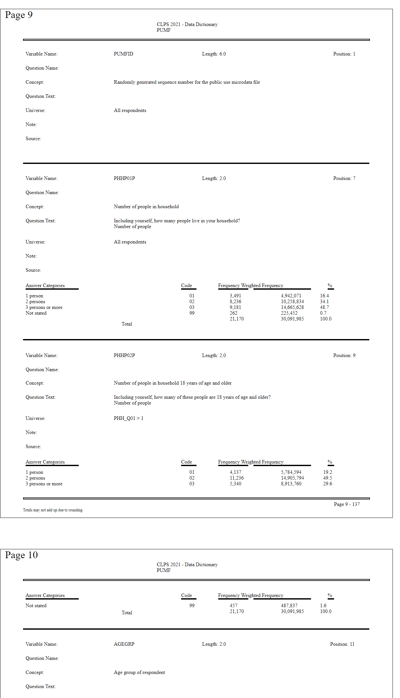

## Introduction
Some friends of mine have been working on a project that required the use of data from the
[Canadian Legal Problems
Survey](https://www.justice.gc.ca/eng/rp-pr/jr/survey-enquete.html) (CLPS).
CLPS is a national survey of Canadians' experiences with the justice system,
conducted periodically by Statistics Canada,
 with the most recent survey conducted in 2021.
Data from the survey is freely available in the form of a [Public Use
Microdata
File](https://www150.statcan.gc.ca/n1/pub/35-25-0002/352500022022001-eng.htm)
provided by StatsCan.


The main data set is a CSV file containing individual survey responses as rows,
with each column corresponding to a survey variable
(i.e. a response to an individual question or a demographic variable).
Column headings represent a variable name.
For example, the column `PRIP05A` corresponds to a question about whether the
respondent had a dispute related to a large purchase,
and values in the `PRIP05A` column represent answers to that question.These
answers are coded as integers,
with "Yes" mapped to `1`, "No" mapped to `2`,
and "Not stated" mapped to `9`.

A full list of these headings and response mappings are provided in a codebook
PDF file, but in a format that is not readily machine-readable,
requiring manual transcribing to access.

Thus, in this project, I extracted the data from the codebook PDF
in order to use it in combination with the main data set for processing and
display. The result is a JSON with the extracted codebook data, as well as a
simple web app for browsing the codebook and verifying correct extraction.
I plan to use this JSON in a future project to create a web app for exploring the main CLPS data set.


## Format of the Codebook
A typical page of the codebook PDF will contain several survey variables, with
each variable separated by dividing lines:


A survey variable section doesn't always reside on a single page, but may bridge across two
pages.

For example, the survey variable `PRIP05C` has its answer categories on a
separate page:


Sometimes, page breaks can occur in the middle of a field. For example,
`CON_10D` has its question text broken over two pages:


As well, when a page break occurs in the middle of the answer categories
fields, it creates more than set of answer category headings:


While it is possible to manually copy-paste the data out into a spreadsheet, I
felt this would be somewhat error-prone and tedious as there 277 survey
variables.
This is especially true as I wanted to extract all the data from each
section,
since the frequency counts etc.
might be useful for cross referencing to the main data set later.

## Extracting to HTML
I first sought out a Python library to extract data from PDFs.
There's a number of options, such as [pypdf](https://github.com/py-pdf/pypdf),
[PyMuPDF](https://github.com/pymupdf/PyMuPDF),
[pdfminer.six](https://github.com/pdfminer/pdfminer.six),
and [PDFquery](https://github.com/jcushman/pdfquery).

After experimenting with extracting the text with them,
I found that the bare text was not sufficient, as
it loses the semantic structure of the document.
For example, the heading "Answer Categories" and the
answer category text values themselves may not be next to each other on
when extracted to text, so it's not clear which text chunk belongs under which heading.

Most of the pdf libraries can include positioning information upon extraction
by embedding the text in XML or HTML tags that contain the coordinates of a
bounding box for each text element.
I ended
up choosing `pdfminer.six` as it had a simple CLI utility that could
convert the entire PDF to HTML in one step,
at which point I could manipulate the HTML with a library like `beautifulsoup4`
(which I already had some familiarity with).

After installing `pdfminer.six`, the CLI utility is a one-liner:
```bash
pdf2txt.py codebook.pdf -o codebook.html --output_type html
```
The resulting HTML file is a reasonably good facsimile of the original PDF:



## Extracting the Data from HTML to JSON
### Parsing HTML with BeautifulSoup
The structure of the extracted HTML file is a list of sibling `<div>` and
`<span>` elements inside the main `<body>` tag. For example, the following is
a very truncated version of the first page of data corresponding to page 9 of the
original pdf:
```html
<div style="position:absolute; top:6786px;"><a name="9">Page 9</a></div>
<div
    style="position:absolute; border: textbox 1px solid; writing-mode:lr-tb; left:245px; top:6806px; width:120px; height:19px;">
    <span style="font-family: NimbusSanL-Bold; font-size:8px">CLPS 2021 - Data Dictionary
        <br>PUMF
        <br></span></div>
<div
    style="position:absolute; border: textbox 1px solid; writing-mode:lr-tb; left:40px; top:6852px; width:64px; height:8px;">
    <span style="font-family: NimbusSanL-Bold; font-size:8px">Variable Name:
        <br></span></div>
...
...
...
<span style="position:absolute; border: black 1px solid; left:36px; top:7548px; width:540px; height:1px;"></span>
<span style="position:absolute; border: gray 1px solid; left:0px; top:7628px; width:612px; height:792px;"></span>
```
This is a relatively simple structure with a few notable features:
- During extraction to HTML, `pdfminer.six` marks the beginning of each page with an e.g. `<div><a name="9">Page
9</a></div>` nested anchor tag.
- Nested `<div><span>text</span></div>` elements represent the text on the page
- Single `<span>` elements represent horizontal lines or other drawn objects.
- A subset of `<span>` horizontal lines are used to divide survey variables from each other.
- Each element also has a `style` attribute that contains positioning and size information.


Using the Python library `beautifulsoup4`, I first cleaned up the HTML in
several steps:
- Locate the starting and ending anchor tags that mark the page breaks at the
  start of Page 9 and the end of Page 126 (i.e. the start of Page 127),
  which correspond to the first and last pages containing survey variable data in the codebook.
- Extract all the HTML between those two anchor elements.
- Filter out unnecessary and cosmetic elements such as:
    - The page break anchor elements
    - Horizontal lines that aren't the dividers between survey variables
    - Headers and footers

This left only the HTML elements corresponding to data for each survey variable and the horizontal
lines that divide survey variables between each other.


### Converting HTML Elements into Python Objects
At this point, rather than continuing to work with the HTML elements, I thought
it would be easier to work with a more structured representation of the data.
I created an `Element` dataclass that would hold positionig information,
whether the element was a text element or a dividing horizontal line,
and any text within the element:
```python
@dataclass
class Element:
    TEXT_TYPE = 'text'
    DIVIDER_TYPE = 'divider'
    elem_type: str
    left: int
    top: int
    width: int
    height: int
    right: int = field(init=False)
    bottom: int = field(init=False)
    text: str = ''

    def __post_init__(self):
        # Convert to ints
        self.left = int(self.left)
        self.top = int(self.top)
        self.width = int(self.width)
        self.height = int(self.height)
        # Calculate right and bottom positions
        self.right = self.left + self.width
        self.bottom = self.top + self.height

```
I then converted each HTML element into an `Element` object,
stripped whitespace from the text,
and sorted the elements by top to bottom position, then left to right,
resulting in a `list` of `Element` objects.

### Assembling Data Elements into Units
The next step was to assemble the `Element` objects into units that correspond
to a single survey variable.

Since the list of `Elements` is sorted by position,
 I iterated through the list and used the divider
elements `Elements` as markers to group elements into sublists.
This list of units of elements could then be iterated through to extract
information for each survey variable.


### Defining a Text Extraction Strategy and the Output Format
At this point, my goal was to convert the data into `list` of `dicts` format
that could be converted directly into JSON:
```json
[
  {
    "variable_name": "PHHP01P",
    "length": "2.0",
    "position": "7",
    "question_name": "",
    "concept": "Number of people in household",
    "question_text": "Including yourself, how many people live in your household? Number of people",
    "universe": "All respondents",
    "note": "",
    "source": "",
    "answer_categories": [
      "1 person",
      ...
  ],
    "code": [
      ...
    ],
    "frequency": [
      ...
    ],
    "weighted_frequency": [
      ...
    ],
    "percent": [
      ...
    ],
    "total": {
      "frequency": "21170",
      "weighted_frequency": "30091985",
      "percent": "100.0"
    }
  },
  ...
]
```
To do this, I wrote a series of functions to extract and clean the text from
each data field. These functions are roughly grouped between the top,
middle, and bottom section for each survey variable:


### Extracting the Top Section
The top section consists of the variable name, length, and position fields
horizontally stacked beside each other:


For variable name, my strategy was to look for the elements containing
the text "Variable Name:" and "Length:" and then look for the single text
element in between these two elements (raising an error if more than one
element was found).

For length and position, the field name and field value were fused into a
  single element (e.g. "Length: 2.0"),
  so I searched for element containing the field heading text
  (e.g. "Length:" and "Position:"), then split/stripped the text to get
  just the field value.

### Extracting the Middle Section
The middle section consists of data fields that are vertically stacked on
top of each other:


My first strategy was to have several functions e.g. `get_question_name`,
`get_concept`, etc. call a generic function `get_middle_section` that
would take as arguments the current field heading and the next field heading
below it.
For example, to get the "Concept" data field,
`get_middle_section` would take in `"Concept:"` and `"Question Text:`
as arguments,
find the elements that contain that text,
and use their position to get all the text elements to the right of
and in between the two data headings.


This strategy generally worked.
However, I discovered that there was a issue with some "question_text"
fields.
For example, for the survey variable ASTP20B, the second line of question text
has a dash that causes `pdfminer.six` to extract it as the following text elements:


```python
# Top text element
'Indicate the helpfulness of the actions you took to resolve your most serious problem'
# Left side text element that fuses with the last line
'Only report the actions you took in Canada.\nthedispute'
# Right side text element
' - Contacted the other party involve in'
```

The way `get_middle_section` was written misses the text element on the right.
Rather than rewriting the whole function and having to check to see if any
new problems arise with the fields that already worked, I decided clone the function
to a new function `get_middle_section_broad` that gets all text elements and
also splits the strings by new lines before putting them together in the right
order.
Then I just had `get_question_text` call `get_middle_section_broad` instead
of `get_middle_section`.


### Extracting the Bottom Section
The bottom section contains the answer categories,
their encodings in the main dataset, frequency, weighted frequency, and percent data for each answer category
for respondents in the survey:


For most of the survey variables, each column is extracted as a single block,
with the headings as a separate element (although the frequency and weighted
frequency headings are fused to each other). The totals row is fused with the
column values above it.

However, sometimes the answer categories get broken by a page break, resulting
in multiple headings:


As well, there are cases that individual answer categories have text broken
into multiple lines. This breaks the corresponding code column into more than
one element. For example, in the code column below, there is an element with
`"1\n2\n3\n4"` and another element with `"6\n7\n9"`:


The extracted text for multiline answer categories are not distinguishable
from multiple answer categories on their own.
For example, the answer category
`"Not applicable/did not retain\nlawyer/paralegal/law student"` would appear as
two answer categories since newline characters also separate the other answer
categories from each other. However, since these cases only appear when the
code column is broken into multiple elements, I could incorporate that
information to figure out where the multiline answer categories occur.


The following is an approximate description of the process to these issues.
I used two custom classes `PageBreak` and `CodeElementBreak` to represent where
page breaks and breaks in the code column occur.
Note that the actual code combines some of these steps, but I've illustrated it
slightly differently for clarity:
```python
## Initial text that gets extracted, text contains internal headers
# as well as a multiline answer category
# Categories:
["Cat1\nCat2A\nCat2B\nCat3\nCat4", "Answer Categories", "Cat 5\nCat6"]
# Codes:
["1\n2","3\n4", "Code", "5\n6"]

## Swap internal headers for PageBreaks
# Categories:
[["Cat1","Cat2A","Cat2B","Cat3","Cat4"], PageBreak, ["Cat 5","Cat6"]]
# Codes:
[["1","2"],["3","4"], PageBreak,["5","6"]]

## Add in CodeElementBreaks in between code elements
## but not where there are page breaks
# Codes:
[["1","2"], CodeElementBreak, ["3","4"], PageBreak, ["5","6"]]

# Flatten both answer categories and codes
# Categories:
["Cat1", "Cat2A", "Cat2B", "Cat3", "Cat4", PageBreak, "Cat 5", "Cat6"]
# Codes:
["1", "2", CodeElementBreak, "3", "4", PageBreak, "5", "6"]

# Infer the presence of a multiline answer category by the presence of a
# CodeElementBreak in the codes list
# Categories:
["Cat1", "Cat2ACat2B", "Cat3", "Cat4", PageBreak, "Cat 5", "Cat6"]

# Clean up CodeElementBreaks and PageBreaks
# Categories
["Cat1", "Cat2ACat2B", "Cat3", "Cat4", "Cat 5", "Cat6"]
# Codes:
["1", "2", "3", "4", "5", "6"]

```

For processing frequency, weighted frequency, and percent columns,
I only had to handle internal headers,
as the multiline issue was already
resolved between the answer category and code columns.


As a side note, I found it helpful to code defensively during this process,
and incorportate `assert` checks to make sure my assumptions about the state of
the columns and data were correct.

### Miscellaneous Issues
There are several other issues of note:
- Words like "certificate" are extracted with `'fi'` as a single character
  `'fi'`. These needed to be replaced.
- In the question text fields, some words contain line-breaking hyphens.
I removed these hyphens, as I felt they would not be useful if the question
text needed to be displayed elsewhere.
- There are occasional inconsistent dashs/hyphens (e.g. spaces before or after
  dashs). I left these as is.
- The survey variables `PUMFID` and `WTPP` have no answer categories. However,
  my extraction function depended on the "Answer Categories" heading to locate
  where the boundary of the "source" field was.
  These survey variables didn't actually have data in the source field, so rather than rewrite the function,
  I just added these as check conditions in the main loop to handle them.
- The survey variable `VERDATE` has no answer categories, as it just has a date
  in the code column.
  This would raise `AssertionErrors` in my extraction functions, so I also
  handled it with a check condition in the main loop.


### Running the Extraction Script
To run the extraction script, run the following in the main project folder:
```bash
python extract_cdbk_pdf_answers.py codebook.html
```
There is an optional `-d` flag to enable debug mode, which will print out
several text files representing intermediate steps in the extraction process,
as well as a `-o` flag to change the output file name
(which by default is `survey_var.json`).

## Verification App
### Rationale
While I was working on the extraction script, I keep discovering new issues
which made me nervous about the integrity of the extracted data.
Since the number of survey variables is fairly small (277),
I thought I could look through all of the extracted data without
consuming too much time.

However, trying to look through the data as a JSON file and then having to
match it to a PDF file while scrolling sounded extremely painful and error-prone.
I decided it would be prudent to make a simple app to display the extracted
data in a nicely formatted way.
Indeed, I ended up discovering several issues this way, which I then went back
and fixed in the extraction script.

### Choosing Streamlit
I had heard about [Streamlit](https://streamlit.io/) some time ago.
Its main draw is that it turns fairly simple Python scripts into decent-looking
web apps,
so this sounded like an easy, fast way to get started with a simple app.


Additionally, [Streamlit Community Cloud](https://streamlit.io/cloud) provides free
hosting and deploys apps straight off a GitHub repo, so I didn't have to worry
about managing a server etc.


### Implementing the App

My initial prototype was to display all the data on a single scrollable page,
but formatted to look like the PDF.
I did this with a bunch of nested `st.container`, `st.column`, and `st.metric` objects,
but I found that the app had trouble loading.
I did some quick testing,
and found that page loading takes
10 seconds with 900 `st.metric` objects,
30-45 seconds with 1800 objects,
and fails to load with 3600 objects.

Since scrolling is kind of a pain anyways, I decided to make the app display
one survey variable at a time.
The user then chooses the survey variable via a searchable dropdown menu in the sidebar,
or can click a next/prev button to cycle through the survey variables.
The current variable displayed is stored as an index in the app's
[session state](https://docs.streamlit.io/en/stable/api.html#streamlit.session_state),
so that the next/prev buttons and the dropdown menu stay in sync with each
other.
The sidebar also includes a button to download the JSON data.


The app is available at [https://clps-survey-variables.streamlit.app/](https://clps-survey-variables.streamlit.app/).
Streamlit Community Cloud hosting hibernates the app after
a few days of no traffic, in which case a user can click the "Wake App" button,
which usually takes from a few seconds to a couple of minutes.

## Discussion and Improvements

The data extraction in the main script relies on finding headers
and using their corner positions as landmarks to find where
data values are located in relation to the headers.
An alternate approach could be to explicitly define bounding boxes
and finding data value elements that overlap with these boxes.
I suspect this approach might lead to more standardized extraction functions
that are easier to think about and read/write,
and perhaps handle edge cases better (e.g. when there are missing headers).

However, since this data extraction step is probably a one-off,
I do not plan to rewrite it at this time.
Instead, I plan to move on and use this extracted data with the main CLPS data set.
