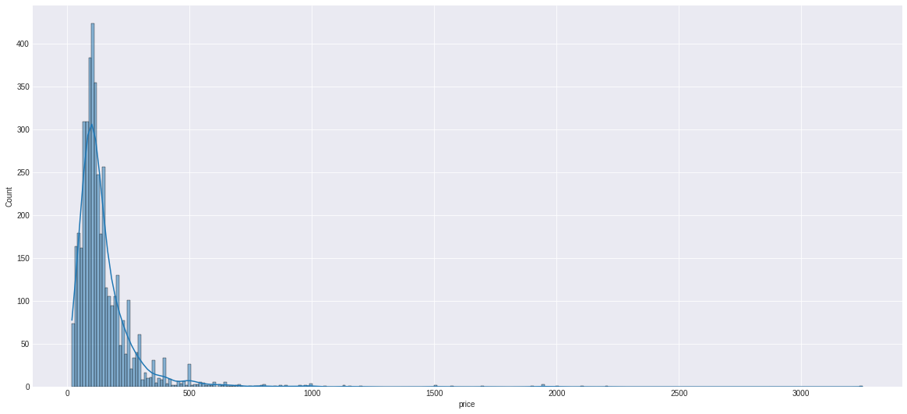
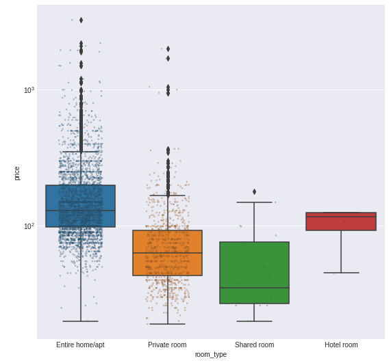
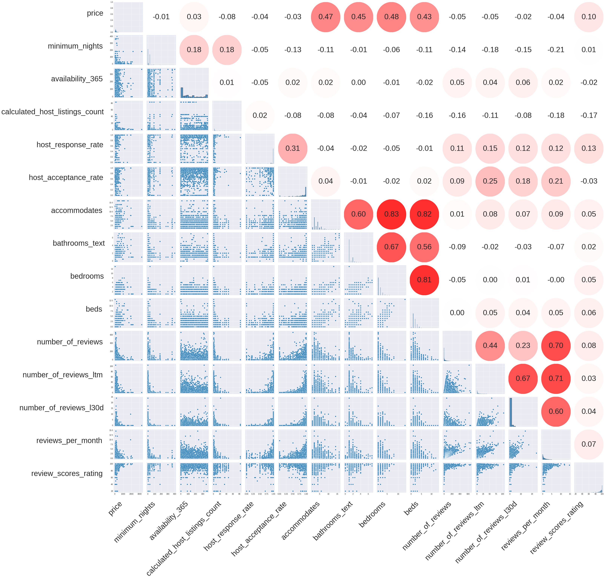
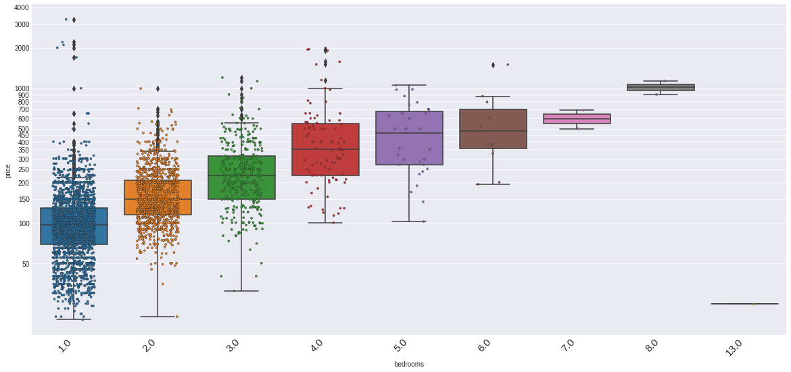
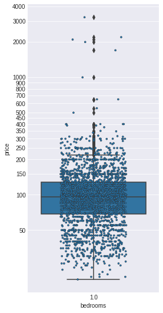
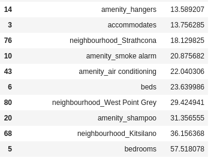
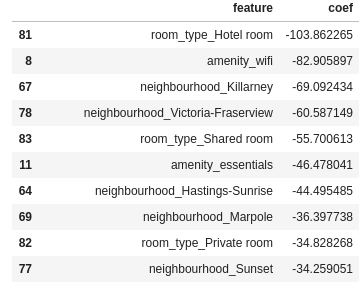

(Note: The code accompanying this post is available in [this GitHub repository](https://github.com/andrewKOwong/dsnd-airbnb-blogpost)).

## Introduction

Airbnb is a platform where home owners can list all or parts of their property as a place for guests to stay. These listings are priced on a nightly basis.

How would a potential Airbnb host price their listing? They might want to find out what everyone else is pricing their listings, so that they can adjust their price accordingly.

Thus, I was curious about the following questions find out about Airbnbs in my city (Vancouver, Canada):

- Where are the Airbnb listings in Vancouver, and how are they priced?
- What features affect the price of an Airbnb listing?
- Can we fit a model to predict a listing’s price based on its features?

To get data on Airbnb listings, I accessed webscraped data from [Inside Airbnb](http://insideairbnb.com/), a website that documents the impact of Airbnb on housing availability.
As a free service, it provides [twelve months of data](http://insideairbnb.com/get-the-data.html) on listings in many cities. For simplicity, I decided to limit my analysis to a single month (April 2021). These data consists of 4299 listings that were scraped over 2 days in mid-April.

## Where are the Airbnb listings and how are they priced?

Here’s a map of the listings, with yellow dots indicating listing, and white outlines for the neighbourhoods of Vancouver:

Downtown is the busiest neighbourhood of listings. I then checked to see what the prices of listings were in the different neighbourhoods. There were large spreads of prices in a lot of neighbourhoods, with Kitsilano having the highest median price:

. Note the log scale for price.")

Overall, prices follow a right-skewed distribution:

## What features affect the price of an Airbnb listing?
Listings have 73 features (including the price). These features range from information about the host, the rooms/location itself, and reviews about the listing.

I initially investigated the relationship between categorical variables and the price, including the presence/absence of a shortened list of amenities. Most individual features were not strongly associated with price. Notably however, whether the listing was an entire unit as opposed to a private/shared room is correlated with a price increase:

Next, I looked at the correlation of quantitative features by plotting a matrix of scatter plots and their Pearson correlation coefficients:

There’s a few hotspots here in the Pearson R-values. The number of reviews, reviews in the last twelve months (ltm), in the last 30 days (l30d), and per month are very correlated with each other, as one might expect. Similarly, the number of people of listing accommodates, the number of bathrooms, bedrooms, and beds a listing has are all correlated with each other, as these all indicate the size of a listing. Notably, the price of a listing is moderately correlated with these size variables as well.

I took a closer look at the correlation between the number of bedrooms a listing has and its price:

The general trend is that as the number of bedrooms increases, the price of a listing goes up. An anomaly is the 13 bedroom listing that is priced below $50. This turns out to be a joke listing for a haunted house:

Looking closer at the one bedroom listings, there’s are several listings that are surprisingly expensive:

There are 5 listings here that are above $1000 a night. Inspecting the listings, they appear to be fairly average one bedroom apartments. Based on their descriptions and that some of them have 6 month minimum stays, I believe these prices are actually intended to be monthly prices that have been mispriced as daily prices.

## Can we fit a model to predict a listing’s price based on its features?
Finally, I used a linear model to see if a simple model would allow me to predict prices. I used most of the features, but dropped features related to the hosts of the listings, such as how long a host has been a host and whether they have a profile pic, as these features were often missing and not very correlated to price according to my exploratory analysis.

Splitting the data 70:30 for training/testing, I ended up with a model with an R² of 0.41.

Examining the predictions, I found that the model was underpredicting expensive listings. As well, some predictions were negative for the lower priced listings:

 and predictions (blue). Top and bottom are linear and log scale for count, respectively.")

These are the most negative and positive coefficients in the linear model:

Once again, the most strongly correlated/anti-correlated features to price are related to listing size (bedrooms etc.). As well, some neighbourhoods seem to be predictive of pricing. Bizarrely, some amenities such as the presence wifi are negatively correlated with price. However, some amenities categories including wifi are very unbalanced between groups (e.g. >50 fold difference between having the amenity and not), and so should be interpreted with caution, as it’s likely not statiscally meaningful.

## Conclusion
To summarize:

- Most Vancouver AirBnb listings were located in Downtown.
- The median nightly price of a listing is 115 CAD, although the distribution of prices was right skewed.
- Of the quantitative variables, the price of a listing was most correlated with how many bedrooms/the size of an listing.
- Some listings appear to be mispriced, where the listed nightly price likely is intended as a monthly price for a longer term rental.

While I was able to fit a moderately predictive linear model, this model needs to be tested on data such as listings outside the month of April 2021. Indeed, it would be desireable to fit (probably more complex) models on a larger data set from a longer time period, and use it to predict prices going forward.

Since the data is taken during the COVID-19 pandemic and associated travel restrictions, it is unclear if this model is generalizable to listings during non-pandemic time.