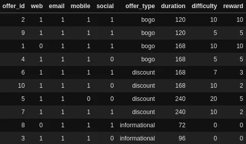
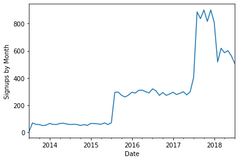
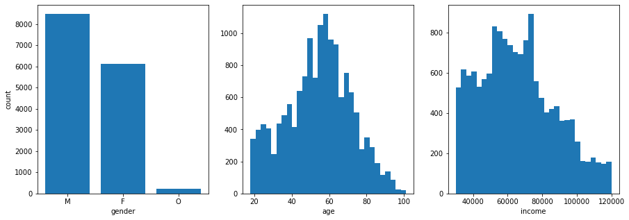
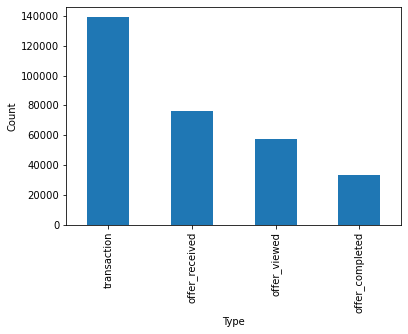
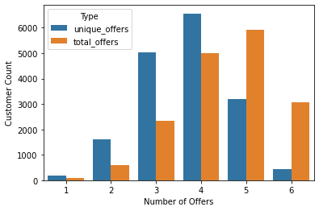
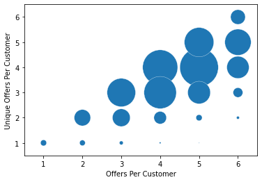
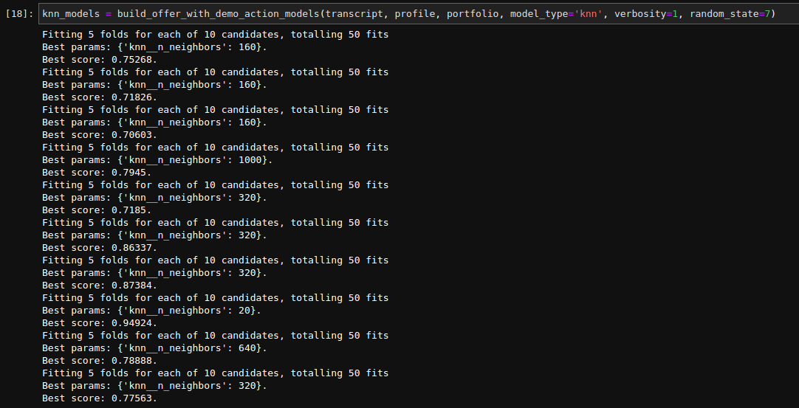
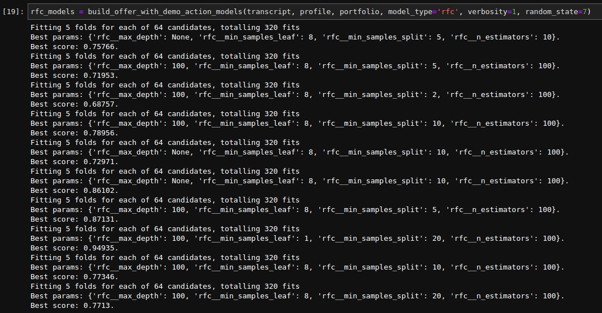

## Project Definition
### Project Overview
(Note: The code accompanying this post is available in [this GitHub repository](https://github.com/andrewKOwong/dsnd-starbucks)).

Starbucks is a well-known coffee company [operating ~32,000 stores with net revenues of 23B USD as of 2020](https://s22.q4cdn.com/869488222/files/doc_financials/2020/ar/2020-Starbucks-Annual-Report.pdf). Starbucks customers can choose to participate in the Starbucks Rewards programs, allowing them to earn discounts on purchases as well as receive special offers from time to time. Knowing how customers react to specific offers could be valuable information, as sending the right offer to the right customer at the right time could favorably influence how much customers spend.

As part of the Data Scientist Nanodegree, Udacity provided a simulated dataset of 17000 rewards program customers. This dataset contains customer transactions over a period of around one month, including when these customers received, viewed, and completed reward offers.

### Problem Statement
The customer data provided could potentially be used to understand and predict how customers respond to different rewards offers. After exploring the data, I elected to build statistical learning models (specifically, K nearest neighbours and random forest models) to predict whether a customer would respond to an offer based on four pieces of information — the customer’s age, gender, income, and length of how long the customer had been a rewards member. These models achieved an F1 score of at least ~0.70, although I found some scores may be inflated by class imbalances.

### Metrics 
Depending on the business scenario, one may choose to minimize false positives or false negatives. Since digital offers have near zero marginal cost, at times one may want to err on the side of sending more offers if they didn’t want to miss a chance for a customer to use an offer (i.e. higher false positives, lower false negatives). Conversely, it may not be important to miss a customer on an offer round, if one could simply send another offer later (higher false negatives). Alternatively, too many unattractive offers might irritate customers (lower false positives).

Thus, it did not appear to me that there are strong reasons *a priori* to minimize either the false positive or false negative rates. Hence, for model development, I decided to use F1 scoring as a generic first attempt to balance precision and recall.

## Data Exploration and Visualization

### Overview
The data consists of three parts:

1) A portfolio of 10 different offers that customers have received
2) Customer profiles for the 17000 customers (87% of which have a associated age/gender/income demographic data)
3) A transcript that lists offer-related events and transactions for those 17000 customers

### Offer Portfolio
Offers were either buy-one-get-one (“bogo”), discount, or informational offers. Bogo and discount offers have an associated “difficulty” indicating the amount of spend the customer must make to complete the offer for a reward. Informational offers have no reward and hence have no completion status.

These offers had various active durations ranging from 72 h (3 days) to 240 h (10 days).

### Customer Profiles
All customers had at least a date associated with when they signed up for membership. The signups dates are chunked into several discrete periods (I am unsure if this is an artifact of the data simulator).

As well, 87% of customers had gender, age, and income data, with the remaining 13% not having any of these data. There were three gender categories. Surprisingly, age is centered around age 60 (US [median age](https://www.statista.com/statistics/241494/median-age-of-the-us-population/) is 38 years, see [distribution](https://www.statista.com/statistics/241488/population-of-the-us-by-sex-and-age/)). Income is centered around $75000 (US [median house hold income](https://www.statista.com/statistics/236765/median-annual-family-income-in-the-united-states-from-1990/) is ~$84000, although we don’t know if this income is individual or household.

### Customer Transcript
The transcript spans a time period of 714 hours (~30 days) and contains both transaction events (where customers spend money), and events related to the offers.

Transaction amounts are highly skewed, with a small number of very large transactions. A thousand dollars spent in a single Starbucks order may seem like a lot, but those could be group or corporate orders (e.g. ten 12-coffee carafes without food could already be $250, and I’ve personally spent $300 on gift cards once to put in gift baskets for an event).

.")

The distribution of total transactions per customer is also highly right skewed, and the number of transactions per customer is slightly skewed.

Offers were sent to customers at six not-quite evenly spaced time points. At each timepoint, all 10 offers were made to ~1200 customers each, with ~4000 customers not receiving a new offer at each time point. Customers must receive offers before being able to complete them. However, customers do not actually have to view the offers first.

Offers have overlapping durations, so customers may have more than one offer active at one time.

### What is the relationship between transactions and other variables?
Of the four pieces of information we know about each customer, I found that there were more obvious differences between customers when considering gender and income.

For gender, people identifying as female seemed to have the highest total transaction spend (i.e. the sum of all the transactions of that customer).

Higher income appears to be associated with higher total transactions. Note there are two apparent distributions.

### Which offers are completed/viewed?
Since customers can receive the same offer more than once and have more than one offer active at one time, a customer may potentially be responding to an offer based on repeated exposure to an offer, or be influenced by exposure to other offers.

To simplify this situation, we can measure if a customer responds at any time to a specific offer in the time frame of this data. That is: if a customer receives an offer at least once, do they view or complete the offer at least once?

Additionally, are there trends between customer demographics and offer view/completion rates?

To answer these questions, I filtered the data for customers with demographic information (87% of the customers). I then plotted view/completion rates for individual offers for these customers.

Below are the data split between customer gender, age, income, and sign up date. As a general note, offers 1, 2, 6, 7, 8, and 9 have high view rates across the board.

For offers 4, 5, 9, and 10, males have the lowest view and completion rate.

.")

For age demographics, the youngest age groups have the lowest view/completion rates for several offers. Note the 100–105 age category is much smaller than most age categories, and hence might have high rates due to the small number of customers.

.")

Offer completion generally increases among higher income customer groups.

.")

Customers first registered in 2015 and 2016 have the highest completion rates.

.")

Now that we’ve done some exploratory data analysis, let’s take a look to see if we can fit a model to predict for whether a customer will view/complete an offer.

## Model Building Methodology
I elected to build models to predict whether a customer (based on their age, income, age, and how long they’ve been a member for) would respond to a particular offer. Knowing whether a customer will complete an offer could help us figure out which offer to target to which customers. Potentially, this could drive engagement in a marketing campaign, and over the long run increase customer spending.

### Data Preprocessing
I compiled the data by again collecting whether — given each offer — a customer would respond or not in the time period of the data set, regardless of number of exposures or exposure to other offers. Each offer thus had its own dataset composed of a number of customer ids along with 0’s or 1’s for non-response and response to an offer. Feature information of age, income, gender, and duration of their rewards membership was also attached. For offers 3 and 8 (which are informational offers), I used viewing as the target customer response, whereas for all other offers I used offer completion as the target.

These ten datasets were then each split into a 70% training set and a 30% test set, such that the training set contains none of customer ids in the test set and vice versa.

Features data was also standardized to zero mean and unit variance.

### Implementation and Refinement
As this is a classification task (i.e. predicting whether a customer is in a “complete or not” category, or in the case of offers 3 and 8, whether a customer is in a “view or not” category), I initially tested a K nearest neighbours (KNN) model for this problem, as it was easy to implement and quick to train.

I used `GridSearchCV` to tune the `n_neighbors` hyperparameter in a search space of `[1, 5, 10, 20, 40, 80, 160, 320, 640, 1000]` neighbors. Given that in the training set there are at most 17000 * 0.7 = 11900 customers, I wasn’t sure if pushing k > 1000 and using more than 10% of the data to classify a point made sense.

For comparison, I then added random forest (RF) models. For these, the hyperparameter search space was (inspired by this [post](https://towardsdatascience.com/hyperparameter-tuning-the-random-forest-in-python-using-scikit-learn-28d2aa77dd74)):

- `n_estimators`: 10, 100
- `max_depth`: 100, None
- `min_samples_split`: 2, 5, 10, 20
- `min_samples_leaf`: 1, 2, 4, 8

Both the KNN and RF models were then trained on the same training set with 5-fold cross validation. F1 scoring was used to balance precision and recall.

## Results
### Model Evaluation and Validation
The best hyperparameters found by `GridSearchCV` for each offer are shown below. Scores are F1 scores for the training set.

I used F1 scores here to balance precision and recall. Below is a plot of all the F1 scores for training vs test data for each offer.

 and random forest (rfc) classifiers for each of 10 offers.")

Why do some offers have much higher F1 scores than others? It turns out this is actually due to class imbalance. Below is a plot of the same test scores but against the proportion of customers that responded (i.e. completed/viewed) an offer.

 on test set data.")

Offers with high response rates generally have higher test scores. Given what we saw in exploratory data analysis, it is likely that the features are discriminatory for response when most customers are responding to an offer. Nonetheless, when the classes are approximately equal, the KNN and RF models reach an F1 score of around 0.70.

Let’s take a look at accuracy vs proportion to get a more intuitive feel of the results.

 on test set data.")

We see a similar trend in accuracy as to the F1 scores. For offers with proportions around 0.5, we’re getting surplus accuracy of around 0.2 better than random. However, this surplus decreases as the proportions get higher, with offer 8 being 90% viewed only getting 0.05 surplus accuracy.

### Model Recommendation and Justification
Although the KNN and RF models achieved around the same test scores, I found the KNN models to be much faster to train on my machine. Thus, I’d probably pick the KNN models for use as it’ll be faster to retrain and readjust with new data if necessary.

For more imbalanced offers such as offers 6, 7, and 8 where customers have high rates of response, it may be better to send the offer to everyone anyways.

However, I feel significant improvements can be made, as discussed below.

## Conclusions, Reflection, and Improvement
Here I built models that predict if a customer would respond to an offer, based on their demographic information (age, income, gender) and how long they’ve been a member. From the exploratory data analysis, these features did not seem to be strongly predictive individually. However, the models reached at least an F1 score of ~0.70.

### Scoring and Class Imbalances
I scored the models using F1 scoring as a generic first attempt. However, it would be worth testing something that takes into account true negatives such as [Matthews correlation coefficient](https://www.ncbi.nlm.nih.gov/pmc/articles/PMC6941312/)
(see [sklearn function](https://scikit-learn.org/stable/modules/generated/sklearn.metrics.matthews_corrcoef.html)) which may help with class imbalances.

### Additional Sources of Data
I only tried two types of classification models as they were easy to implement. However, while I could’ve tested more model types, I suspect that the limiting factor here is data about the customers. Presumably, a customer’s spending patterns could tell us something about the offers they prefer, so incorporating transaction data into the models could be a good step forward. As well, if the business case for offers was to directly increase customer spend in the short term (as opposed to long term initiatives like building customer habituation or brand awareness etc.), the transactions themselves could be a prediction target.

Additionally, if we had more detailed data about what actual items customers purchase, or how they use the mobile rewards app, we probably could build a more detailed profile for each customer with more features for prediction.

### Alternative Experimental Setups
For these models, I defined targets as whether a customer responds to an offer over the entire course of the time period of the data set. I did this solely as a simplification to avoid dealing with overlapping and repeated offers.

An alternative would be asking whether an offer is responded to strictly within its duration window. This would be more pertinent if your business question was whether the customer would respond in the short term to any planned offer campaigns. Another way would be to run experiments with more standardized offer durations and timepoints.

Indeed, this could potentially lower the apparently high response rates of some of the offers. With careful consideration, the lag time between when a customer receives an offer to when they view it, or when they view it to when they complete the offer may also be useful.

An interesting future direction would be to build a combined model based on offer type. For example, one could build a model for bogo offers and factor in the difficulty and reward amounts. However, since there’s probably only a limited number of offer configurations (e.g. bogos are probably being offered in “round” increments of 5/10 etc.), this may not be worth extra effort.

## References
- [Github Repository](https://github.com/andrewKOwong/dsnd-starbucks)
- [Starbucks FY2020 Annual Report](https://s22.q4cdn.com/869488222/files/doc_financials/2020/ar/2020-Starbucks-Annual-Report.pdf)
- [Statista US Median Age](https://www.statista.com/statistics/241494/median-age-of-the-us-population/)
- [Statista US Age Distribution](https://www.statista.com/statistics/241488/population-of-the-us-by-sex-and-age/)
- [Statistia US Median Income](https://www.statista.com/statistics/236765/median-annual-family-income-in-the-united-states-from-1990/)
- [Towards Data Science on Random Forest Hyperparameter tuning](https://towardsdatascience.com/hyperparameter-tuning-the-random-forest-in-python-using-scikit-learn-28d2aa77dd74)
- [Chicco and Jurman on Matthews Correlation Coefficient](https://www.ncbi.nlm.nih.gov/pmc/articles/PMC6941312/)
- [Scikit Learn Matthew Correlation Coefficient](https://scikit-learn.org/stable/modules/generated/sklearn.metrics.matthews_corrcoef.html)