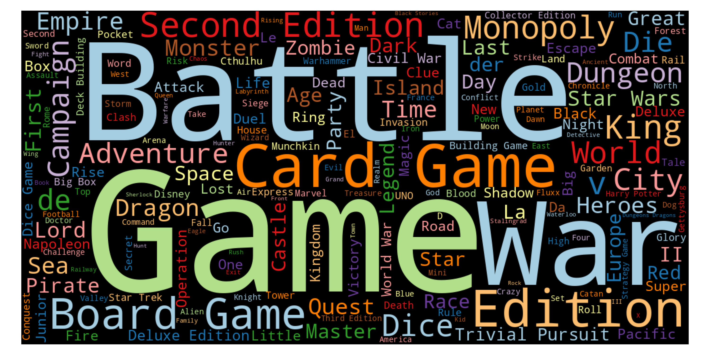
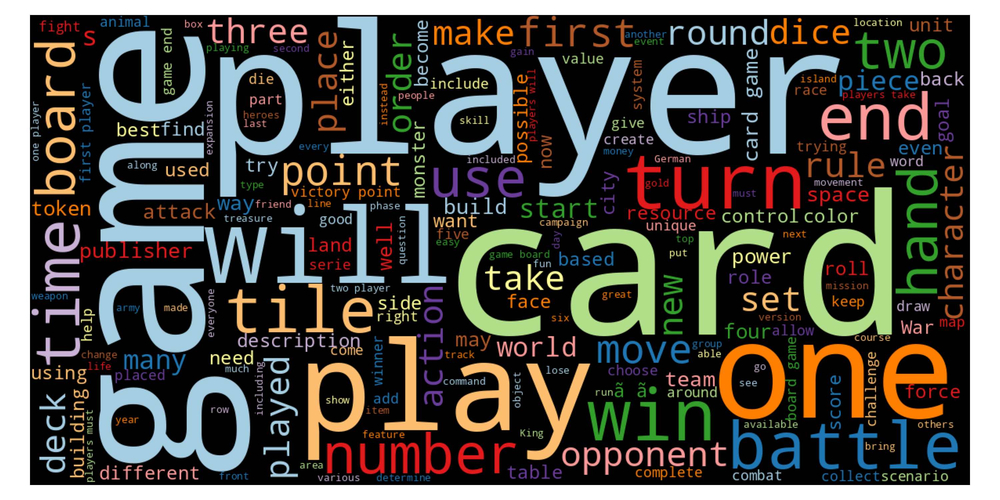
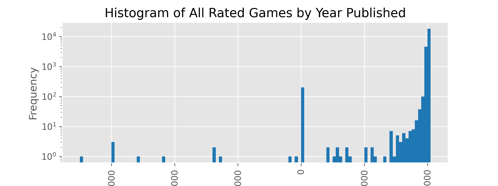
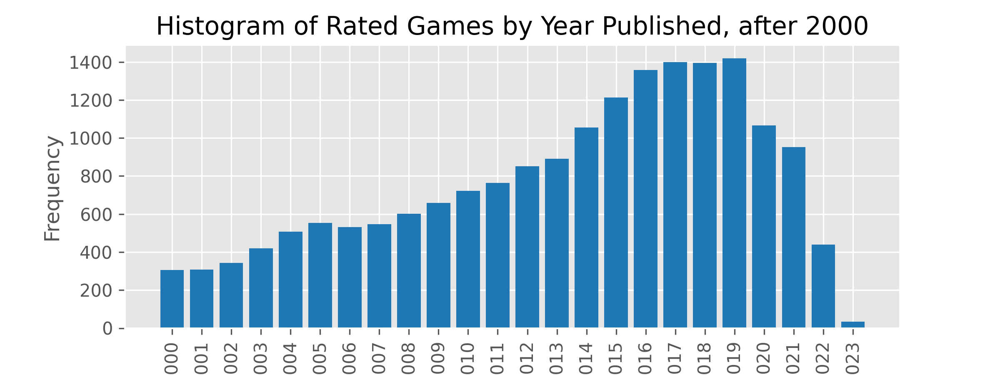
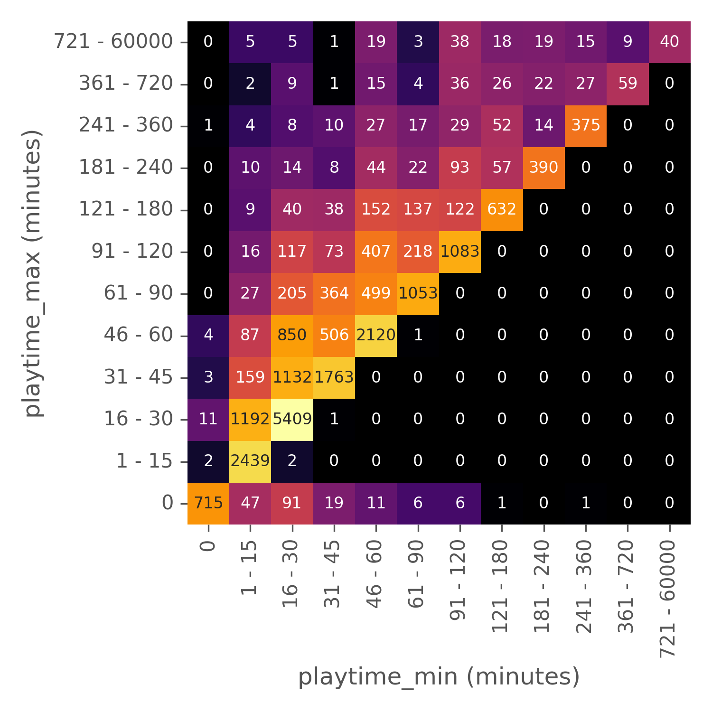
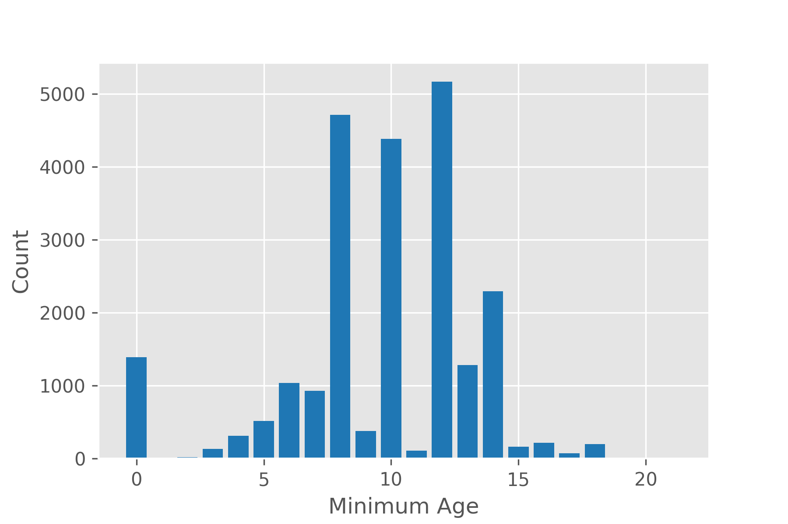
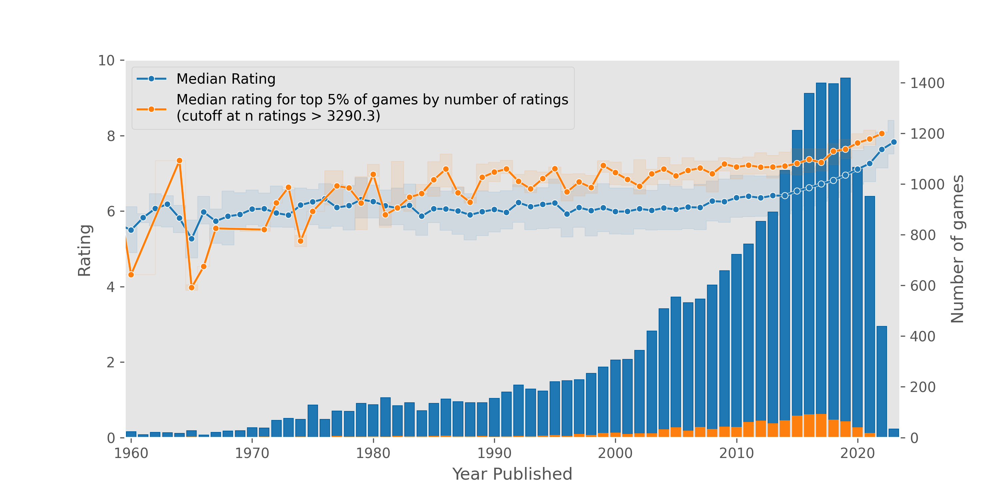

- Cover image word cloud


- Copy paragraph from notebook about ratings and dummy values
- [link to image]() plot of ratings sloping with dummy variables
- Paragraph about fitting the dummy variable parameters.
- Restricting games to >30 ratings and justify
    - Less noisy, since everyone can put a game up

- quick summary of interesting results of remaining dataset
    - size
    - missing values are 0's
    - broadly something about year of games, missing values are 0s
    - other parameters

- What is the golden age of board games?
- Set up definition of golden age of board games.
    - Average rating for board games + avg number of ratings by year.
- Is complexity related to quality?
    - maybe, correlation small
    - but need to plot
- Is there a surplus of medium complexity games or higher?
    - What are some games I like
- Fit a linear model to discover quality


## Discussion
- As of this writing, one of the recommend.games website is down.
- What data do I require?
    - API has user ratings, get those
    - build a recommender system using..
        - list some SVM or something


# TODO Boardgames
## Introduction
This is an analysis of boardgame data downloaded from boardgamegeek.com
on (DATE)

Described in part one (LINK).

Describe what I will look at.

## Overview of Data
The data consists of blah blah.
I'm gonna look at the 


Restricting the data set below.
Then cut off data by rated games etc.

## The Bayesian Average Rating: Rated vs Unrated Games
### The Geek Rating: Rated vs Unrated Games

Games on BGG may be rated by users out of 10. Games that receive 30+ user ratings are assigned a ["geek rating"](https://boardgamegeek.com/wiki/page/BoardGameGeek_FAQ#toc13). This geek rating is used to rank board games against each other, and is necessary to prevent games with a few high rankings from appearing higher than games with a large number of rankings. For example, one may not want a game with five ratings of 10 to be considered a "better" board game than a game with a ratings mean of 4.8 but with 100K ratings. Games that don't meet the 30+ user rating threshold receive a geek rating of 0, and I'll refer to these games as "unrated" games.

The exact calculation method for the geek rating is not published by BGG, but it is apparently mostly a [Bayesian average](https://en.wikipedia.org/wiki/Bayesian_average).
Indeed, in the original XML data this field is called `bayesaverage`,
which I've renamed to `ratings_bayes_average`.
Its construction probably involves taking the user ratings 
and adding in something like [100](https://boardgamegeek.com/wiki/page/BoardGameGeek_FAQ) 
or [1500-1600](https://boardgamegeek.com/blogpost/109537/reverse-engineering-boardgamegeek-ranking) 
dummy ratings at a value of 5.5.

Of the entire dataset, about 85K games are unrated 
vs 23K games with geeks ratings.

### Visualizing the Effect of Dummy Ratings

The following scatterplot visualizes the impact of the dummy ratings.
Bayes ratings are plotted along the x axis and the actual ratings along the y.
The number of ratings a game possesses is mapped to the color of the points.

When the number of ratings is low,
the Bayes rating is composed mostly of dummy ratings
and ends up at around 5.5.
As the number of ratings increase,
actual ratings swamp out the dummy ratings
resulting in the points drifting toward to the `y=x` diagonal.


### Computing the Parameters of the Bayesian Average
If we assume the Bayesian average uses the model:

$$
r = 
    \frac
        { R m  + \sum_i^n x^i}
        {m + n}
$$

where Bayes average rating \\(r\\) is constructed from the sum of all user ratings
\\(x_i\\) and \\(m\\) dummy ratings of value \\(R\\), divided by the total of user ratings + dummy ratings,
then we can try to discover what values of \\(R\\) and \\(m\\) fits our data here.

A caveat here is that this doesn't take into account other parameters
that BGG might be using, such as weighting ratings based on information about certain users.

I first translated the equation into a function that computes a Bayesian average with an arbitrary number of dummy ratings and average dummy rating value:
```python
def compute_bayesian_average(
    game_df: pd.DataFrame,
    dummy_rating: float,
    num_dummies: int,
    ratings_mean_key: str='ratings_mean',
    ratings_n_key: str='ratings_n'
    ) -> pd.Series:
    """Compute a Bayesian average using vectorized ops.
    
    Args:
        game_df: game dataframe with ratings info.
        dummy_rating: the mean rating for dummy values.
        num_dummies: number of dummy ratings to use.
        ratings_mean_key: col key for ratings mean.
        ratings_n_key: col key for number of ratings.
    
    Returns:
        pd.Series with computed Bayesian averages.
    """
    return (
        ((game_df[ratings_mean_key] * game_df[ratings_n_key]) 
            + (dummy_rating * num_dummies))
        /(game_df[ratings_n_key] + num_dummies))
```
We can then evaluate how far the generated Bayesian ratings are from the actual Bayesian ratings from BGG by calculating the [RMSD](https://en.wikipedia.org/wiki/Root-mean-square_deviation):

```python
def compute_rmsd(
        y_trues: pd.Series|np.ndarray,
        y_preds: pd.Series|np.ndarray) -> float:
    """Compute the root mean squared deviation.
    
    Args:
        y_trues: 1D vector of .
        y_preds (np.ndarray or pd.Series): A 1D vector.
    Returns:
        RMSD as a scalar float.
    """
    # Check both are 1D vectors of same length.
    assert len(y_trues.shape) == 1
    assert y_trues.shape == y_preds.shape
    return np.sqrt(((y_trues - y_preds)**2).mean())
```

Next, we'll use the [`minimize` function](https://docs.scipy.org/doc/scipy/reference/generated/scipy.optimize.minimize.html) from `scipy.optimize` to find
the values of $R$ and $m$ that minimizes the RMSD of the
computed Bayesian averages.

We'll need to write a wrapper function that takes in $R$ and $m$ as an argument,
while outputting the RMSD.
This function will used as one of the parameters
for `minimize`.

```python
def error_wrapper(
    dummy_args: tuple[float, int],
    game_df: pd.DataFrame,
    bayes_average_key: str='ratings_bayes_average'
    ) -> float:
    """Objective function to minimize Bayes dummy parameters.

    This function is meant to be used in by `scipy.optimize.minimize` as
    the objective function to be minimized. The `game_df` param will be
    supplied in the `args` parameter for `minimize`.
    
    Args:
        dummy_args: a tuple of (dummy_rating, num_dummies)
            i.e. args for compute_bayesian_average().
        game_df: game dataframe from which y_true bayes average ratings
            are taken.
        bayes_average_key: col key for bayes average ratings. 
    
    Returns:
        Float for RMSD.
    """
    (dummy_rating, num_dummies) = dummy_args

    y_true = game_df[bayes_average_key] 
    y_pred = compute_bayesian_average(game_df, dummy_rating, num_dummies) 
    error = compute_rmsd(y_true, y_pred)
    return error 
```
Now we can run the optimization like so:

```python
# i.e. scipy.optimize.minimize
op_res = minimize(error_wrapper, (0, 0), args=(rated))
```
Here are the results:
```
Optimization terminated successfully.
        Current function value: 0.019480
        Iterations: 29
        Function evaluations: 120
        Gradient evaluations: 40
=============================================
Optimization Result
-------------------
Mean Dummy Rating: 5.495617489008271
Number of Dummy Ratings: 1972.456740224388
Final RMSD: 0.019480321333741443
```

The closest we can get to reproducing the real Bayes rating values
seems to be when the number of dummy ratings is around 1972
with a rating value of 5.5.

For comparison, here are the RMSDs for 0 dummies (i.e. the real user ratings), 100, 1500, and 1972 dummies at a rating value of 5.5:

|                   | RMSD |
|-------------------|------|
| Real User Ratings             | 1.1244 
| Computed Bayesian (100 x 5.5) | 0.6033 
| Computed Bayesian (1500 x 5.5)| 0.0520 
| Computed Bayesian (1972 x 5.5)| 0.0194

We can visualize this trend. In the following plot, the x axis plots the real Bayes rating values,
whereas the y axis plots the mean real user rating (panel A),
Bayes rating values when using 100 dummy values (B),
1500 dummy values (C),
and the number of dummy we got from our optimization i.e. ~1972 (D).
As we increase the number of dummy values, the generated Bayes rating
approached the real Bayes rating from BGG. The step from 1500 to 1972 ratings lowers the RMSD by a relatively small amount, suggesting that the 1500 estimate was fairly accurate.


[](images/optimizing_bayes_model.png)

We can look at the remaining difference between real Bayes ratings
and the computed Bayes ratings. 
In the plot below, 
the x axis plots the number of ratings on a log scale,
while the y axis plots the differences.

The residual differences are less than 0.1 for almost all games,
although there are a small number of strong outliers.

[](images/bayes_residuals.png)

## Data Overview
## Shape Missing Values, Dupes
## IDs

## Name and Description

For fun, this is a [word cloud](https://amueller.github.io/word_cloud/generated/wordcloud.WordCloud.html) of common words in the name field:

[](images/name_wordcloud.png)

Similarly, this is a word cloud of the description field:
[](images/description_wordcloud.png)

## Year Published

It's a reasonable assumption that most of the games not from the modern era are approximations. 0's also are a placeholder value.

[](images/year_histo_all.png)


Almost all the games are recent.

Some diminishing as you get to 2023. New games probably take time to get added on?

[](images/year_histo_modern.png)


## Players


## Playtime

This is a heatmap showing the annotated minimum and maximum suggested playtimes for games. 0 and 0 are missing values. The biggest category is for games at 30 minimum predicted playtime.


[](images/playtime_heatmap.png)

## Age

Most of the minimum ages are 8, 10, 12. 0 is a missing value placeholder.

[](images/age_histogram.png)

## Ratings


## What is the Golden Age of Board Games


## Discussion

- Would've downloaded the entire dataset. Would've been easier.


