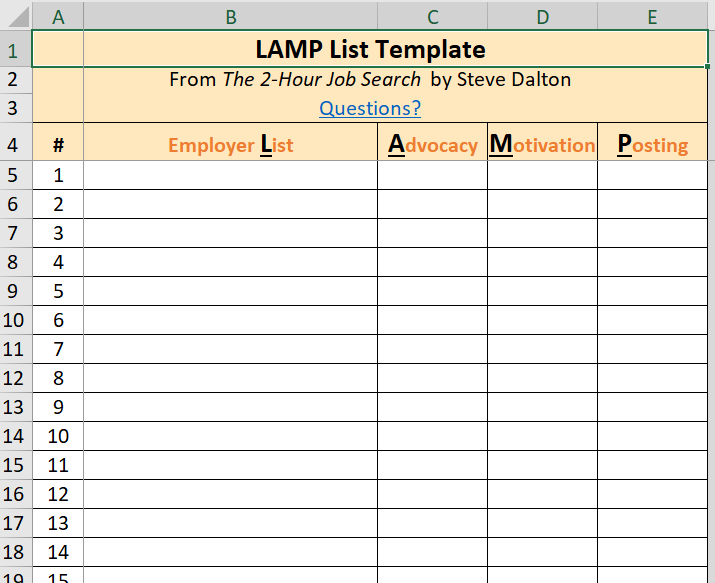

## Introduction
I first heard of [Steve Dalton's book "The Two-Hour Job Search"](https://www.goodreads.com/book/show/50478429-the-2-hour-job-search) (2HJS) when [Will Huang](https://www.linkedin.com/in/will-ph-huang/) referred it to me during a Vancouver [Learn Data Science Meetup](https://www.meetup.com/learndatascience/) event. Indeed, it has become the topic of the [May 9, 2023 meetup](https://www.meetup.com/learndatascience/events/293144506/). I ended up writing a bunch of notes, which I thought might be useful for others to read about in this blogpost.

The fundamental premise of 2HJS is that while applying to online job postings
seems and feels like the right thing to do, these applications usually contribute zero
progress to actually securing a job. This is because applying to an online
posting is easy enough that everyone is doing it, resulting in a deluge of
hundreds or thousands of resumes and applicants for every job post. Hiring
managers are therefore highly unlikely to be able to pick your resume out of
the pile (unless it's exceptional). In many cases they may ignore their online
postings altogether, since they would have spend way too much time to read
through and assess all of the resumes fairly, preferring instead to rely on
referrals from people internal to the company.

Instead of the reactive approach of applying to job postings and relying on the whims of chance, Dalton's 2HJS offers an alternate proactive strategy in three parts:
1) Create a list of target companies list (the LAMP list).
2) Identify people that work at those companies that you can contact.
3) Setup informational metings with these contacts, so that they can advocate for you internally.

Dalton believes this approach is much more efficient and likely to result in success. The theme of reactive/proactive strategies recurs throughout the book, as Dalton sets up a concrete system containing much in-depth instruction, example scenarios,   the do/don'ts of each step, and mindset advice. If you find this method interesting, I recommend reading the book in detail.

Note that 2HJS doesn't promise getting a job in *only* two hours. Instead, the time used for setting up the lists, identifying contacts, and the first informational meeting takes approximately two hours in total. 2HJS doesn't cover actual interviewing, or things like resumes/cover letters, negotiations, etc.

At the time of writing, I have not gone through and implemented this process, although I intend to in the coming weeks.

## Prioritize: The LAMP list
The first step in 2HJS requires making the LAMP list, which stands for List, Advocacy, Motivation, and Posting. This list will give you companies to target for the later steps and is longest part of the process (70 min).

The book website offers a [spreadsheet template](https://2hourjobsearch.com/resources), which contains columns for each of the four substeps:

### List (40 min)
The first substep is to make a list of at least 40 potential employers (and up to 100). This is necessary, because the later steps will eliminate a whole bunch of these companies, and you need to have enough starting stock to have enough companies remaining in the end. Listing such a large number also surfaces a lot of employers you normally wouldn't think about.

Dalton warns strongly that while making this list, you should not get distracted and start researching the companies, as that is task-switching that creates mental drag preventing you from moving through this process swiftly.

There are 4 approaches to coming up with this list:
1) Dream employers:
	- Think of all the companies you already want to work for, for whatever reason. Once you have a few, you can google similar competitors, or use the "People also viewed" box on the company's LinkedIn page
2) Affinity/Alumni employers:
	- This is looking at people from your school/program or any sort of group you belong to, and see who employs them. The reasoning is these companies are employing people that are similar to you.
3) Actively hiring employers
	- This is simply going to Indeed or LinkedIn and searching for job titles of interest in your region. Dalton specifically warns NOT to click on the actual postings and reading about them in-depth (or worse yet, applying), because the point is to just get a list of who's hiring generally. He also advises not to be worried about urgent postings closing, as companies almost always make exceptions for internal referrals.
4) Trending employers
	- These are companies that come up in whatever specific news/publications/feeds you look at. This tends to work because the publications/feeds you subscribe to reflects your interests.

These companies will go in the L column of the spreadsheet.

### Advocacy (10 min)
The next step is to find out whether a company potentially has someone that can help you. This can be because they are similar to you (e.g. alum of same university/program/other group), or already know you in some way (e.g. friends, former colleagues. That is, we are identifying whether each company might have a potential advocate.

The point here is you basically run through (in 10 minutes!) your list of 40-100 employers and either put Y/N (yes/no) for each of them. You put Y if you can think of any reason, such as alumni (e.g. through LinkedIn boxes), friends/family, someone that is from the same local region, relevant experience you have that will pique someone's interest, etc. that might give you a reason for you to contact them. And if you can't think of anyone immediately, put N (don't worry, as it doesn't rule them out entirely).

### Motivation (5 min)
Now go through the list again. In the motivation column put down a score of 1-3 (lowest motivation to highest) reflecting your intuition, your gut-feel, of how much you want to apply to the company, given only what you know about the company right at this moment. Use a score of 0 for companies if you don't know anything about them.

Again, this step is about instinct, and is supposed to be fast.

### Posting (15 min)
Now return to a job posting site (as of the publication year 2020, Dalton recommends Indeed.com). For each employer in the list, put them in the job search engine and look at their job postings. Put a score of 3 if there are relevant postings, 2 if there are semi-relevant postings, 1 if there are no relevant postings.

Dalton warns here NOT to actually click into the postings beyond the summary blurb and spend time reading them. The point is to gather information about whether the companies are generally hiring with relevant positions. The actual posting text doesn't matter too much because companies usually put a bunch of unnecessary requirements in their postings anyways.

### LAMP Wrap-up
Now we sort the spreadsheet by:
1) Motivation (high to low)
2) Posting (high to low)
3) Advocacy (reverse alpha, i.e. Y first)

There's a few optional cleanup steps here:
- If employer number 6 feels like it should be in the top 5, you can give them a motivation score of 4.
- If there are any motivation score of 2 employers that you feel should be in top 5 (given what you now know about postings), you can upgrade their motivation score.
- Examine the employers with a motivation score of 0. You may (quickly) do some googling on them and see if you learn something that boosts their motivation score.

Re-sort the list. The list is now prioritized for who you should approach first, with the top 5 being your first batch.

## Making Contact
### Naturalize (20 min)

The next part of 2HJS deals with how to actually contact people at these
companies, in order to have informational meetings with them. First we have to
figure out who to contact. Dalton uses the term "naturalize" to borrow the
meaning of "gaining admittance to a new community."

Dalton recommends five traits for contacts you should look for (in order of importance):
- Functional relevance (i.e. their job is like what you want)
- Alumni or membership in some group you're in
- People one or two levels above where you would be.
- Someone who has already been promoted.
- People with a unique name (this is because you'll be trying to find their email later, so it's harder when someone has a very common name).

On LinkedIn, you can look up a company and search its people with these criteria. The first three should give you less than 10 people. The final two can be used to tie break. This should yield two starter candidates for the company.

(Interestingly, Dalton warns that clicking directly into lots of profiles may trigger LinkedIn to think that you're a recruiter and try to force you to get a recruiter subscription. I don't know if this is relevant given how quickly algorithms can change).

Dalton then recommends five ways of contacting the person, giving a number of reasons why one method works better than another. These are ranked in order of how likely someone is actually going to reply:
1) LinkedIn Groups
2) Email
3) LinkedIn invitations to connect
4) Other social media
5) LinkedIn second degree connections

For locating someone's email address, one can use alumni databases,
email-finding websites like [hunter.io](https://hunter.io/), and (for certain
candidates) finding articles they wrote and getting their email info from
there. You may have to get a bit creative here and do some guessing.

### The Six-Point Email (20 min)
If you're somewhat introverted like me, the thought of writing what is essentially a cold-call email makes you cringe. But Dalton states that this is because we imagining writing an email where we have to "sell ourselves". Instead, he outlines a six-point email method, which I've copied here verbatim:

1.  Write fewer than seventy-five words.
2.  Ask for insight and advice, not job leads.
3.  State your connection first.
4.  Make your request in the form of a question (ending in "?")
5.  Define your interest both narrowly and broadly.
6.  Keep over half the word count about the _contact_, not about you.

There's bunch of reasoning and psychology in each of these points, and Dalton
provides a number of examples in the text.

This email format optimizes replies from a certain type of person. Dalton classifies potential respondents into several segments:
- Curmudgeons: people that won't reply
- Obligates: people that feel like they have to reply, but don't really want to, and end up usually replying slowly and becoming a time and energy sink
- Boosters: people that actively enjoy helping people.

Note: I don't think this is to pigeon-hole people into roles, but is just an expression of behaviour. I myself have been all three depending on the circumstances.

The strategy is to target Boosters, since they're the ones that will want to help anyways. Expect your success rate of getting a reply to be around 20-40%.

### Track (10 min)
I used to email people, not get a reply, and then get very flustered agonizing over when it would be too soon or rude to contact them again. To avoid this, Dalton recommends setting up a tracking system, so that you can know ahead of time exactly when you need to follow-up, and when it's time to move on.

The system is called "3B7". First, you email one of your candidate contacts. If after 3 business days (3B), you get no response, you email the second candidate (starting the 3 business day count on the second candidate). After 7 days have passed, you send a follow-up to the first candidate if they still haven't replied. These times are marked in your calendar software as soon as you send the first email, so that you can automate reminders and tracking. Do this with each of the first candidates for the top 5 employer batch simultaneously.

This system is proactive, rather than reactively waiting for replies. As well, it unloads the cognitive burden of tracking from your mind. Job searching is already stressful, and it's harder to keep track of things under stress.

And if you're wondering about what happens when, say, the second contact replies at the same time as the first person (so who do you reply to first), the book outlines contingencies for all the weird scheduling scenarios that could occur.

## Convince: Informational Meetings
Eventually, you'll be able to schedule an informational meeting with someone. Critically, these meetings aren't asking about jobs. Rather, these meetings are an opportunity for a contact and you to get to know each other, and for them to share their knowledge on their industry, their company, etc. with you. Once someone knows you, it's much easier for them to naturally help and advocate for you when the time comes.

This part of the book takes up the last three chapters, and contains a wealth of information on things like:
- What kind of preparation to do?
- What kind of research to do before-hand, and how much research is too much?
- A framework for making good small-talk at the start of the meeting.
- A framework (TIARA, for trends, insights, advice, resources, assignments) for the questions and answers you should be looking for during the meeting.
- How to wrap up a conversation.
- A systematic approach to following-up after meetings.

It's a bit too much for me to write about in this post, but it's certainly worth reading!

## Conclusion
I hope this summary gives you a good general idea of the 2HJS method. Again, I highly recommend reading the actual book; it covers all kinds of divergent scenarios in more depth.

If you're interested, Steve Dalton has a [second book](https://www.goodreads.com/book/show/56569863-the-job-closer) (that I haven't read) about other parts of the job search like resumes, LinkedIn profiles, behavioural interviewing etc.

Best of luck to you in your job search!